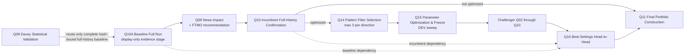

# Gate Manifest v3 — Vault mirror proposal (OWNER E3)

Status: **PROPOSAL / READ-INERT / REVIEW REQUIRED**

Authority: OWNER decision E3, `decisions/2026-08-22_owner_pipeline_realignment_q09_q11.md`

Implementation task: `OPS-GATE-MANIFEST-V3-E3`

Activation prerequisites: Claude review **and** reviewed closure of `OPS-Q10-REALIGN-E1-E2`

This document is the repo-side source for Claude to mirror into Vault `03 Pipeline`.
It does not change the live Vault, enqueue work, mutate a verdict, or activate v3.

## 1. Target order

`Q10A` is uppercase on operator surfaces and is deliberately **not** a writable
`work_items.phase`. It labels a baseline evidence binding. `write_phase_id("Q10A")`
continues to fail closed. The canonical writable gate set remains Q00–Q16.

## 2. Q08 baseline reuse assessment

The current Q08 aggregator can produce the exact evidence needed for Q10A:

- a fresh full-history baseline report and summary;
- EX5, MQ5, setfile, report, summary, and source-stream SHA-256 bindings;
- EA/symbol identity and trade-stream binding.

It does not do so uniformly for every historical artifact. In
`framework/scripts/q08_davey/aggregate.py`, `baseline_run` can be absent when an
existing trade stream is accepted, and older evidence can explicitly report only a
stream/source binding without a report/build binding. Therefore the v3 rule is:

1. reuse Q08 as Q10A only when the full-history baseline and its report, EX5,
   setfile, source identity, EA, and symbol are hash-bound;
2. otherwise require one Q10A baseline run;
3. never infer a binding from a verdict alone.

This removes redundant runs for complete modern Q08 evidence while keeping legacy or
partial evidence fail-closed.

## 3. Gate-by-gate v2 → v3 diff

| Gate/stage | v2 | v3 proposal | Runtime criteria / verdict change |
|---|---|---|---|
| Q00 | Research Intake → Q01 | unchanged | none |
| Q01 | Build & Spec → Q02 | unchanged | none |
| Q02 | Baseline Screening → Q03 | unchanged | none |
| Q03 | Parameter Sweep → Q04 | unchanged | none |
| Q04 | Walk-Forward + Commission → Q05 | unchanged | none |
| Q05 | Gross Full-History Robustness → Q06 | unchanged | none |
| Q06 | Stress HARSH → Q07 | unchanged | none |
| Q07 | Multi-Seed → Q08 | unchanged | none |
| Q08 | Davey Statistical Validation → Q09 | unchanged writable gate; qualifying full-history baseline may be bound as Q10A evidence | none |
| Q10A | absent | display-only `Baseline Full Run`; reuse complete Q08 binding, otherwise require baseline run; then Q09 | new evidence role only; no v3 runtime activation in this change |
| Q09 | News Impact Mode → Q10 | `News Impact + FTMO Recommendation` → Q10; surfaces show explicit FTMO geeignet JA/NEIN by reusing `ftmo_q09_admission` | no criteria or Q09 verdict change |
| Q10 | Full-History Confirmation → Q11, with explicit Q14 fork | `Incumbent Full-History Confirmation`; non-optimized → Q11, optimized → Q14 | no confirmation threshold or verdict change |
| Q11 | Portfolio Construction → Q12 | `Final Portfolio Construction`; reached from Q10 (not optimized) or Q16 (optimized) | no book/admission criteria change; OWNER authority unchanged |
| Q12 | Operational Readiness → Q13 | unchanged | none |
| Q13 | Live Burn-In DXZ | unchanged terminal gate | none |
| Q14 | Optimization Admission → Q15 | `Pattern Filter Selection` → Q15; sealed DL-089 rule and hard cap of 3 filters per direction | no selection-rule change |
| Q15 | Challenger Build & Freeze → Q16 | `Parameter Optimization & Freeze`; DEV-only sweep and freeze remain unchanged; challenger still traverses Q02→Q10 | no sweep/threshold/verdict change |
| Q16 | Head-to-Head Requalification → Q11 | `Best-Settings Head-to-Head`; binds Q10A baseline and incumbent Q10 references before Q11 | no H2H threshold or verdict-vocabulary change |
| Q11_DXZ / Q11_FTMO | Q11 storage lanes | unchanged final storage lanes | none |

The manifest retains the five verdict dimensions, all authorities, runners, legacy
aliases, writable phase IDs, and `next` pointers byte-for-field relative to v2. Only
names/evidence roles and the read-inert topology description are revised.

## 4. Q09 FTMO recommendation presentation

The aggregate Cockpit, Mission Control v2, and Strategy Archive EA detail page consume
the same read-only projection. Each pair is evaluated by
`portfolio.ftmo_q09_admission.evaluate_ftmo_q09_admission`; the presentation layer
only maps `admitted=true/false` to **JA/NEIN** and exposes the existing reason code.

No new eligibility heuristic, fallback, threshold, verdict, challenge decision, or
deployment action exists in the surface. Missing or unauthenticated evidence remains
**NEIN** with the evaluator's fail-closed reason.

## 5. Vault pages to mirror after review

### `03 Pipeline/Pipeline Overview.md`

- Replace the target-flow illustration with the graph in §1.
- State that Q10A is an evidence stage, not a writable work-item phase.
- State both Q11 routes: Q10→Q11 for non-optimized lineages and Q16→Q11 for optimized lineages.
- Keep Q00–Q16 as the only canonical writable gate IDs.

### `03 Pipeline/Q09*.md`

- Label Q09 `News Impact + FTMO Recommendation`.
- Add the explicit per-pair and aggregate `FTMO geeignet JA/NEIN` presentation.
- Cite `ftmo_q09_admission` as the sole logic source; criteria and verdicts unchanged.
- After E1/E2 review, describe Q09_PORTFOLIO as informational and Q09_NEWS CONFIG_LOCKED as the Q10 gate.

### `03 Pipeline/Q10*.md`

- Add Q10A `Baseline Full Run` before Q09 using the conditional Q08 binding rule in §2.
- Label Q10 `Incumbent Full-History Confirmation`.
- Document that Q10 is the incumbent reference for Q16 and the direct Q11 predecessor for non-optimized EAs.

### `03 Pipeline/Q11*.md`

- Label Q11 `Final Portfolio Construction`.
- State that portfolio construction is after Q16 for optimized EAs and after Q10 for non-optimized EAs.
- Preserve OWNER authority and both target-specific storage lanes.

### `03 Pipeline/Q14*.md` through `Q16*.md`

- Q14: `Pattern Filter Selection`, sealed DL-089 selection, maximum three filters per direction.
- Q15: `Parameter Optimization & Freeze`, unchanged DEV sweep, trial ledger, and freeze.
- Q16: `Best-Settings Head-to-Head`, challenger best-settings full run compared against both the bound Q10A baseline and incumbent Q10.
- Preserve existing Q16 thresholds and verdict vocabulary.

## 6. Activation boundary

The candidate file is `tools/strategy_farm/config/gate_manifest.v3.json`, but
`gate_manifest.DEFAULT_MANIFEST` intentionally remains v2. The v3 manifest declares:

- `state = READ_INERT`;
- `requires_completed_review = OPS-Q10-REALIGN-E1-E2`;
- `requires_approver = CLAUDE`;
- `default_manifest_switch = false`.

Activation is a later reviewed change. It must validate the prerequisite, switch the
default manifest deliberately, bind the operational Q10A/Q16 dependency records, run
the focused and full regression suites, and update the Vault mirror. This proposal
does not authorize any enqueue, pipeline verdict, T_Live, terminal, deployment,
challenge-purchase, or AutoTrading action.
