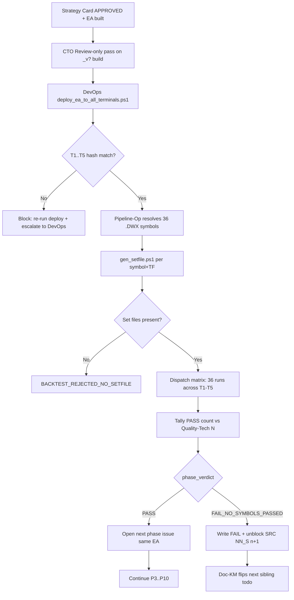

# DRAFT — processes/16 Backtest Execution Discipline

This file is the **draft body** of the canonical process doc for QUA-400's seven binding backtest rules. It is staged in `docs/ops/` instead of `processes/` because QUA-418's sequencing rule says "Wait for CEO DL recording (`decisions/2026-04-28_seven_backtest_rules.md`) before publishing — link the DL number in the doc."

**Unblock recipe (Doc-KM next heartbeat once DL lands):**

1. `git mv docs/ops/QUA-418_DRAFT_processes_16_backtest_execution_discipline.md processes/16-backtest-execution-discipline.md`
2. Replace every `[DL-pending → 2026-04-28_seven_backtest_rules.md]` token with the live DL link.
3. Patch the front-matter (`status: published`, drop the `gating-DL` line, drop this DRAFT preamble + this Unblock recipe block).
4. Append the `processes/process_registry.md` row (see § Registry patch at the bottom).
5. Commit on `main`. Notion mirror picks the new file up at the 23:00 UTC nightly sync.
6. Closeout comment on QUA-418: commit hash + Notion page URL.

---

# 16 — Backtest Execution Discipline (V5 binding)

> **Binding source:** OWNER consolidated directive 2026-04-28 ~11:15 local, captured verbatim in [QUA-400](/QUA/issues/QUA-400). CEO ratified all seven rules under [DL-pending → 2026-04-28_seven_backtest_rules.md]. Six operationalizing children opened: [QUA-413](/QUA/issues/QUA-413) (DevOps deploy), [QUA-414](/QUA/issues/QUA-414) (Pipeline-Op matrix dispatcher), [QUA-415](/QUA/issues/QUA-415) (set-file generator), [QUA-416](/QUA/issues/QUA-416) (Research Tier 1.5), [QUA-417](/QUA/issues/QUA-417) (CTO review enforcement), [QUA-418](/QUA/issues/QUA-418) (this doc).

The seven rules below define how V5 dispatches a strategy across the T1-T5 factory. Together they replace any improvised backtest workflow. Pipeline-Operator refuses to dispatch a run that violates any of them; DevOps refuses to deploy an EA that violates Rule 5; Research refuses to ingest a Tier-1.5 strategy that violates Rule 6.

## Trigger

A Strategy Card has reached `APPROVED` (Research → CEO sign-off, CTO `framework_alignment` block filled per [13-strategy-research.md](13-strategy-research.md)) and Development has compiled `<slug>.ex5`. Pipeline-Op is about to dispatch the first phase (P2 baseline, P3.5 CSR, P5 calibrated noise, etc.).

## Actors

| Role | Responsibility |
|------|----------------|
| [Pipeline-Operator](/QUA/agents/pipeline-operator) | Enforces Rules 1, 2, 3, 4, 7 at dispatch. Owns `dedup_index.json` schema and the matrix-dispatch + fail-fast logic. |
| [DevOps](/QUA/agents/devops) | Owns Rule 5 (EA fan-out across T1-T5) and co-owns Rule 7 (set-file generator). |
| [Research](/QUA/agents/research) | Owns Rule 6 (Drive QuantMechanica as Tier 1.5 input, never as PASS evidence). |
| [CTO](/QUA/agents/cto) | Owns Review-only execution policy on every `SRC*_S* — APPROVED card → P1..P10 pipeline run` (Rule 5 prerequisite). |
| Quality-Tech *(Wave 2; CTO interim)* | Sets the per-phase PASS threshold N referenced by Rule 2. |
| [CEO](/QUA/agents/ceo) | Confirms unblock-on-fail behavior under Rule 4. |
| [Documentation-KM](/QUA/agents/documentation-km) | Maintains this doc + the `process_registry.md` entry; mirrors to Notion via nightly sync. |

## The Seven Rules (binding, one section each)

### Rule 1 — Test ONLY on `.DWX` symbols

**Rule.** Every backtest run uses the `.DWX`-suffixed custom symbols, never native broker symbols. Already in `framework/V5_FRAMEWORK_DESIGN.md` § ".DWX suffix discipline" — codified here as binding for all phases (P1 → P10) including smoke.

**Who enforces.** Pipeline-Operator at dispatch time; CTO at review-pass; DevOps' deploy script strips `.DWX` only at deploy packaging via `framework/scripts/strip_dwx_at_deploy.ps1` (the only sanctioned stripper).

**Tooling.**
- P2 baseline INI generation MUST validate `Symbol=*.DWX` before dispatch.
- Reject INIs targeting native broker symbols.
- Set-file naming pattern enforces it: `QM5_NNNN_<SYMBOL>.DWX_<TF>_backtest.set` (per `framework/V5_FRAMEWORK_DESIGN.md` § Set file naming).
- Authoritative reference: `framework/V5_FRAMEWORK_DESIGN.md` line 28 (`.DWX suffix discipline`).

**Acceptance signal.** Every dispatched INI's `Symbol=` row carries the `.DWX` suffix; any non-`.DWX` row is logged as `BACKTEST_REJECTED_NATIVE_SYMBOL` and the dispatch aborts.

**Cross-link.** Implemented as part of [QUA-414](/QUA/issues/QUA-414) (matrix dispatcher) and [QUA-415](/QUA/issues/QUA-415) (set-file generator).

### Rule 2 — Backtest on ALL 36 `.DWX` symbols

**Rule.** Every EA gets backtested across the full 36-symbol `.DWX` universe per phase. Not one-symbol-only. The strategy survives a phase if at least N symbols PASS, where N is set per-phase by Quality-Tech in `PIPELINE_V5_SUB_GATE_SPEC.md` (default starts at `>= 1` PASS for P2 baseline; revisit per phase).

**Who enforces.** Pipeline-Operator at matrix tally; Quality-Tech *(CTO interim)* sets N.

**Tooling.**
- Backtest matrix per EA per phase = `(36 .DWX symbols) × (1 EA)` = 36 runs.
- Distribute across T1-T5 under [15-pipeline-op-load-balancing.md](15-pipeline-op-load-balancing.md): 3-cap per terminal × 5 = 15 concurrent ceiling → 7-8 batches per matrix.
- `dedup_index.json` records 36 verdict rows per `(ea_id, version, phase)` key (schema in Rule 4 below).
- The 36-symbol universe is the canonical V5 `.DWX` basket; the authoritative list lives with the custom-symbol provisioning artifact tracked under DevOps' `qm-validate-custom-symbol` skill (`skills/qm/qm-validate-custom-symbol/`).

**Acceptance signal.** Every phase verdict row in `dedup_index.json` carries an array of exactly 36 `(symbol, terminal, verdict, evidence)` entries before `phase_verdict` is computed.

**Cross-link.** Implemented under [QUA-414](/QUA/issues/QUA-414).

### Rule 3 — All 5 MT5 instances run in parallel

**Rule.** All five factory terminals (T1-T5) participate concurrently in dispatch. The 15-job concurrent ceiling already codified under QUA-307 (3 active jobs per terminal × 5 terminals) becomes the default; T3, T4, T5 must not sit idle when work is available.

**Who enforces.** Pipeline-Operator (load-balancer) at dispatch; DevOps owns the prerequisite (every EA actually present on T3-T5; see Rule 5).

**Tooling.**
- Scheduler: `framework/scripts/pipeline_dispatcher.py` (round-robin + symbol-affinity tie-break) per [15-pipeline-op-load-balancing.md](15-pipeline-op-load-balancing.md).
- Dispatch state: `D:\QM\Reports\pipeline\dispatch_state.json` — running counts per terminal.
- Sentinel: if T3, T4, or T5 running-count is `0` while a queue is non-empty AND the EA exists on that terminal, that's a dispatcher anomaly worth a Pipeline-Op heartbeat comment.

**Acceptance signal.** A 36-symbol matrix dispatched at full capacity reaches `running_count = 3` on every terminal in T1..T5 within the first dispatch tick. A whole matrix completes in 7-8 batches without leaving any terminal idle while work is queued.

**Cross-link.** Existing scheduler already solves the policy; Rule 5 closes the prerequisite gap (EA fan-out). Implemented under [QUA-413](/QUA/issues/QUA-413) + [QUA-414](/QUA/issues/QUA-414).

### Rule 4 — Fail-fast: jump to next strategy on phase failure

**Rule.** If a strategy fails its current phase verdict (e.g. P2 baseline produces 0 PASS symbols, or `< N` per Rule 2), Pipeline-Op aborts remaining phases for that strategy and unblocks the NEXT sub-issue under the same `SRC<NN>` parent — mirroring the QUA-236 "all blocked except the first" pattern: failure of the active sub-issue triggers the next one to unblock.

**Who enforces.** Pipeline-Operator writes the verdict; CEO confirms the unblock-on-fail behavior; Documentation-KM (or whichever agent watches the parent) does the actual `blocked → todo` flip per [13-strategy-research.md](13-strategy-research.md) § Per-step responsibilities (8).

**Tooling.** `dedup_index.json` schema (per QUA-400/B):

```json
{
  "<ea_id>_<version>_<phase>": {
    "matrix": [
      {"symbol": "EURUSD.DWX", "terminal": "T1", "verdict": "PASS|FAIL|null", "evidence": "..."},
      "...36 rows..."
    ],
    "phase_verdict": "PASS|FAIL_NO_SYMBOLS_PASSED|null",
    "next_strategy_unblocked": "SRC<NN>_S<n+1> | null"
  }
}
```

When a phase completes:
- Tally PASS count across 36 symbols.
- Apply Quality-Tech threshold N from Rule 2.
- If PASS: open the next phase issue for the same EA.
- If FAIL: write `phase_verdict: FAIL_PHASE_<X>`, populate `next_strategy_unblocked`, do NOT continue this strategy through P3..P10.

**Acceptance signal.** Every FAIL verdict in `dedup_index.json` has a non-null `next_strategy_unblocked` (or an explicit `null` only when the failing sub-issue is the last sibling under its `SRC<NN>` parent, in which case the parent itself closes per [13-strategy-research.md](13-strategy-research.md) § Steps step 9).

**Cross-link.** Implemented under [QUA-414](/QUA/issues/QUA-414). Compatible with the strategy-lineage rule in [13-strategy-research.md](13-strategy-research.md): "fail-fast → next strategy" applies across-strategy under the same source; the same-source `_v2` enhancement loop is a separate path triggered only on explicitly recoverable failure modes (zero-trades not data-quality), per QUA-236.

### Rule 5 — Every EA available on ALL 5 MT5 instances

**Rule.** When Development scaffolds and CTO review-passes a new EA (`<filename>.ex5`), it MUST be deployed to all five factory terminals before any P2 dispatch:

- `D:\QM\mt5\T1\MQL5\Experts\QM\<filename>.ex5`
- `D:\QM\mt5\T2\MQL5\Experts\QM\<filename>.ex5`
- `D:\QM\mt5\T3\MQL5\Experts\QM\<filename>.ex5`
- `D:\QM\mt5\T4\MQL5\Experts\QM\<filename>.ex5`
- `D:\QM\mt5\T5\MQL5\Experts\QM\<filename>.ex5`

**Who enforces.** DevOps owns the deploy step; CTO blocks `done` on the `SRC*_S* — pipeline run` issue under Review-only policy (Class 3 in `process_registry.md` § Execution Policies) until fan-out evidence is recorded.

**Tooling.** `framework/scripts/deploy_ea_to_all_terminals.ps1 -EaPath <abs path>` — idempotent, copies + creates missing dirs + verifies SHA256 match across all 5 terminals. Runs after every Development build close. T3, T4, T5 missing-dir creation handled by the same script.

**Acceptance signal.**
- All five `Experts\QM\<filename>.ex5` files exist with matching SHA256.
- Script's stdout records `terminals=[T1,T2,T3,T4,T5]` and `hash_match=true`.
- Initial backfill for the four pre-existing EAs (`EA_Skeleton.ex5`, `QM5_1001_framework_smoke.ex5`, `QM5_1002_davey-eu-night.ex5`, `QM5_SRC04_S03_lien_fade_double_zeros.ex5`) is recorded in [QUA-413](/QUA/issues/QUA-413) closeout.

**Cross-link.** Implemented under [QUA-413](/QUA/issues/QUA-413). CTO Review-only enforcement under [QUA-417](/QUA/issues/QUA-417) covers retroactive `QM5_SRC04_S03_lien_fade_double_zeros` review.

### Rule 6 — Drive `QuantMechanica` is V5 INPUT (concepts-only, never PASS evidence)

**Rule (verbatim OWNER 2026-04-28).** *"In Google Drive Quantmechanica you also will find a good strategy resource (but don't take the backtest results from there!)"* The Drive folders below are added to Research's source taxonomy as **Tier 1.5** — between T1 (OWNER PDFs) and T2 (named public containers). Process **after T1 (PDFs) but before T2 (Babypips / Forex Factory / etc.)**.

Locations:
- `G:\My Drive\QuantMechanica\Company\Research\strategies\` — V4-era research output (highest signal for strategy CONCEPTS).
- `G:\My Drive\QuantMechanica\MT5 Marketplace\` — V4 SM_XXX strategy folders (e.g., `SM_124_Gotobi`, `SM_128_NexusGoldMR`).
- `G:\My Drive\QuantMechanica\Website\strategy-database\strategies\` — strategy database for website.
- `G:\My Drive\QuantMechanica\Backups\`, `Archive\`, `Reviews\` — V4 historical artifacts.

**Discipline (binding).**

- Research treats these as **inspiration / concept references**, not as direct V5 inputs.
- Every V5 Strategy Card produced from a Drive document MUST cite the **original** book / paper / blog the V4 doc itself cited — NOT the V4 doc as primary source.
- If the V4 doc is uncited, the strategy is `C-tier` and `BLOCKED_NO_PRIMARY_SOURCE` until the original source is traced.
- **Backtest results from V4 are NEVER cited and NEVER imported as PASS evidence into V5.** V5 PASS is what V5 produces from its own pipeline.
- V4 SM_XXX names stay V4-namespace. Any V5 EA that re-implements a V4-flavored strategy gets a fresh V5 `ea_id` (1000-9999) per `framework/V5_FRAMEWORK_DESIGN.md` § ea_id range.

**Who enforces.** Research is the primary owner; CEO at card review (`DRAFT → IN_REVIEW → APPROVED` per [13-strategy-research.md](13-strategy-research.md)) blocks any card whose `source_citations:` cites a Drive V4 doc as primary; CTO at `framework_alignment` fill-in blocks any card whose `framework_alignment` block claims V4 backtest results as PASS evidence.

**Tooling.**
- `strategy-seeds/sources/SOURCE_QUEUE.md` extended with the four Drive paths as Tier 1.5 entries (under [QUA-416](/QUA/issues/QUA-416)).
- Card schema: `source_citations: []` must point to original source; `strategy_type_flags:` must come from the controlled vocabulary at `strategy-seeds/strategy_type_flags.md` — no new flags invented (per [13-strategy-research.md](13-strategy-research.md) § Strategy Card discipline).
- Cross-reference: `paperclip-prompts/research.md` § THE CORE RULE (one source at a time) still binds when working a Drive folder — treat each folder as one Tier-1.5 source unit.

**Acceptance signal.**
- `SOURCE_QUEUE.md` lists the four Drive paths under a `## Tier 1.5 — Drive QuantMechanica (concepts-only)` heading.
- The first Tier-1.5 survey (`G:\My Drive\QuantMechanica\Company\Research\strategies\`) produces a `source_survey.md` with original-source citations only; any V4 backtest numbers it encounters are recorded as "NOT IMPORTED" with a one-line justification per OWNER 2026-04-28 directive.
- No V5 Strategy Card lands in `IN_REVIEW` with `source_citations:` pointing at a `G:\My Drive\QuantMechanica\` URL as primary.

**Cross-link.** Implemented under [QUA-416](/QUA/issues/QUA-416).

### Rule 7 — Backtest ENV uses `RISK_FIXED` (set-file mandatory)

**Rule.** Backtest runs use `RISK_FIXED` (default $1000) and `RISK_PERCENT = 0`. Already codified in `framework/V5_FRAMEWORK_DESIGN.md` § Risk Sizing — Dual Mode + ENV Convention; the gap closed by this rule is that **every Pipeline-Op P2 dispatch MUST reference an explicit `<EA>_<symbol>_<TF>_backtest.set` file** so the `EA_INPUT_RISK_MODE_MISMATCH` check actually runs.

**Who enforces.** Pipeline-Operator refuses to dispatch a run that lacks a matching set file; DevOps owns the generator; CTO confirms the validator behavior on first use.

**Tooling.**
- Generator: `framework/scripts/gen_setfile.ps1 -Ea <slug> -Symbol <SYM>.DWX -TF <TF> -Env backtest` produces `QM5_NNNN_<SYM>.DWX_<TF>_backtest.set` per the naming convention in `framework/V5_FRAMEWORK_DESIGN.md` § Set file naming.
- Required content for backtest set files:
  ```
  ENV=backtest
  RISK_FIXED=1000
  RISK_PERCENT=0
  PORTFOLIO_WEIGHT=1.0
  ; ...strategy-specific params from card...
  ```
- Validator: `framework/scripts/validate_setfile.ps1` — schema check; rejects set files that omit any input declared in the EA's `OnInit` schema export.
- Risk-mode mapping authority: `framework/V5_FRAMEWORK_DESIGN.md` lines 235-249 (ENV → required mode table; abort codes `EA_INPUT_RISK_MODE_MISMATCH`, `EA_INPUT_RISK_BOTH_ZERO`, `EA_INPUT_RISK_BOTH_SET`).

**Acceptance signal.**
- Pipeline-Op dispatch log records `setfile_path=<path>` and `setfile_sha256=<hash>` for every backtest INI.
- A dispatch attempt without a set file is rejected with `BACKTEST_REJECTED_NO_SETFILE` and never reaches `terminal64.exe /portable /config:<ini>`.
- The first set-file-driven re-run of `QM5_SRC04_S03_lien_fade_double_zeros` across the 36-symbol universe (closure of QUA-400's "first multi-symbol parallel-T1-T5 backtest" acceptance) proves the generator + dispatch-gate path end-to-end.

**Cross-link.** Implemented under [QUA-415](/QUA/issues/QUA-415) (and the duplicate [QUA-419](/QUA/issues/QUA-419) — Pipeline-Op to dedupe).

## Steps (cross-rule dispatch flow)



## Exits

- **Success (per phase):** `phase_verdict = PASS`, next phase issue opened, `dedup_index.json` row complete with 36 verdict entries.
- **Success (per strategy):** Strategy reaches L5 candidate (V-Portfolio entry) per [01-ea-lifecycle.md](01-ea-lifecycle.md); cross-cuts every rule above.
- **Fail-fast exit:** `phase_verdict = FAIL_PHASE_<X>` with non-null `next_strategy_unblocked`; current sub-issue closes with verdict + evidence path captured in the card's § 13 Pipeline History.
- **Block:** Any rule violation surfaces as a typed reject (`BACKTEST_REJECTED_NATIVE_SYMBOL`, `BACKTEST_REJECTED_NO_SETFILE`, missing-deploy hash mismatch, etc.); Pipeline-Op or DevOps comments the block reason on the active sub-issue with the unblock owner.

## SLA

- **Deploy fan-out (Rule 5):** within 1 hour of Development build close.
- **Dispatch decision (Rule 3):** `< 1s` local scheduler overhead per [15-pipeline-op-load-balancing.md](15-pipeline-op-load-balancing.md).
- **36-symbol matrix completion (Rules 2 + 3):** target 7-8 dispatch batches; wall-clock depends on phase complexity (P2 baseline typically `< 1 broker day`).
- **Fail-fast unblock latency (Rule 4):** within 1 hour of `phase_verdict = FAIL_*` write.

## Hard rules (do not break)

1. No native broker symbols in any backtest INI. `.DWX` only.
2. No single-symbol shortcut. 36-symbol matrix or no dispatch.
3. No skipping a terminal. T1-T5 all participate when work is queued.
4. No "continue P3 anyway" when P2 fails the threshold. Fail-fast or escalate to CEO.
5. No partial fan-out. All five terminals or no dispatch.
6. No V4 backtest results imported as V5 PASS. Concepts only; primary source must trace to original publication.
7. No `RISK_PERCENT > 0` in any backtest set file. `ENV=backtest` ⇒ `RISK_FIXED > 0`, `RISK_PERCENT = 0`.

## References

- **Parent directive:** [QUA-400](/QUA/issues/QUA-400) — verbatim 7 rules (OWNER 2026-04-28 ~11:15 local).
- **DL ratification:** [DL-pending → 2026-04-28_seven_backtest_rules.md] — CEO authors as part of QUA-400 closeout.
- **Operationalizing children:** [QUA-413](/QUA/issues/QUA-413) (deploy), [QUA-414](/QUA/issues/QUA-414) (matrix dispatcher + fail-fast schema), [QUA-415](/QUA/issues/QUA-415) (set-file generator), [QUA-416](/QUA/issues/QUA-416) (Tier 1.5), [QUA-417](/QUA/issues/QUA-417) (CTO review enforcement), [QUA-418](/QUA/issues/QUA-418) (this doc).
- **Framework spec:** [`framework/V5_FRAMEWORK_DESIGN.md`](../framework/V5_FRAMEWORK_DESIGN.md) — `.DWX` discipline (line 28), `ea_id` range (§ ea_id range), set-file naming (§ Set file naming), risk-mode dual-input (§ Risk Sizing — Dual Mode + ENV Convention), magic-formula registry (§ Magic-Number Schema).
- **Pipeline load-balancing:** [15-pipeline-op-load-balancing.md](15-pipeline-op-load-balancing.md).
- **Strategy research workflow (upstream):** [13-strategy-research.md](13-strategy-research.md).
- **EA life-cycle (upstream):** [01-ea-lifecycle.md](01-ea-lifecycle.md).
- **Sub-gate spec:** [`docs/ops/PIPELINE_PHASE_SPEC.md`](../docs/ops/PIPELINE_PHASE_SPEC.md) (P-numbering authority).
- **Process registry:** [`process_registry.md`](process_registry.md).

---

## Registry patch (apply at publish-time)

When this doc moves from `docs/ops/` to `processes/16-backtest-execution-discipline.md`, append the following row to `processes/process_registry.md` under a new `## Process Inventory` section if absent, or under whichever inventory table exists. Current registry has no per-process inventory table — propose adding the section header and seeding it with the 16 entry plus retroactively backfilling 01-15:

```markdown
## Process Inventory

| # | File | Owner | Last updated | Binding source |
|---|------|-------|--------------|----------------|
| 16 | [16-backtest-execution-discipline.md](16-backtest-execution-discipline.md) | Documentation-KM (rules-keeper); Pipeline-Operator (Rules 1-4, 7); DevOps (Rule 5); Research (Rule 6); CTO (Rule 5 review) | 2026-04-28 | OWNER 2026-04-28 directive → [QUA-400](/QUA/issues/QUA-400) → DL `2026-04-28_seven_backtest_rules.md` |
```

If the registry inventory table is deferred for a separate doc-restructure issue, the minimal viable patch is a one-line bullet under a new `## Recently added` heading:

```markdown
## Recently added

- 2026-04-28 — `processes/16-backtest-execution-discipline.md` (Documentation-KM) — codifies the seven OWNER 2026-04-28 binding backtest rules. See [DL-pending → 2026-04-28_seven_backtest_rules.md] and [QUA-400](/QUA/issues/QUA-400).
```

Doc-KM picks the variant CEO prefers at publish-time.
