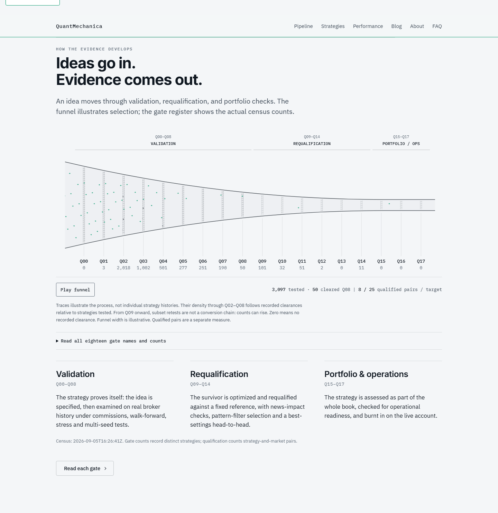

# Funnel v2 — curved walls and emerald flow — REVIEW

Date: 2026-09-06. Router task: `c821067c-f20e-4bb1-9a15-ed40520f4344`.
Local preview: `http://127.0.0.1:8772/`.

Changed only the deploy copy's
`C:/QM/deploy/qm-ops-refresh/tools/site-build/homepage-v4/scripts/qm-funnel.js`.
The complete changed file is preserved as
[the review source](2026-09-06_funnel_v2_qm-funnel.js). No shared `style.css`
edit, push, Netlify action or deploy occurred. The existing deployment hold
`OWNER-DEC-WEBSITE-DEPLOY-20260905` remains in force.

The walls now follow a smooth concave profile, expressed as cubic Bezier curves
with a horizontal tangent into the short outlet. The clipping boundary, sieves
and particles share that same radius function. The mouth ellipse is removed,
leaving an open inlet. Small three-pixel-diameter emerald particles with short,
faint tails make selection visible without dominating the gate labels.

The funnel reads the CEO's existing `--accent` token, resolved to `#059669`,
with a `#12b981` fallback. The wash is neutral steel-gray on the paper ground.
PASS/FAIL tokens are untouched. I rejected a bottle-like shoulder, a straight
trapezoid, decorative ellipse, and large green particles: each would distract
from the gate instrument. The curve is deliberately restrained so all eighteen
gate labels and counts remain readable.

The public census remains the sole data source: `public-data/funnel-stats.json`,
snapshot 2026-09-05T16:26:41Z. Three phases and all eighteen counts match it;
3,097 tested, 50 cleared Q08, and 8/25 qualified pairs are preserved. Later
subset counts are not presented as a monotonically decreasing conversion chain.

## Visual evidence

Paused/rest state:

Mid-animation:

## Verification

Headless Chrome rendered the local page through CDP. Both screenshots were
visually inspected. The [browser receipt](2026-09-06_funnel_v2_verification.json)
and [reproduction probe](2026-09-06_funnel_v2_probe.js) record:

- 18 gate rows, 3 phases, exact public-data count alignment and inherited emerald.
- A curved midpoint radius of 43.25px versus the old linear 70.5px.
- A visible paused frame with 116,070 nontransparent canvas pixels; normal motion
  advances through the actual Play control.
- Reduced-motion preference stops requestAnimationFrame completely while keeping
  the diagram visible. The control reports “Motion reduced”; normal mode retains
  the Play/Pause control and saved pause preference.
- At a 390px viewport, no document overflow; the instrument scrolls horizontally
  within its own region and the full 18-row register remains accessible.
- No browser runtime exceptions and no private-path/terminal/EA-ID/parameter/
  ticket/magic tokens in rendered funnel text. Census and artifact hashes recorded.
- `node --check` passes. The local file was already untracked in the deploy
  checkout, so its complete source is archived here rather than claiming a
  tracked Git diff. Evidence is committed only on `agents/board-advisor`.

The disposable headless browser was closed after capture. Existing preview
server and trading terminals were not controlled. This handoff stays REVIEW.
