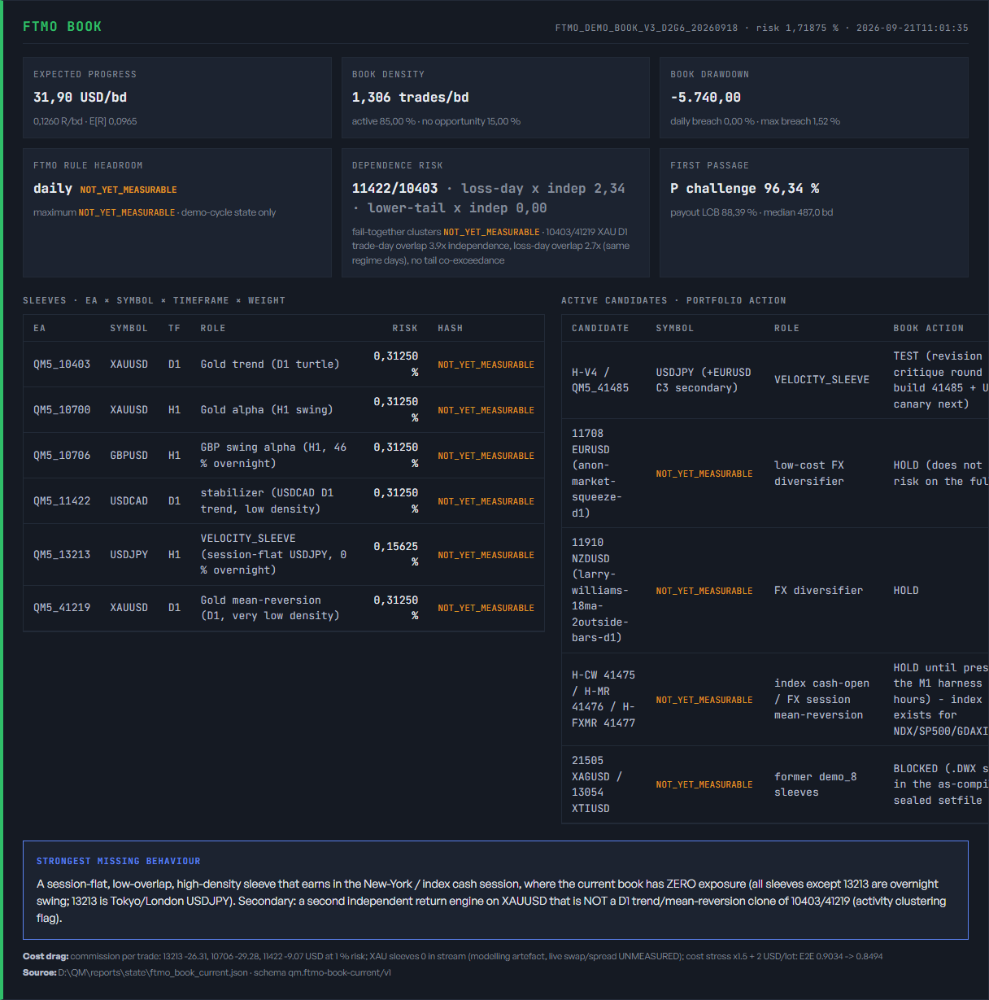

# Mission Control FTMO BOOK panel

Router task: `1a5da47c-523c-4f79-b236-25839ac15c2c`  
Decision: `OWNER-DEC-FTMO-BOOK-PORTFOLIO-20260921`  
Code branch: `agents/codex-ftmo-book-20260921`  
Code commit: `f507e68431` (`feat(cockpit): add FTMO book panel`)

## Result

`render_cockpit_v2.py`, the primary `cockpit.html` renderer, now reads
`D:/QM/reports/state/ftmo_book_current.json` under the exact schema
`qm.ftmo-book-current/v1` and renders an account-level **FTMO BOOK** panel.

The panel includes:

- sleeves with EA, symbol, timeframe, role, risk weight, and bound-hash short form;
- active candidates with portfolio action;
- expected progress in USD/bd and R/bd;
- trade density, active-day share, and time with no opportunity;
- book drawdown and Daily/Maximum Loss breach probabilities;
- FTMO Daily/Maximum Loss headroom from the demo-cycle state only;
- top fail-together pair, cluster count, and tail-dependence summary;
- `P_CHALLENGE_PASS`, `P_FIRST_NET_FTMO_PAYOUT_LCB`, and median business days;
- the strongest missing portfolio behaviour and cost-drag statement.

Absent fields are rendered as `NOT_YET_MEASURABLE`; they are never blank or
zero-filled. Missing, unreadable, non-object, and wrong-schema state renders as
`EVIDENCE_MISSING`. All state-supplied strings are HTML-escaped.

The current Fable v1 state does not yet contain sleeve hashes, demo-cycle rule
headroom, or a fail-together cluster count, so the rendered evidence correctly
shows those fields as `NOT_YET_MEASURABLE`.

## Rendered evidence

- Screenshot: `docs/ops/evidence/2026-09-21_mission_control_ftmo_book_panel/ftmo_book_panel.png`
- Screenshot SHA-256: `98c61ff7ccc46390ee47f8551065e00b06bf18f75325aa11bcc4a3f34dc8f20a`
- Bound state SHA-256: `a476014bcd5f1416916b7b88b3582982dedc22a103bc4fca2797fd59ca1041d1`
- Scratch rendered HTML SHA-256: `996f04332b80ee1dfaf4cd381fa0afabc1c0b47247aa81f700441ca78077cd0a`
- Screenshot capture hid the existing sticky control strip so it would not obscure
  the panel while Playwright scrolled the element into view. No dashboard output
  or operational state was overwritten.

## Fixture and verification

- Fixture: `tools/strategy_farm/tests/fixtures/ftmo_book_current_v1.json`
- Fixture SHA-256: `0f18c7a748e4c1de57826fd913a9cd07514c6fb57e6d23075047084c732acc30`
- Tests: `tools/strategy_farm/tests/test_render_cockpit_ftmo_book.py`
- `python -m py_compile tools/strategy_farm/render_cockpit_v2.py` — PASS
- `python -m pytest -q tools/strategy_farm/tests/test_render_cockpit_ftmo_book.py` — **4 passed**
- `python -m pytest -q tools/strategy_farm/tests/test_render_cockpit_v2.py -k "not twentyfive_is_no_longer_an_objective_string"` — **30 passed, 1 deselected**
- Full combined renderer run — **34 passed, 1 unrelated failure**. The existing
  `test_twentyfive_is_no_longer_an_objective_string` reads the live
  `factory_population.json`, whose current resource-feasible display is `/25`;
  the failure is outside the FTMO BOOK panel and was not changed by this task.
- Scratch render against current read models — PASS (`108311` HTML bytes), with
  no write to `D:/QM/strategy_farm/dashboards/cockpit.html`.

## Scope and safety

This change is renderer-only and read-only toward the farm database, terminals,
T_Live, and the FTMO demo. It creates no cards, work rows, deployments, or gate
changes and introduces no non-Q phase names.
