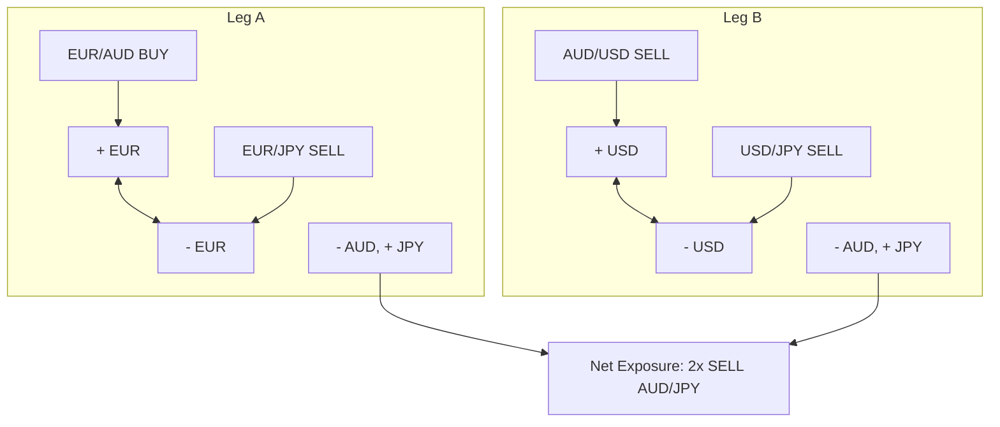

# Reverse-Engineering Report: Unconventional Forex 'T-WIN' & 'U.F.O.' Basket Hedging Strategy
**Developer Profile:** Dr. M. Giavon (Bachelor of Economics & Commerce)  
**Source Channel:** *Unconventional Forex Trading*  
**Research Batch:** 01  

This report provides a detailed mathematical and structural decomposition of the proprietary trading methodology presented in the following videos:
*   [gU9bjAiaGVo](https://www.youtube.com/watch?v=gU9bjAiaGVo) — *Forex hedging technique: trading workflow example*
*   [up3EDNT73ok](https://www.youtube.com/watch?v=up3EDNT73ok) — *Unconventional Forex day trading education - presentation*
*   [BbzS6maxdAk](https://www.youtube.com/watch?v=BbzS6maxdAk) — *Foreign Exchange market Education: Support and Resistance levels in retail Forex day trading*
*   [Fy0sfTpn2FY](https://www.youtube.com/watch?v=Fy0sfTpn2FY) — *Forex automated trading software system review: an Expert Advisor for MT4*

Cleaned transcript source text files generated for reference:
*   [webinar_workflow_clean.txt](file:///C:/QM/repo/webinar_workflow_clean.txt)
*   [day_trading_presentation_clean.txt](file:///C:/QM/repo/day_trading_presentation_clean.txt)
*   [support_resistance_levels_clean.txt](file:///C:/QM/repo/support_resistance_levels_clean.txt)
*   [automated_ea_review_clean.txt](file:///C:/QM/repo/automated_ea_review_clean.txt)

---

## 1. Core Philosophy: "Trade What Is Not" (T-WIN)

The core principle behind "Trade What Is Not" is that retail traders lose because they utilize obsolete, lagging technical indicators on individual pairs. Instead, the T-WIN strategy:
*   Analyzes the **8 major currencies** individually (USD, EUR, GBP, AUD, JPY, CAD, CHF, NZD) across all **28 cross pairs** to isolate absolute strength/weakness.
*   Trades synthetic baskets of 4 pairs rather than trading a single cross pair directly. This is done to diversify risk, reduce volatility, and exploit currency divergences.
*   Focuses on **correlation and currency strength divergence**, seeking the most probable combination of the absolute strongest and weakest currencies.

---

## 2. Currency Pairs & Basket Composition

Rather than opening a single position on a pair (e.g., Sell AUD/JPY), the strategy opens a **4-pair basket** that synthetically replicates the desired exposure. The intermediate currency exposures (usually EUR and USD) net out to zero.

### Case A: Target Trade is Sell AUD/JPY (Weak AUD, Strong JPY)
*As demonstrated in the video [webinar_workflow_clean.txt](file:///C:/QM/repo/webinar_workflow_clean.txt#L56-L74) (timestamps [03:37] to [04:28]):*

The basket consists of:
1.  **EUR/AUD: BUY** (Long EUR, Short AUD)
2.  **EUR/JPY: SELL** (Short EUR, Long JPY)
    *   *Leg A Net*: Short AUD, Long JPY (Synthetic Sell AUD/JPY)
3.  **AUD/USD: SELL** (Short AUD, Long USD)
4.  **USD/JPY: SELL** (Short USD, Long JPY)
    *   *Leg B Net*: Short AUD, Long JPY (Synthetic Sell AUD/JPY)

### Case B: Target Trade is Buy GBP/AUD (Strong GBP, Weak AUD)
*As demonstrated in [support_resistance_levels_clean.txt](file:///C:/QM/repo/support_resistance_levels_clean.txt#L28-L44) (timestamps [02:13] to [03:16]):*

The basket consists of:
1.  **EUR/AUD: BUY** (Long EUR, Short AUD)
2.  **EUR/GBP: SELL** (Short EUR, Long GBP)
    *   *Leg A Net*: Long GBP, Short AUD (Synthetic Buy GBP/AUD)
3.  **GBP/USD: BUY** (Long GBP, Short USD)
4.  **AUD/USD: SELL** (Short AUD, Long USD)
    *   *Leg B Net*: Long GBP, Short AUD (Synthetic Buy GBP/AUD)

> [!NOTE]
> By splitting a position into a 4-pair basket, the trader spreads liquidity and correlation risk. Symmetrical legs hedge against sudden localized spikes in intermediate currencies (EUR, USD).

---

## 3. Mathematical Analysis & Excel Formulas

The strategy's decision engine relies on feeding real-time MetaTrader 4 tick data into Excel via DDE/RTD.

### Dynamic "Market Performance" Indexing
*   **Reference Point:** The starting point of the daily calculation is **midnight** (Broker Time) (confirmed in [support_resistance_levels_clean.txt](file:///C:/QM/repo/support_resistance_levels_clean.txt#L147-L148) at [09:25]).
*   **Formula Logic:** The index measures the percentage change of each pair from its daily open price at midnight:
    $$\text{Performance} (\%) = \frac{\text{Price}_{\text{Current}} - \text{Price}_{\text{Midnight}}}{\text{Price}_{\text{Midnight}}} \times 100$$
*   **Isolating Individual Currency Strength:**
    The absolute strength of a single currency (e.g., JPY) is isolated by summing its performance across all pairs in which it is traded. For example:
    $$\text{Strength}_{\text{JPY}} = -\text{Perf}_{\text{USD/JPY}} - \text{Perf}_{\text{EUR/JPY}} - \text{Perf}_{\text{GBP/JPY}} - \text{Perf}_{\text{AUD/JPY}} \dots$$
    *(Note: Negative signs are used when JPY is the quote currency).*

### Mathematical Support & Resistance Calculation
*   Standard chart support/resistance lines are rejected as "subjective" ([support_resistance_levels_clean.txt](file:///C:/QM/repo/support_resistance_levels_clean.txt#L61-L64) at [04:42]).
*   Instead, **cross-correlation support/resistance** is derived by identifying the price levels of the market's absolute strongest and weakest pairs.
*   *Example:* The weakest pair, such as AUD/NZD, acts as a primary liquidity support line for EUR/USD because the money flow cycles through these base assets.

---

## 4. Entry & Exit Rules

### Entry Logic
1.  **Divergence Detection:** The Excel engine monitors the 8 currency strength scores. It identifies when a divergence occurs (one currency is extremely strong, while another is extremely weak).
2.  **Permutations Verification:** The system computes the permutations of the cross pairs to confirm that the strength is systemic rather than an isolated spike.
3.  **Basket Execution:** The 4 orders representing the synthetic trade are injected simultaneously into MT4 ([support_resistance_levels_clean.txt](file:///C:/QM/repo/support_resistance_levels_clean.txt#L84-L89) at [05:45]).

### Exit & Management Logic
*   **Hedged Profit Target:** Trades are managed as a combined portfolio. The basket is closed as a group when the aggregate net profit reaches a target threshold.
*   **Correlation Shift:** If the Excel engine detects that the absolute strength rankings are shifting (e.g., the weak currency starts strengthening or a new currency gains momentum), the basket is closed immediately ([webinar_workflow_clean.txt](file:///C:/QM/repo/webinar_workflow_clean.txt#L143-L146) at [09:40]).

---

## 5. Timeframe, Session & Risk Management

### Timeframe & Trading Session
*   **Timeframe:** Daily charts are used to identify the core currency strength relationships ([webinar_workflow_clean.txt](file:///C:/QM/repo/webinar_workflow_clean.txt#L21) at [01:38]). Lower timeframes (M5, H1) are used for monitoring execution.
*   **Trading Session:** London Open / early morning (approx. 8:40 AM to 9:00 AM Europe/Broker time).
*   **Constraint:** Do not trade at the end of the market on Friday afternoons ([webinar_workflow_clean.txt](file:///C:/QM/repo/webinar_workflow_clean.txt#L22-L24) at [01:40]).

### Risk & Sizing Rules
*   **Position Sizing:** Micro-lots of **0.01 lots** are used ([automated_ea_review_clean.txt](file:///C:/QM/repo/automated_ea_review_clean.txt#L70) at [04:52]).
*   **Grid scaling:** Multiple 0.01 lot positions are added at close intervals at support/resistance levels rather than trading one large block.
*   **Maximum Retracement:** Drawdowns of **30 to 50 pips** are considered normal and acceptable ([automated_ea_review_clean.txt](file:///C:/QM/repo/automated_ea_review_clean.txt#L225-L227) at [13:32]) due to the hedging and correlation buffering. Symmetrical pairs offset each other's losses.
*   **Tight Stop Losses / Hedging Recovery:** Positions can be protected with tight stop-losses, or recovery baskets can be opened if a key correlation channel is breached.

---

## 6. Expert Advisor (EA) Parameters & Settings

The custom Expert Advisor (referred to as **u.U.F.O.** / **S.A.T.O.R.I.**) displays the following on-screen features:
*   **Dynamic Support/Resistance Levels:** Calculated mathematically using multi-pair high/low data.
*   **Directional Arrows:** Displays direction bias based on the Excel currency matrix calculations.
*   **Money Management Dashboard:** Monitors:
    *   Lowest and highest performing pairs in the basket.
    *   Hedged state (identifies if the group is currently "hedged in profit" or "hedged in loss" in real-time).
*   **Synergistic Algorithms:** Contains 5 synergistic algorithms running tick-by-tick to place stop and limit pending orders.
*   **Visual Trend Shading:** Color overlays on the chart (e.g., green for buying environment, red for selling pressure) to signal changes in momentum.
*   **Low Resource Footprint:** Designed to run simultaneously on up to 30 charts without performance degradation.
