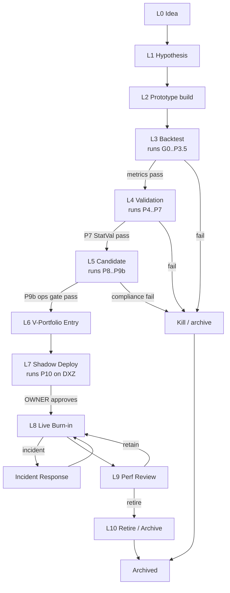

# 01 — EA Life-Cycle (L0 → L10)

The 11-phase journey an expert advisor takes from idea to retirement, **distinct from the methodological validation pipeline** (G0..P10) at [PIPELINE_PHASE_SPEC.md](../docs/ops/PIPELINE_PHASE_SPEC.md).

> **Phase-label disambiguation (V5).** Lifecycle labels here are `L0 … L10` (organizational journey: idea → retire). The methodological pipeline at [PIPELINE_PHASE_SPEC.md](../docs/ops/PIPELINE_PHASE_SPEC.md) uses `G0 … P10` (validation methodology: Research Intake → Shadow Deploy). Same numbers no longer collide — `L` is lifecycle, `G/P` is pipeline. The **pipeline runs inside lifecycle phases L3–L5** (validation, candidate, portfolio entry); see § Pipeline integration.

## Trigger

- New strategy hypothesis from [Research](/QUA/agents/research) (Wave 0) — sourced from approved Strategy Cards
- Re-entry of a previously killed EA with new evidence (CEO decision)
- External input (OWNER directive, marketplace signal, post-mortem learning)

## Actors (V5 hires)

This table reflects the **2026-04-27 hiring state** (Wave 0 + Wave 1 live; Wave 2/3/4/5 placeholders). Where a wave-2+ role is not yet hired, the **Interim** column names the active V5 agent absorbing the duty until that role lands. See [`docs/ops/AGENT_SKILL_MATRIX.md`](../docs/ops/AGENT_SKILL_MATRIX.md) for wave triggers.

| Phase | Owner | Support | Interim (until hired) |
|-------|-------|---------|-----------------------|
| L0 Idea | [Research](/QUA/agents/research) | [CEO](/QUA/agents/ceo) | — |
| L1 Hypothesis | [Research](/QUA/agents/research) | [CTO](/QUA/agents/cto) | — |
| L2 Prototype | Development *(Wave 2)* | [CTO](/QUA/agents/cto) | CTO owns until Development is hired |
| L3 Backtest / Pipeline G0–P3 | [Pipeline-Operator](/QUA/agents/pipeline-operator) | Quality-Tech *(Wave 2)* | CTO covers Quality-Tech review until Wave 2 |
| L4 Validation Pipeline P4–P7 | [Pipeline-Operator](/QUA/agents/pipeline-operator) | Quality-Tech *(Wave 2)* | CTO covers review until Wave 2 |
| L5 Candidate (P8–P9b) | [Pipeline-Operator](/QUA/agents/pipeline-operator) | Quality-Business *(Wave 2)* | CEO covers business gate until Wave 2 |
| L6 V-Portfolio Entry | [Pipeline-Operator](/QUA/agents/pipeline-operator) | [CTO](/QUA/agents/cto) | — |
| L7 Shadow Deploy (Pipeline P10) | [DevOps](/QUA/agents/devops) | Observability-SRE *(Wave 3)* | DevOps covers Obs-SRE until Wave 3 |
| L8 Live Burn-in (DXZ) | LiveOps *(Wave 4)* | Observability-SRE *(Wave 3)* | OWNER + DevOps until LiveOps hired |
| L9 Performance Review | Controlling *(Wave 3)* | [CEO](/QUA/agents/ceo) | CEO covers Controlling until Wave 3 |
| L10 Retire / Archive | [CTO](/QUA/agents/cto) | [Documentation-KM](/QUA/agents/documentation-km) | — |

**Wave reference (per `decisions/2026-04-27_v5_org_proposal.md`):** Wave 0 = CEO/CTO/Research/Documentation-KM; Wave 1 = DevOps/Pipeline-Operator; Wave 2 = Quality-Tech/Development/Quality-Business (gated on PC1-00 + framework steps 1–5); Wave 3 = Controlling/Observability-SRE; Wave 4 = LiveOps; Wave 5 = R-and-D; Wave 6 = Chief of Staff (deferred).

## Pipeline integration

The lifecycle is the **outer journey**; the methodological pipeline (G0..P10) is the **inner validation engine** that runs while an EA sits in lifecycle phases L3–L7.

| Lifecycle phase | Pipeline phases run inside |
|-----------------|----------------------------|
| L3 Backtest | G0 Research Intake → P1 Build Validation → P2 Baseline → P3 Sweep → P3.5 CSR |
| L4 Validation | P4 Walk-Forward → P5 Stress Test → P5b Calibrated Noise → P5c Crisis Slices → P6 Multi-Seed → P7 StatVal |
| L5 Candidate | P8 News Impact → P9 Portfolio Construction → P9b Operational Readiness |
| L7 Shadow Deploy | P10 Shadow Deploy |

Per `decisions/2026-04-26_dxz_live_only_and_p10_live_burn_in.md`, P10 in V5 is **live shadow deploy on DarwinexZero** (no separate paper-trade gate). L7 → L8 transition is gated on OWNER approval per CLAUDE.md hard rule.

## Steps

## Exits

- **Success:** EA reaches L10 after a meaningful live-equity contribution, retired with documented learnings archived by [Documentation-KM](/QUA/agents/documentation-km).
- **Escalation:** Any gate-fail at L3/L4/L5 auto-creates an issue for [CEO](/QUA/agents/ceo) if it invalidates a strategic thesis; deploy decisions (L7→L8) always escalate to OWNER per [12-board-escalation.md](12-board-escalation.md) class 5.
- **Kill:** Backtest fail (L3), validation fail (L4), compliance fail (L5), or repeated incidents (L8) all drop to `KILL`.

## SLA

- **L0 → L3:** variable, research-paced; no hard SLA.
- **L3 → L4 handoff:** within 1 business day of pipeline-P3.5 metrics-pass.
- **L4 validation run:** budget per pipeline phase per `docs/ops/PIPELINE_PHASE_SPEC.md`.
- **L6 → L7:** within 2 business days of V-Portfolio entry.
- **L7 → L8 (OWNER deploy approval):** OWNER cadence; agents do not deploy on silence.
- **L8 live monitoring:** continuous; see [04-incident-response.md](04-incident-response.md).
- **L9 review:** monthly cadence; CEO covers until Controlling (Wave 3) is hired.

## References

- **Methodological pipeline (G0..P10):** [`docs/ops/PIPELINE_PHASE_SPEC.md`](../docs/ops/PIPELINE_PHASE_SPEC.md)
- **V5 hire plan / wave triggers:** [`decisions/2026-04-27_v5_org_proposal.md`](../decisions/2026-04-27_v5_org_proposal.md), [`docs/ops/AGENT_SKILL_MATRIX.md`](../docs/ops/AGENT_SKILL_MATRIX.md)
- **Org self-design model:** [`docs/ops/ORG_SELF_DESIGN_MODEL.md`](../docs/ops/ORG_SELF_DESIGN_MODEL.md)
- **DXZ-only deploy + P10 live burn-in:** [`decisions/2026-04-26_dxz_live_only_and_p10_live_burn_in.md`](../decisions/2026-04-26_dxz_live_only_and_p10_live_burn_in.md)
- **T6 boundary (deploy permitted, AutoTrading manual):** `CLAUDE.md` § Hard Boundaries (per OWNER 2026-04-27)
- **Process registry:** [`process_registry.md`](process_registry.md)
- **Cross-process links:** [02-zt-recovery.md](02-zt-recovery.md), [03-v-portfolio-deploy.md](03-v-portfolio-deploy.md), [04-incident-response.md](04-incident-response.md), [12-board-escalation.md](12-board-escalation.md)
