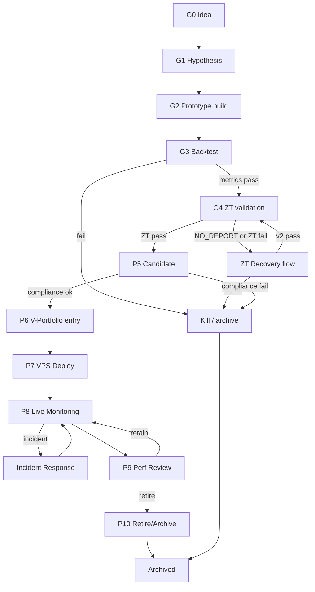

# 01 — EA Life-Cycle (G0 → P10)

The 10-phase journey an expert advisor takes from idea to live portfolio allocation.

> ⚠️ **Phase-label scope:** The `G0 … P10` labels on this page describe the **organisational lifecycle** an EA moves through (idea → live portfolio → retire). They are **not the same as** the `G0 … P10` labels in the **methodological pipeline** at `.claude/rules/pipeline-v2-1.md` (e.g. pipeline `P5 = Stress Test`, lifecycle `P5 = Candidate`; pipeline `P7 = Statistical Validation`, lifecycle `P7 = VPS Deploy`). Same symbols, two axes. When citing a phase in cross-cutting discussion, qualify it as "lifecycle P5" or "pipeline P5". See the Pipeline V2.1 phase table under [References](#references).

## Trigger

- New strategy hypothesis from [R-and-D](/QUAA/agents/r-and-d) or [Research](/QUAA/agents/research)
- Re-entry of a previously killed EA with new evidence
- External input (board directive, marketplace signal, post-mortem learning)

## Actors

| Phase | Owner | Support |
|-------|-------|---------|
| G0 Idea | [R-and-D](/QUAA/agents/r-and-d) | [Research](/QUAA/agents/research) |
| G1 Hypothesis | [R-and-D](/QUAA/agents/r-and-d) | [Strategy-Analyst](/QUAA/agents/strategy-analyst) |
| G2 Prototype | [Development](/QUAA/agents/development) | [R-and-D](/QUAA/agents/r-and-d) |
| G3 Backtest | [Pipeline-Operator](/QUAA/agents/pipeline-operator) | [Strategy-Analyst](/QUAA/agents/strategy-analyst) |
| G4 Zero-Trust Validation (ZT) | [Strategy-Analyst](/QUAA/agents/strategy-analyst) | [Quality-Tech](/QUAA/agents/quality-tech) |
| P5 Candidate | [Pipeline-Operator](/QUAA/agents/pipeline-operator) | [Quality-Business](/QUAA/agents/quality-business) |
| P6 V-Portfolio entry | [Pipeline-Operator](/QUAA/agents/pipeline-operator) | [CTO](/QUAA/agents/cto) |
| P7 VPS Deploy | [DevOps](/QUAA/agents/devops) | [Observability-SRE](/QUAA/agents/observability-sre) |
| P8 Live Monitoring | [Observability-SRE](/QUAA/agents/observability-sre) | [Strategy-Analyst](/QUAA/agents/strategy-analyst) |
| P9 Performance Review | [Controlling](/QUAA/agents/controlling) | [CEO](/QUAA/agents/ceo) |
| P10 Retire / Archive | [CTO](/QUAA/agents/cto) | [Documentation-KM](/QUAA/agents/documentation-km) |

## Steps

## Exits

- **Success:** EA reaches P10 after a meaningful live-equity contribution, retired with documented learnings archived by [Documentation-KM](/QUAA/agents/documentation-km).
- **Escalation:** Any gate-fail at G3/G4/P5 auto-creates an issue for [CEO](/QUAA/agents/ceo) if it invalidates a strategic thesis.
- **Kill:** Backtest fail (G3), ZT v2 fail (G4), compliance fail (P5), or repeated incidents (P8) all drop to `KILL`.

## SLA

- **G0 → G3:** variable, research-paced; no hard SLA.
- **G3 → G4 handoff:** within 1 business day of metrics-pass.
- **G4 ZT run:** one scheduled run per candidate; NO_REPORT handled within 24h per [02-zt-recovery.md](02-zt-recovery.md).
- **P6 → P7:** within 2 business days of V-Portfolio entry.
- **P8 live monitoring:** continuous; see [04-incident-response.md](04-incident-response.md).
- **P9 review:** monthly cadence driven by [Controlling](/QUAA/agents/controlling).

## References

- Org spec: `Company/QUANTMECHANICA_ORG_SPEC_v1.2.md`
- **Pipeline V2.1 phase table (methodological, disjoint from the lifecycle labels above):** `.claude/rules/pipeline-v2-1.md` (G0 Research Intake, P1 Build Validation, P2 Baseline, P3 Sweep, P3.5 CSR, P4 Walk-Forward, P5 Stress Test, P5b Calibrated Noise, P5c Crisis Slices, P6 Multi-Seed, P7 StatVal, P8 News Impact, P9 Portfolio Construction, P9b Operational Readiness, P10 Shadow Deploy).
- ZT recovery: [02-zt-recovery.md](02-zt-recovery.md)
- V-Portfolio deploy: [03-v-portfolio-deploy.md](03-v-portfolio-deploy.md)
- Incident response: [04-incident-response.md](04-incident-response.md)
