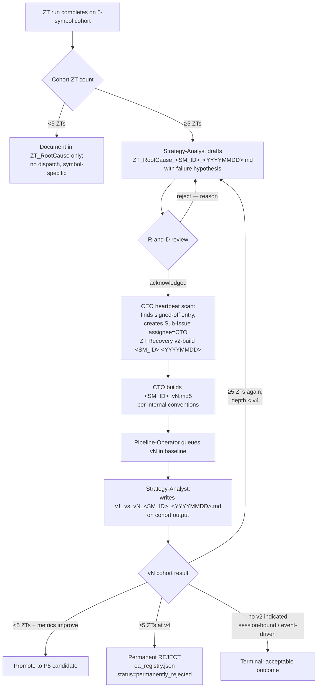

# 02 — ZT / NO_REPORT Recovery Flow

Recovers strategies whose Zero-Trust (ZT) validation run produced NO_REPORT / zero-trade outcomes. Enforced by `CLAUDE.md` § "ZT Recovery Protocol" and anchored in [QUAA-129](/QUAA/issues/QUAA-129).

Rule: **analyze-and-propose, not auto-rebuild.** ZT / NO_REPORT EAs are never silently eliminated. The protocol is a pipeline for proposals — `no v2 indicated` is an acceptable outcome for session-bound / event-driven designs.

## Trigger

- ZT scheduled run for an EA candidate yields `NO_REPORT` (no artifact produced), or
- ZT produced a report but the trade sample is empty / clustered (zero-trade cluster)

## Cohort threshold (board policy 2026-04-19)

The full dispatch chain only fires when **N ≥ 5 ZT-detections across the 5-symbol baseline cohort** (3 Forex pairs + Gold + 1 Index). Below 5 = symbol-specific noise, not a strategy defect → no automatic dispatch, `ZT_RootCause` documentation only.

Rationale: the 5-symbol baseline is the canonical cohort. Anything under 5 means the failure is isolated to one or two symbols, which is a symbol-parameter concern, not an EA-edge concern.

## Iteration policy (max depth)

- v1 → v2: after N ≥ 5 ZTs on v1 across cohort
- v2 → v3: after N ≥ 5 ZTs on v2
- v3 → v4: same threshold
- **Hard cap: v4.** If v4 also shows N ≥ 5 ZTs → **permanent REJECT**. Flag in `Company/data/ea_registry.json` as `status: "permanently_rejected"` with `rejection_reason: "zt_cohort_after_v4"`; EA is never auto-requeued.

After four iterations the edge is either absent or the hypothesis is fundamentally wrong — further rebuilds are unlikely to produce signal and consume pipeline budget.

## Actors + signoff gate

- [Strategy-Analyst](/QUAA/agents/strategy-analyst) — detects the ZT cohort, writes the **draft** failure hypothesis in `ZT_RootCause_<ea>_<YYYYMMDD>.md`. Does **not** file the CEO dispatch directly; must wait for R-and-D signoff.
- [R-and-D](/QUAA/agents/r-and-d) — **reviews and signs off** the Strategy-Analyst hypothesis before CEO is allowed to dispatch. R-and-D comments on the `ZT_RootCause` file or an escalation issue with either:
  - `acknowledged` (hypothesis accepted → CEO may dispatch), or
  - `reject — <reason>` (hypothesis rejected; Strategy-Analyst iterates).
  If Strategy-Analyst and R-and-D cannot reach agreement, both positions are escalated to [CEO](/QUAA/agents/ceo) as a tie-break.
- [CEO](/QUAA/agents/ceo) — on every heartbeat scans `Company/Analysis/ZT_RootCause_*` for entries that carry R-and-D signoff. For each signed-off, cohort-≥5 entry, creates a **Sub-Issue assignee = [CTO](/QUAA/agents/cto)** titled `ZT Recovery v2-build <SM_ID> <YYYYMMDD>` with a link to the RootCause doc. Does not skip the signoff gate.
- [CTO](/QUAA/agents/cto) — builds the v2 EA (`<SM_ID>_v2.mq5`) per internal conventions.
- [Pipeline-Operator](/QUAA/agents/pipeline-operator) — queues the v2 in baseline once `.ex5` is compiled; logs recovery lineage.
- Loop-back: Strategy-Analyst re-evaluates v2 baseline output. If v2 again trips N ≥ 5 on cohort, re-enter the chain at step 1 (Strategy-Analyst draft → R-and-D signoff → CEO dispatch for v3). Continues up to v4 per iteration policy above.

[Quality-Tech](/QUAA/agents/quality-tech) participates **on request** (not by default) — e.g. when R-and-D's v2 proposal needs a prompt / spec / deterministic-behaviour review before CTO implements it. See [01-ea-lifecycle.md](01-ea-lifecycle.md) Actors table (G4 Support) for the lifecycle-side view of the same role.

## Steps (sequential, not parallel)

## Exits

- **Pass:** vN baseline trips <5 ZTs on cohort AND metrics improve over v(N-1) → promoted to P5 candidate; dispatch parent closed with the linked `v1_vs_vN` comparison.
- **No v2 indicated (acceptable):** R-and-D rejects the Strategy-Analyst hypothesis with `reject — session-bound/event-driven` or similar terminal reason. No CEO dispatch occurs; documented in `ZT_RootCause` as terminal.
- **Below-threshold terminal:** Cohort shows <5 ZTs on v1. No dispatch, no v2. Documented in `ZT_RootCause` as symbol-specific.
- **Permanent REJECT:** v4 still trips ≥5 ZTs on cohort → `ea_registry.json` flagged `status: "permanently_rejected"`, `rejection_reason: "zt_cohort_after_v4"`. [Documentation-KM](/QUAA/agents/documentation-km) archives the four-version hypothesis trail so the same edge does not return without new evidence.
- **Escalation:** If diagnosis surfaces a systemic pipeline bug (affects >1 EA across different families), [Pipeline-Operator](/QUAA/agents/pipeline-operator) escalates to [CTO](/QUAA/agents/cto) via a new issue with `blockedByIssueIds` linking the dispatch parent.
- **Tie-break:** If Strategy-Analyst and R-and-D disagree on the hypothesis (no `acknowledged` signoff obtainable), both positions are posted as comments on the dispatch issue and CEO adjudicates.

## SLA

- **Detection → `ZT_RootCause` draft:** 1 heartbeat (Strategy-Analyst 15-min cadence).
- **R-and-D signoff verdict on hypothesis:** 1–2 business days.
- **CEO dispatch after signoff:** same heartbeat after scanning signed-off `ZT_RootCause_*`.
- **CTO v2 build → Pipeline-Operator v2 baseline:** 1–3 business days combined.
- **Strategy-Analyst `v1_vs_vN` comparison:** 1 heartbeat after vN baseline lands on cohort.
- **Total budget per iteration:** 5 business days from `ZT_RootCause` draft to pass / rejected / next-iteration decision. Exceeding this auto-escalates to [CEO](/QUAA/agents/ceo) + board.

## References

- Protocol source: `CLAUDE.md` § "ZT Recovery Protocol"
- Enforcement issue: [QUAA-129](/QUAA/issues/QUAA-129)
- Feedback anchor (Fabian): ZT EAs must be analysed + v2-rebuilt, never silently eliminated. Stored in the auto-memory layer at `C:/Users/fabia/.claude/projects/G--Meine-Ablage-QuantMechanica/memory/feedback_zero_trades.md` (outside the repo working tree — not reachable via relative link).
- Analysis artifacts: `Company/Analysis/ZT_RootCause_<YYYYMMDD>.md`, `Company/Analysis/v1_vs_v2_<SM_ID>_<YYYYMMDD>.md`
- Subtask A (system_prompt edits): [QUAA-132](/QUAA/issues/QUAA-132)
- Parent process: [01-ea-lifecycle.md](01-ea-lifecycle.md)
- Revision source: [QUAA-158](/QUAA/issues/QUAA-158) (follow-up from review [QUAA-151](/QUAA/issues/QUAA-151))
