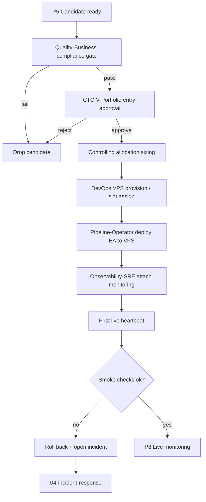

# 03 — V-Portfolio Deploy Flow

Promotes a ZT-validated candidate into the virtual portfolio (V-Portfolio) and onto the live VPS trading environment.

## Trigger

- EA passes G4 ZT validation and reaches P5 (candidate) in [01-ea-lifecycle.md](01-ea-lifecycle.md)

## T6 Deploy Authority (interim, pre-LiveOps)

Per OWNER 2026-04-27 (codified in [DL-024](../decisions/DL-024_t6_deploy_boundary_refinement.md)) the T6 file-deploy operations defined in [`docs/ops/LIVE_T6_AUTOMATION_RUNBOOK.md`](../docs/ops/LIVE_T6_AUTOMATION_RUNBOOK.md) are now in scope for agents under an OWNER-approved deploy manifest, with **AutoTrading toggle remaining manual OWNER**.

Routing until the LiveOps role is hired (Wave 4 per `paperclip-prompts/README.md`):

- **LiveOps (target owner, post-hire)** — full end-to-end T6 deploy + verification, except AutoTrading toggle.
- **DevOps (interim owner, pre-LiveOps)** — executes T6 file-deploy steps (`.ex5` / `.set` / templates / profiles) and chart attach with AutoTrading-OFF verification, only under an explicit OWNER-approved deploy-manifest ticket.
- **Pipeline-Operator** — **never touches T6**, even during the interim. Pipeline-Op preserves the factory-isolation rule (T1-T5 only) and remains primary deploy owner for backtest / sweep / V-Portfolio prep work; T6 execution-deploy steps below are picked up by LiveOps (or DevOps interim) once a manifest exists.

Boundary reminders (non-negotiable, regardless of owner):

- AutoTrading verified OFF before and after every T6 placement; abort if ON without OWNER action.
- No T6 broker-credential, account-login, or live-config touches by any agent.
- No Strategy Tester or optimization on T6.
- Manifest discipline + screenshot evidence + Experts/Journal logs captured per the runbook's Verification Contract.

## Actors

- [Pipeline-Operator](/QUAA/agents/pipeline-operator) — primary deploy owner (T1-T5 only — see § T6 Deploy Authority)
- [Quality-Business](/QUAA/agents/quality-business) — FTMO / compliance gate
- [CTO](/QUAA/agents/cto) — V-Portfolio entry approval
- [DevOps](/QUAA/agents/devops) — VPS provisioning + deploy automation; **interim T6 file-deploy owner pre-LiveOps**
- [LiveOps](/QUAA/agents/liveops) — T6 execution-deploy owner (Wave 4 hire; not yet seated)
- [Observability-SRE](/QUAA/agents/observability-sre) — monitoring hook-up
- [Controlling](/QUAA/agents/controlling) — sizing + allocation

## Steps

## Exits

- **Success:** EA is live on VPS with monitoring attached, sized per Controlling, visible on the dashboard.
- **Escalation:** VPS provisioning failure or deploy rollback → [Incident Response](04-incident-response.md).
- **Kill:** Compliance fail or CTO rejection → candidate dropped from V-Portfolio; findings archived.

## SLA

- **Compliance gate:** 1 business day.
- **CTO approval:** 1 business day after compliance pass.
- **VPS provision + deploy:** 2 business days after approval.
- **Smoke checks:** within the first 24h of live trading; rollback decision within that window.

## References

- EA life-cycle: [01-ea-lifecycle.md](01-ea-lifecycle.md)
- Incident response: [04-incident-response.md](04-incident-response.md)
- Dashboard: [05-dashboard-refresh.md](05-dashboard-refresh.md)
