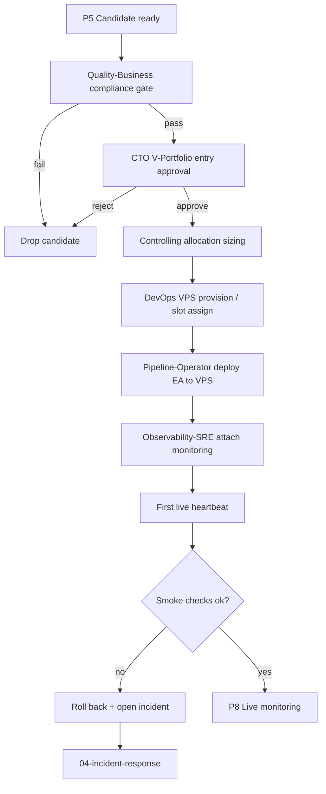

# 03 — V-Portfolio Deploy Flow

> **V5 audit (2026-04-29, [QUA-213](/QUA/issues/QUA-213) → consolidated role-rename child).** Namespace `/QUAA/` → `/QUA/`. Non-V5 role mentions annotated inline with their V5 wave / interim owner per [`decisions/2026-04-27_v5_org_proposal.md`](../decisions/2026-04-27_v5_org_proposal.md) § 6 and [`processes/process_registry.md`](process_registry.md) § "Active agents". V4 issue references kept as historical examples (no auto-rewrite). Flow content NOT changed — substantive rewrites tracked under sister children of QUA-213.

Promotes a ZT-validated candidate into the virtual portfolio (V-Portfolio) and onto the live VPS trading environment.

## Trigger

- EA passes G4 ZT validation and reaches P5 (candidate) in [01-ea-lifecycle.md](01-ea-lifecycle.md)

## Actors

- [Pipeline-Operator](/QUA/agents/pipeline-operator) — primary deploy owner
- [Quality-Business](/QUA/agents/quality-business) — FTMO / compliance gate (Wave 2 LIVE per [DL-039](../decisions/2026-04-28_quality_business_hire.md))
- [CTO](/QUA/agents/cto) — V-Portfolio entry approval
- [DevOps](/QUA/agents/devops) — VPS provisioning + deploy automation
- [Observability-SRE](/QUA/agents/observability-sre) — monitoring hook-up *(Wave 3 deferred — interim: [DevOps](/QUA/agents/devops))*
- [Controlling](/QUA/agents/controlling) — sizing + allocation *(Wave 3 deferred — interim: [CEO](/QUA/agents/ceo))*

## Steps

## Exits

- **Success:** EA is live on VPS with monitoring attached, sized per Controlling, visible on the dashboard.
- **Escalation:** VPS provisioning failure or deploy rollback → [Incident Response](04-incident-response.md).
- **Kill:** Compliance fail or CTO rejection → candidate dropped from V-Portfolio; findings archived.

## SLA

- **Compliance gate:** 1 business day.
- **CTO approval:** 1 business day after compliance pass.
- **VPS provision + deploy:** 2 business days after approval.
- **Smoke checks:** within the first 24h of live trading; rollback decision within that window.

## References

- EA life-cycle: [01-ea-lifecycle.md](01-ea-lifecycle.md)
- Incident response: [04-incident-response.md](04-incident-response.md)
- Dashboard: [05-dashboard-refresh.md](05-dashboard-refresh.md)
