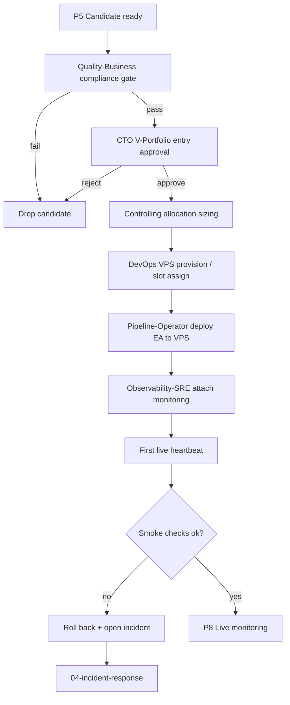

# 03 — V-Portfolio Deploy Flow

Promotes a ZT-validated candidate into the virtual portfolio (V-Portfolio) and onto the live VPS trading environment.

## Trigger

- EA passes G4 ZT validation and reaches P5 (candidate) in [01-ea-lifecycle.md](01-ea-lifecycle.md)

## Actors

- [Pipeline-Operator](/QUAA/agents/pipeline-operator) — primary deploy owner
- [Quality-Business](/QUAA/agents/quality-business) — FTMO / compliance gate
- [CTO](/QUAA/agents/cto) — V-Portfolio entry approval
- [DevOps](/QUAA/agents/devops) — VPS provisioning + deploy automation
- [Observability-SRE](/QUAA/agents/observability-sre) — monitoring hook-up
- [Controlling](/QUAA/agents/controlling) — sizing + allocation

## Steps

## Exits

- **Success:** EA is live on VPS with monitoring attached, sized per Controlling, visible on the dashboard.
- **Escalation:** VPS provisioning failure or deploy rollback → [Incident Response](04-incident-response.md).
- **Kill:** Compliance fail or CTO rejection → candidate dropped from V-Portfolio; findings archived.

## SLA

- **Compliance gate:** 1 business day.
- **CTO approval:** 1 business day after compliance pass.
- **VPS provision + deploy:** 2 business days after approval.
- **Smoke checks:** within the first 24h of live trading; rollback decision within that window.

## References

- EA life-cycle: [01-ea-lifecycle.md](01-ea-lifecycle.md)
- Incident response: [04-incident-response.md](04-incident-response.md)
- Dashboard: [05-dashboard-refresh.md](05-dashboard-refresh.md)
