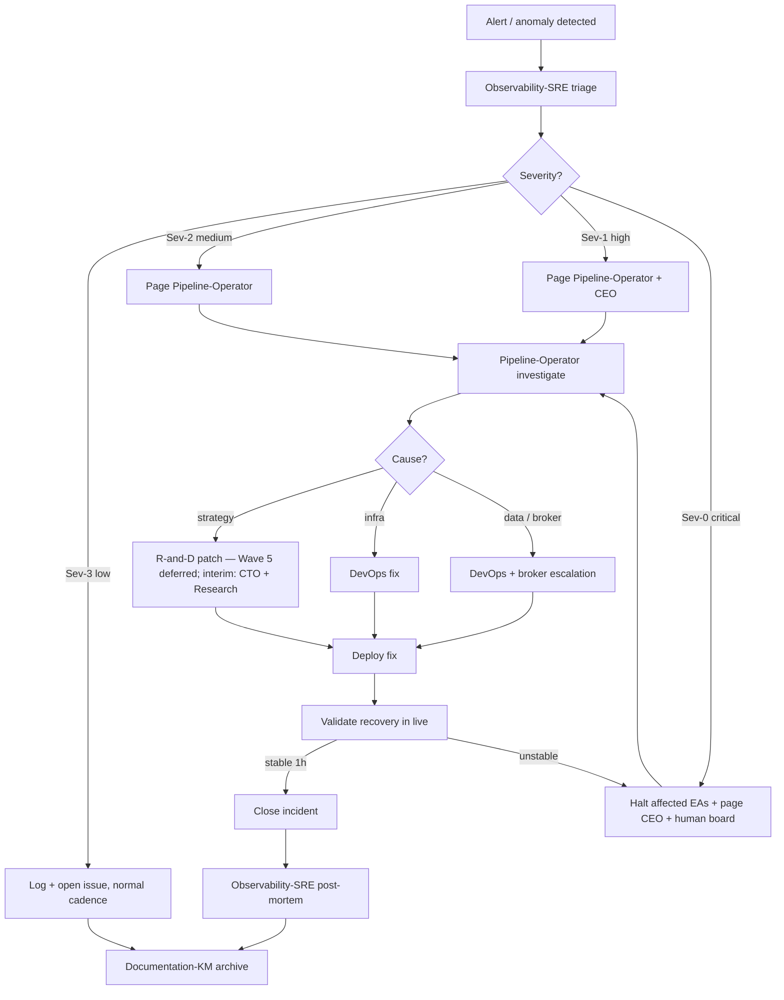

# 04 — Incident Response Flow

> **V5 audit (2026-04-29, [QUA-213](/QUA/issues/QUA-213) → consolidated role-rename child).** Namespace `/QUAA/` → `/QUA/`. Non-V5 role mentions annotated inline with their V5 wave / interim owner per [`decisions/2026-04-27_v5_org_proposal.md`](../decisions/2026-04-27_v5_org_proposal.md) § 6 and [`processes/process_registry.md`](process_registry.md) § "Active agents". V4 issue references kept as historical examples (no auto-rewrite). Flow content NOT changed — substantive rewrites tracked under sister children of QUA-213.

How a live-trading anomaly travels from detection to resolution.

## Trigger

- [Observability-SRE](/QUA/agents/observability-sre) *(Wave 3 deferred — interim: [DevOps](/QUA/agents/devops))* heartbeat detects a threshold breach (drawdown, heartbeat gap, error rate, broker disconnect)
- Manual report from board (human-observed anomaly)
- Automated alert from VPS / broker integration

## Actors

- [Observability-SRE](/QUA/agents/observability-sre) — detection, triage, post-mortem *(Wave 3 deferred — interim: [DevOps](/QUA/agents/devops))*
- [Pipeline-Operator](/QUA/agents/pipeline-operator) — live-system hands-on fix
- [DevOps](/QUA/agents/devops) — infra-side fix (VPS, network, broker adapter)
- [CEO](/QUA/agents/ceo) — cross-team coordination if impact is wide
- Human board (OWNER) — final call for kill / halt / roll-back of wide-impact incidents

## Steps

## Exits

- **Success:** EAs stable for 1h after fix, incident closed, post-mortem archived by [Documentation-KM](/QUA/agents/documentation-km).
- **Escalation:** Sev-0 always goes to human board; Sev-1+ also auto-escalates to [CEO](/QUA/agents/ceo).
- **Kill:** Repeated incidents on the same EA within a review window (owned by [Controlling](/QUA/agents/controlling) — *Wave 3 deferred; interim: [CEO](/QUA/agents/ceo)*) trigger retirement via P10 in [01-ea-lifecycle.md](01-ea-lifecycle.md).

## SLA

| Severity | Initial response | Mitigation target |
|----------|------------------|-------------------|
| Sev-0 | immediate | ≤ 1h |
| Sev-1 | ≤ 15 min | ≤ 4h |
| Sev-2 | ≤ 1h | same business day |
| Sev-3 | ≤ 1 business day | next sprint window |

## References

- Dashboard alerts feed: [05-dashboard-refresh.md](05-dashboard-refresh.md)
- Live phase: [01-ea-lifecycle.md](01-ea-lifecycle.md) (P8)
