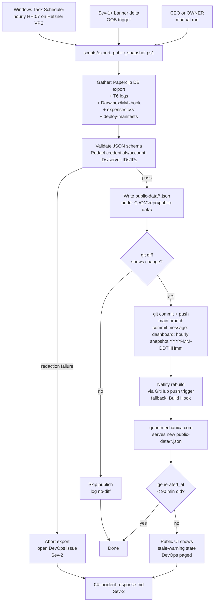

# 05 — Dashboard Refresh Cadence (V5)

> **V5 audit (2026-04-29, [QUA-213](/QUA/issues/QUA-213) → full V5 rewrite under [QUA-230](/QUA/issues/QUA-230)).** This file was rewritten end-to-end. The V4 mechanism (Strategy-Analyst routine `5d3aed1c` + V4 `project_dashboard.html` + Windows Scheduled Task `QM_ProcessesHtml_Build` rebuilding `Processes/processes.html`) is **retired** in V5 — Strategy-Analyst is not a V5 role and the local PowerShell scheduled task was disabled 2026-04-21 to stop popups. **Pending CEO ack before merge** per QUA-213 § Boundary reminder (architectural change — mechanism replacement).

How the public QuantMechanica dashboard at quantmechanica.com (and adjacent internal surfaces) stays current via an hourly VPS export → public-data JSON → Netlify rebuild path. Source-of-truth spec: [`docs/ops/WEBSITE_DASHBOARD_PAPERCLIP_STYLE.md`](../docs/ops/WEBSITE_DASHBOARD_PAPERCLIP_STYLE.md).

## Surfaces

V5 covers three distinct dashboard surfaces — do not conflate them:

| Surface | Audience | Source | Refresh trigger | Cadence | Mechanism |
|---|---|---|---|---|---|
| **quantmechanica.com / Project Dashboard** (public) | board + public | `public-data/*.json` exported from Paperclip + T6 + expenses | Windows Task Scheduler on Hetzner VPS | hourly | `scripts/export_public_snapshot.ps1` → git commit + push (only when data changed) → Netlify rebuild via GitHub push or Build Hook fallback |
| **Internal Paperclip dashboard** (private) | active agents + OWNER | Paperclip API/DB direct | Real-time UI; no export step | continuous | Paperclip server `pnpm dev` UI, served at `http://127.0.0.1:3101/` (or production equivalent) |
| **Internal docs/ops mirror** (private) | OWNER + Doc-KM | Notion → Git mirror via [`infra/notion-sync/manifest.yaml`](../infra/notion-sync/manifest.yaml) | Doc-KM nightly routine | daily 23:00 UTC | One-way Notion → `docs/notion-mirror/<slug>.md`; never pushes back |

**V4 surfaces dropped:** `project_dashboard.html` (Dashboard v3), `Processes/processes.html` (Process Landscape Scheduled Task `QM_ProcessesHtml_Build`), and Strategy-Analyst routine `5d3aed1c`. Do not recreate any of these for V5.

## Trigger

For the **public quantmechanica.com surface** (the only surface this process actively governs — internal Paperclip dashboard refresh is platform-native; Notion mirror is governed by [process_registry.md](process_registry.md) § Doc-KM nightly routine):

1. **Scheduled** — Windows Task Scheduler on the Hetzner VPS fires hourly (default `HH:07`):
   ```powershell
   powershell.exe -NoProfile -ExecutionPolicy Bypass -WindowStyle Hidden -File C:\QM\repo\scripts\export_public_snapshot.ps1
   ```
2. **Event-driven (Sev-1+ banner delta)** — Out-of-band push when a Sev-1+ condition needs to surface on the public dashboard before the next hourly slot. Until Wave 3 hires Observability-SRE, [DevOps](/QUA/agents/devops) owns the manual push by re-running the export script and forcing a Netlify deploy.
3. **Manual** — [CEO](/QUA/agents/ceo) or OWNER may invoke the export script ad-hoc for spot-checks (e.g. before a board update, episode publish, or deploy event).

Fragment-update events from Controlling (Wave 3 deferred) are folded into the hourly export job rather than triggering separate publishes — V5 does not run a separate fragment-publish path.

## Actors

- [DevOps](/QUA/agents/devops) — **Primary owner** for V5. Maintains `scripts/export_public_snapshot.ps1`, the Hetzner VPS Windows Task Scheduler entry, the public-data JSON schema, the Netlify deploy path (GitHub push trigger or Build Hook fallback), and stale-export monitoring (interim coverage of Obs-SRE Wave 3 duty).
- [Controlling](/QUA/agents/controlling) *(Wave 3 deferred — interim: [CEO](/QUA/agents/ceo) sanity-review on KPI correctness)* — KPI definitions, public-vs-private split for portfolio metrics, expense-log accuracy, drift between V5 ratified figures and exported snapshot. Until Wave 3 hires, CEO performs a weekly sanity check against `expenses.csv` / `last_check_state.json` and the latest snapshot.
- [Documentation-KM](/QUA/agents/documentation-km) — Public copy boundary (no investment claims; support/CTA isolation per [`paperclip-prompts/documentation-km.md`](../paperclip-prompts/documentation-km.md) § operating contract); redaction of credentials / account IDs / broker server IDs / IP addresses / RDP ports / raw logs from anything reaching public-data; brand-application sanity for the rendered dashboard.
- [Observability-SRE](/QUA/agents/observability-sre) *(Wave 3 deferred — interim: [DevOps](/QUA/agents/devops) cron health)* — Stale-export alert, Sev-1+ banner-delta out-of-band push. Until Wave 3 hires, DevOps checks the cron health each weekday and on any episode-publish day.
- [CEO](/QUA/agents/ceo) — Approves data-boundary changes (what becomes public), reviews any new widget content before launch, signs deploy events that change exported KPIs (e.g. T6 first deploy → `t6.status` flips from `offline` to `live`).
- OWNER — Final authority for public/private data boundary changes per [`docs/ops/WEBSITE_DASHBOARD_PAPERCLIP_STYLE.md`](../docs/ops/WEBSITE_DASHBOARD_PAPERCLIP_STYLE.md) § Launch Criteria.

## Steps



**Key invariants:**
- **No-diff is normal**, not an error. The hourly fire publishes only when data changed; same `generated_at` with same payload skips.
- **Redaction is mandatory** before write. The export script must strip credentials, account IDs, broker server IDs, IPs, RDP ports, and raw log paths. Failure is a Sev-2 abort, not a partial publish.
- **Stale rule is owned by the public UI**, not the export job. If `generated_at > 90 min`, the dashboard renders a stale-warning chip; DevOps gets paged via the cron-health check.
- **Public-vs-private split** lives in the export script, not in Netlify. Anything reaching `public-data/*.json` is by definition publishable; Netlify never gates redaction.

## Public-private boundary

Per [`paperclip-prompts/documentation-km.md`](../paperclip-prompts/documentation-km.md) § operating contract and [`docs/ops/WEBSITE_DASHBOARD_PAPERCLIP_STYLE.md`](../docs/ops/WEBSITE_DASHBOARD_PAPERCLIP_STYLE.md) § Support CTA / Internal Dashboard Extension:

**Public dashboard MUST NOT carry:**
- Account IDs, broker server IDs, IP addresses, RDP ports, raw logs, MT5 journal excerpts, OWNER personal data, deploy-manifest credentials, agent JWT secrets.
- Investment-language claims that conflict with the "DarwinexZero live-test portfolio / proof portfolio / public track record" framing per § Paperclip Live Portfolio Autonomy. Donations / Buy-Me-A-Coffee CTA must be isolated from portfolio performance claims.
- Mock or placeholder data masquerading as live state. The launch criterion is real snapshot JSON, not mock.

**Public dashboard SHOULD carry:**
- Pipeline phase counts, agent online/offline summary, latest decisions (redacted), expense totals + budget, T6 aggregate KPIs, deploy-manifest ledger (post-redaction), latest episode artifact pointer, current process roadmap excerpt.

**Internal-only extensions (never reach `public-data/*.json`):**
- Exact account IDs, open position detail, full T6 journal, raw Paperclip issue links to private docs, failed automation traces, emergency flatten controls.

Doc-KM owns the boundary check; CEO owns ratification; DevOps owns enforcement in the export script.

## Exits

- **Success:** `public-data/*.json` updated within the hourly window; quantmechanica.com reflects latest metrics within ≤ 90 min of `generated_at`; no-diff hours log a clean skip.
- **Escalation:**
  - **Stale-export (>90 min since last successful change)** → [04-incident-response.md](04-incident-response.md) Sev-2; DevOps owns fix (Wave 3 deferred Obs-SRE coverage).
  - **Redaction failure** → Sev-2 abort; DevOps issue; CEO informed if scope is "public credential leak averted".
  - **Public-vs-private boundary breach** (e.g. KPI definition drifted to expose internal-only field) → Doc-KM + CEO joint review; flow paused until corrected.
- **Kill:** N/A — this flow is always-on; OWNER can pause during maintenance windows or pre-launch via direct DevOps directive (record the pause in commit message and re-enable date).

## SLA

| Event | Target | Hard threshold |
|---|---|---|
| Hourly export run-to-write | ≤ 5 min wall-clock per hour | ≤ 15 min before stale-warning logic engages |
| Stale-export detect → page DevOps | ≤ 1 cron-health-check tick (≤ 1 hour) | 2 missed cycles = Sev-2 |
| Sev-1+ banner OOB push | ≤ 5 min from detection to Netlify deploy | ≤ 15 min |
| Manual generator (CEO / OWNER ad-hoc) | ≤ 2 min wall-clock | n/a |
| Redaction-failure abort → DevOps issue | within same export run | n/a |

## References

- V5 dashboard spec (canonical): [`docs/ops/WEBSITE_DASHBOARD_PAPERCLIP_STYLE.md`](../docs/ops/WEBSITE_DASHBOARD_PAPERCLIP_STYLE.md)
- Export script: `scripts/export_public_snapshot.ps1` (DevOps-owned; tracked separately under DevOps backlog if not yet present)
- Public-data schema example: see [`docs/ops/WEBSITE_DASHBOARD_PAPERCLIP_STYLE.md`](../docs/ops/WEBSITE_DASHBOARD_PAPERCLIP_STYLE.md) § Export Contract
- Notion mirror routine: [`infra/notion-sync/RUNBOOK.md`](../infra/notion-sync/RUNBOOK.md), [`infra/notion-sync/manifest.yaml`](../infra/notion-sync/manifest.yaml)
- Incident response (stale-export Sev-2 path): [04-incident-response.md](04-incident-response.md)
- Daily operating rhythm cross-reference: [08-daily-operating-rhythm.md](08-daily-operating-rhythm.md) *(also in V5-rewrite scope under [QUA-231](/QUA/issues/QUA-231); cross-ref to be re-synced when QUA-231 lands)*
- V5 hire plan (Wave 3 Controlling / Obs-SRE triggers): [`decisions/2026-04-27_v5_org_proposal.md`](../decisions/2026-04-27_v5_org_proposal.md) § 6
- Public-private boundary policy: [`paperclip-prompts/documentation-km.md`](../paperclip-prompts/documentation-km.md) § operating contract; OWNER-managed

## V4 anchors retired

For audit clarity, the following V4 anchors are intentionally NOT carried into V5 and must not be re-introduced without superseding this doc:

- ~~Strategy-Analyst routine `5d3aed1c`~~ (V4 role; folded into Research / Quality-Tech / CEO duties in V5)
- ~~`project_dashboard.html` (Dashboard v3)~~ (V4 surface; replaced by Netlify-rendered quantmechanica.com)
- ~~`Processes/processes.html` (Process Landscape)~~ (V4 surface; process docs now live as Markdown in `processes/` and are rendered by quantmechanica.com directly from Markdown source)
- ~~Windows Scheduled Task `QM_ProcessesHtml_Build`~~ (disabled 2026-04-21 on the local workstation; do not recreate)
- ~~`Company/scripts/build_processes_html.ps1` / `build_processes_html.py`~~ (V4 build tooling; replaced by `scripts/export_public_snapshot.ps1`)
- ~~15-min cron cadence~~ (V4 anchor; V5 cadence is hourly per spec)
