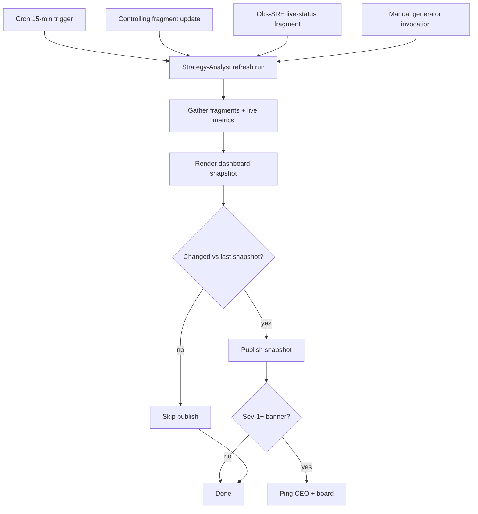

# 05 — Dashboard Refresh Cadence

How the QuantMechanica dashboard stays current. Combines a scheduled 15-minute cron, fragment refreshes from Controlling, and an on-demand manual generator.

## Surfaces and Ownership

This flow covers two distinct HTML surfaces — do not conflate them:

| Surface | Source | Refresh owner | Cadence | Mechanism |
|---|---|---|---|---|
| `project_dashboard.html` (Dashboard v3) | Strategy-Analyst routine + fragments | [Strategy-Analyst](/QUAA/agents/strategy-analyst) routine `5d3aed1c` | 15 min | Agent heartbeat |
| `Processes/processes.html` (Process Landscape) | `Company/Processes/*.md` | Windows Scheduled Task `QM_ProcessesHtml_Build` | 30 min | Guardrail rebuild (not an agent heartbeat) |

`processes.html` is rebuilt by `powershell.exe -File Company/scripts/build_processes_html.ps1 -Guardrail`, which invokes `Company/scripts/build_processes_html.py`. The guardrail compares source mtimes and skips rebuilds when `Company/Processes/*.md` + template are unchanged. [Documentation-KM](/QUAA/agents/documentation-km) owns the markdown sources and template, but **no agent is responsible for pushing the rebuild** — the Scheduled Task is the sole trigger.

> V5 local workstation status: `QM_ProcessesHtml_Build` was disabled on 2026-04-21 to stop recurring PowerShell/Python popups. Do not recreate this task for the V5 restart. The public dashboard cadence moves to the Hetzner VPS hourly export job (`export_public_snapshot.ps1`) instead.

## Trigger

- Scheduled: [Strategy-Analyst](/QUAA/agents/strategy-analyst) routine `5d3aed1c` fires every 15 minutes
- Fragment: [Controlling](/QUAA/agents/controlling) updates sizing / allocation fragments on any portfolio change
- Manual: [CEO](/QUAA/agents/ceo) or board invokes the manual generator for ad-hoc refresh
- Event-driven: [Observability-SRE](/QUAA/agents/observability-sre) publishes Sev-1+ banner deltas out-of-band

## Actors

- [Strategy-Analyst](/QUAA/agents/strategy-analyst) — primary refresh owner (routine)
- [Controlling](/QUAA/agents/controlling) — allocation / sizing fragments
- [Observability-SRE](/QUAA/agents/observability-sre) — live-status fragment
- [Documentation-KM](/QUAA/agents/documentation-km) — schema + pointer maintenance
- [CEO](/QUAA/agents/ceo) — manual refresh trigger, reviewer of rendered output

## Steps

## Exits

- **Success:** Snapshot published, dashboard reflects latest metrics within the cadence window.
- **Escalation:** Routine miss or fragment update failure → [Incident Response](04-incident-response.md) Sev-2.
- **Kill:** N/A — this flow is always-on; it can be paused by [CEO](/QUAA/agents/ceo) during maintenance windows only.

## SLA

- Cron cadence: **15 min** (target), **30 min** (hard miss threshold).
- Fragment publish: within 5 min of a qualifying upstream event.
- Manual generator: on-demand, target completion under 2 min wall-clock.
- Sev-1+ banner delta: pushed out-of-band within 1 min of detection — does **not** wait for the 15-min cadence.

## References

- Routine id: `5d3aed1c` — see `GET /api/routines/5d3aed1c` for current config
- Incident response: [04-incident-response.md](04-incident-response.md)
- Daily operating rhythm: [08-daily-operating-rhythm.md](08-daily-operating-rhythm.md)
