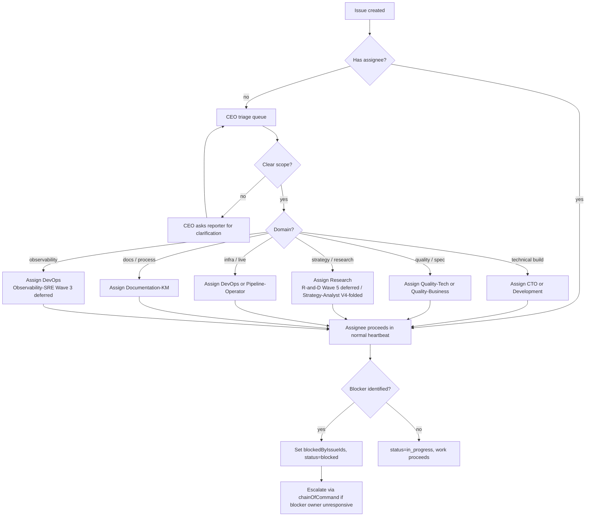

# 06 — Issue Triage Workflow

> **V5 audit (2026-04-29, [QUA-213](/QUA/issues/QUA-213) → consolidated role-rename child).** Namespace `/QUAA/` → `/QUA/`. Non-V5 role mentions (Strategy-Analyst) annotated as V4-only / folded; deferred-wave roles annotated with their V5 wave and interim owner per [`decisions/2026-04-27_v5_org_proposal.md`](../decisions/2026-04-27_v5_org_proposal.md) § 6 and [`processes/process_registry.md`](process_registry.md) § "Active agents". Per [DL-031](../decisions/DL-031_projects_formalization_and_routing_convention.md), V5 triage is project-routed (`projectId` set on every new issue); the triage flowchart below remains the role-routing layer that runs after project assignment. Flow content NOT changed.

Routes a new issue (from board, agent, or automated source) to the right owner with the right priority.

## Trigger

- Board user opens an issue in Paperclip
- An agent creates an issue as a by-product of its heartbeat (child task, cross-team delegation, post-incident follow-up)
- External source fires a webhook routine that creates an issue

## Actors

- [CEO](/QUA/agents/ceo) — primary triage (default inbox for unassigned top-level work)
- [CTO](/QUA/agents/cto) — technical work delegate
- Domain specialists — [Quality-Tech](/QUA/agents/quality-tech) *(Wave 2 LIVE)*, [Quality-Business](/QUA/agents/quality-business) *(Wave 2 LIVE per [DL-039](../decisions/2026-04-28_quality_business_hire.md))*, ~~Strategy-Analyst~~ *(V4-only role, folded into Research / Quality-Tech / CEO in V5; do not assign)*, etc.
- [Documentation-KM](/QUA/agents/documentation-km) — docs / spec changes
- Reporter — responds to clarifying questions during triage

## Steps

## Exits

- **Success:** Issue reaches a correct owner within the triage SLA, moves to `in_progress` or `blocked` with explicit reasoning.
- **Escalation:** If the triage chain disputes ownership, [CEO](/QUA/agents/ceo) is the tie-breaker; if CEO is disputed, escalate to board.
- **Kill:** Duplicates / invalid issues are moved to `cancelled` with a comment pointing to the canonical issue.

## SLA

- **Unassigned → CEO triage:** within 1 CEO heartbeat (≈ 15–30 min during active window).
- **Triage → assigned:** same business day.
- **Clarification round-trip:** not more than 2 rounds before CEO makes a best-guess assignment and notes the assumption.

## References

- Paperclip coordination skill (covers status lifecycle + API endpoints): invoke via the `paperclip` skill in-session; there is no repo-local `api-reference.md` today — the skill itself is the canonical source.
- Cross-strand coordination: [07-ceo-cto-dialectic.md](07-ceo-cto-dialectic.md)
