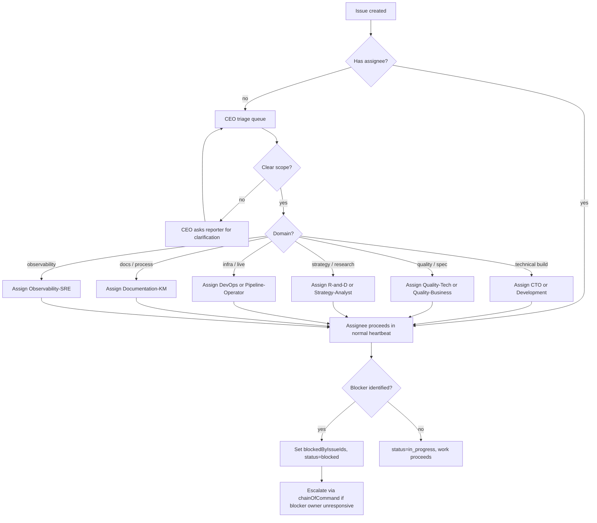

# 06 — Issue Triage Workflow

Routes a new issue (from board, agent, or automated source) to the right owner with the right priority.

## Trigger

- Board user opens an issue in Paperclip
- An agent creates an issue as a by-product of its heartbeat (child task, cross-team delegation, post-incident follow-up)
- External source fires a webhook routine that creates an issue

## Actors

- [CEO](/QUAA/agents/ceo) — primary triage (default inbox for unassigned top-level work)
- [CTO](/QUAA/agents/cto) — technical work delegate
- Domain specialists — [Quality-Tech](/QUAA/agents/quality-tech), [Quality-Business](/QUAA/agents/quality-business), [Strategy-Analyst](/QUAA/agents/strategy-analyst), etc.
- [Documentation-KM](/QUAA/agents/documentation-km) — docs / spec changes
- Reporter — responds to clarifying questions during triage

## Steps

## Exits

- **Success:** Issue reaches a correct owner within the triage SLA, moves to `in_progress` or `blocked` with explicit reasoning.
- **Escalation:** If the triage chain disputes ownership, [CEO](/QUAA/agents/ceo) is the tie-breaker; if CEO is disputed, escalate to board.
- **Kill:** Duplicates / invalid issues are moved to `cancelled` with a comment pointing to the canonical issue.

## SLA

- **Unassigned → CEO triage:** within 1 CEO heartbeat (≈ 15–30 min during active window).
- **Triage → assigned:** same business day.
- **Clarification round-trip:** not more than 2 rounds before CEO makes a best-guess assignment and notes the assumption.

## References

- Paperclip coordination skill (covers status lifecycle + API endpoints): invoke via the `paperclip` skill in-session; there is no repo-local `api-reference.md` today — the skill itself is the canonical source.
- Cross-strand coordination: [07-ceo-cto-dialectic.md](07-ceo-cto-dialectic.md)
