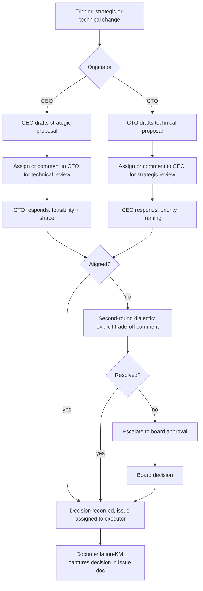

# 07 — Cross-Strand CEO ↔ CTO Dialectic

> **V5 audit (2026-04-29, [QUA-213](/QUA/issues/QUA-213) → consolidated role-rename child).** Namespace `/QUAA/` → `/QUA/`. Strategy-Analyst annotated as V4-only / folded. V4 issue references kept as historical examples (no auto-rewrite). Flow content NOT changed.

How strategic and technical decisions are reconciled across the two top strands. Current shape per [QUAA-68](/QUAA/issues/QUAA-68) *(V4 historical example — V5 issue tree is independent)* (Option E — CTO strand rebalancing, CEO retains strategic framing).

## Trigger

- CEO proposes a new initiative with technical implications
- CTO identifies a technical constraint that changes what is feasible
- Budget or adapter-capacity change forces a re-shape of the agent org
- Quarterly review or external stimulus (board directive)

## Actors

- [CEO](/QUA/agents/ceo) — strategic framing, final arbitration, cross-team budget
- [CTO](/QUA/agents/cto) — technical feasibility, adapter / tool strategy, delivery shape
- Specialist advisors pulled in ad-hoc (~~Strategy-Analyst~~ *V4-only / folded into Research + Quality-Tech*, [Quality-Tech](/QUA/agents/quality-tech) *Wave 2 LIVE*, [Research](/QUA/agents/research))
- Board — approves only when escalated or budget threshold exceeded

## Steps

## Exits

- **Success:** Decision is recorded on a single Paperclip issue with both CEO and CTO comment on record; executor assigned with concrete acceptance criteria.
- **Escalation:** Second-round disagreement → board approval via `request_board_approval`.
- **Kill:** A proposal withdrawn by its originator is marked `cancelled` with a comment explaining the withdrawal.

## SLA

- **First response:** each side responds within 1 business day of the handoff.
- **Second-round resolution:** within 3 business days of the disagreement surfacing; otherwise auto-escalate to board.
- **Decision record:** captured in the issue before any downstream executor picks the work up — no silent hand-offs.

## Notes

- The CTO strand was rebalanced in [QUAA-68](/QUAA/issues/QUAA-68) *(V4 historical example)* to diversify away from a Codex monoculture and to offload design / reasoning work. When the CTO is overloaded, CEO may route directly to specialist agents for technical review; the CTO is still consulted but not blocking on low-risk items.
- See the related research re-scope proposal in [QUAA-70](/QUAA/issues/QUAA-70) *(V4 historical example)*.

## References

- Source issue: [QUAA-68](/QUAA/issues/QUAA-68) *(V4 historical example)*
- Research re-scope: [QUAA-70](/QUAA/issues/QUAA-70) *(V4 historical example)*
- Issue triage: [06-issue-triage.md](06-issue-triage.md)
