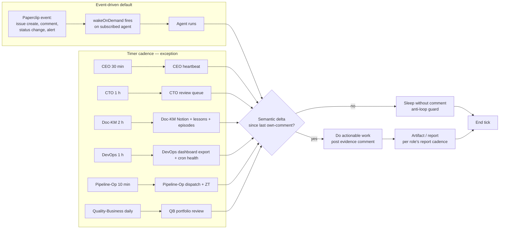

# 08 — Daily Operating Rhythm (V5)

> **V5 audit (2026-04-29, [QUA-213](/QUA/issues/QUA-213) → full V5 rewrite under [QUA-231](/QUA/issues/QUA-231)).** This file was rewritten end-to-end. The V4-era 13-agent table (Strategy-Analyst, R-and-D, Controlling, Observability-SRE, LiveOps, Quality-Tech, Quality-Business, Development as live rhythm rows) is **retired** — V5 has 9 active agents (Wave 0 + Wave 1 + Wave 2). Wave 3/4/5 placeholders are listed below the table, not given rhythm rows. Cadence policy is **inverted**: event-driven by default, timer cadence only when the role does scheduled recurring work. **Pending CEO ack before merge** per QUA-213 § Boundary reminder (architectural change — table shrinkage + policy inversion).

The per-agent cadence of heartbeats, feeds, and reports that keeps QuantMechanica running as a system. Source-of-truth pointers: each agent's V5 BASIS prompt at [`paperclip-prompts/<role>.md`](../paperclip-prompts/) (OWNER-managed; do not edit) and the V5 cadence policy in [`decisions/2026-04-27_v5_org_proposal.md`](../decisions/2026-04-27_v5_org_proposal.md) § 3.

## V5 cadence policy

**Event-driven by default.** Timer heartbeats only when the role does scheduled recurring work — not as a substitute for activity. Per [`decisions/2026-04-27_v5_org_proposal.md`](../decisions/2026-04-27_v5_org_proposal.md) § 3:

> Heartbeat cadence policy: event-driven by default. Timer heartbeats only when the role does scheduled recurring work (DevOps hourly cron, Documentation-KM 2h Notion sync, CTO 1h review queue). Wake-on-demand only for Research (event-driven per BASIS) and CEO (board/issue events).

**Anti-loop rule** (per [DL-042](../decisions/2026-04-29_runtime_health_doc_propagation.md) and [`processes/17-agent-runtime-health.md`](17-agent-runtime-health.md)): no-op heartbeat comments that re-trigger `wakeOnDemand` are forbidden. Agents must not post a comment whose only purpose is to mark a heartbeat tick — that pattern caused the Development recursive-wake incident on 2026-04-29 (see [lessons-learned/2026-04-29_development_recursive_wake.md](../lessons-learned/2026-04-29_development_recursive_wake.md)). When a wake produces no semantic delta vs the last own-comment, sleep without commenting.

## Trigger

Continuous — this is the baseline clock the company runs on. The agent-specific cadence below is the **upper bound** on how often a role wakes on its own; upstream triggers (Paperclip wake-on-demand on issue events, OWNER comments, board-state changes, cron firings, webhook deliveries) may accelerate any agent within the same day. There is no fixed morning/midday/evening window — V5 runs 24/7 with the wake-on-demand path absorbing the human-time-of-day variation.

## Actors and rhythm

V5 active agents (9, per [`processes/process_registry.md`](process_registry.md) § "Active agents" — Wave 0 + Wave 1 + Wave 2 all live as of 2026-04-28). Cadence specifics live in each agent's BASIS prompt; this table is the at-a-glance summary, not the source of truth.

| # | Agent | Wave | Heartbeat cadence | Wake-on-demand triggers | Primary recurring work | Report cadence | BASIS prompt |
|---|-------|------|-------------------|-------------------------|------------------------|----------------|--------------|
| 1 | [CEO](/QUA/agents/ceo) | 0 | **30 min timer** ([DL-034](../decisions/2026-04-28_ceo_heartbeat_30min.md)) | board/issue events, hire requests, escalations | Triage queue, hire approvals, gate decisions, OWNER weekly status | **Daily summary** to OWNER | [`ceo.md`](../paperclip-prompts/ceo.md) |
| 2 | [CTO](/QUA/agents/cto) | 0 | **1 h timer** | review-queue events, Hard Rule violations | EA spec authoring, code-review queue, framework implementation | **Daily summary** | [`cto.md`](../paperclip-prompts/cto.md) |
| 3 | [Research](/QUA/agents/research) | 0 | **None — wake-on-demand only** (event-driven per BASIS) | source assignment, source-survey approval, Strategy Card request | Source extraction, Strategy Card authoring per [DL-029](../decisions/2026-04-27_strategy_research_workflow.md) | Per-source-completion artifact | [`research.md`](../paperclip-prompts/research.md) |
| 4 | [Documentation-KM](/QUA/agents/documentation-km) | 0 | **2 h timer** | doc-impact issues, BASIS-prompt edits, learning candidates | Notion ↔ Git nightly sync (23:00 UTC), learning-archive checks, episode-pack work, process-doc audit | **Weekly digest** to OWNER | [`documentation-km.md`](../paperclip-prompts/documentation-km.md) |
| 5 | [DevOps](/QUA/agents/devops) | 1 | **Hourly timer** (cron-style monitoring) + on-demand | infra issues, deploy queue events, ALERT_*.md filings | Hourly dashboard export, infra reproducibility, scheduled-task health | Per-deploy log + per-event | [`devops.md`](../paperclip-prompts/devops.md) |
| 6 | [Pipeline-Operator](/QUA/agents/pipeline-operator) | 1 | **10 min timer** (with no-op skip logic) | dispatch events, ZT/NO_REPORT triggers, Sev-1+ disk alerts | T1-T5 backtest dispatch, ZT recovery, mirror integrity | Per-run artifact | [`pipeline-operator.md`](../paperclip-prompts/pipeline-operator.md) |
| 7 | [Quality-Tech](/QUA/agents/quality-tech) | 2 | **None — on-demand only** | EA review request, PR / spec-change events, framework review handoff | EA code review, V5 framework review (CTO handoff) | Per-PR review | [`quality-tech.md`](../paperclip-prompts/quality-tech.md) |
| 8 | [Development](/QUA/agents/development) | 2 | **None — on-demand only** | CTO dispatch, Strategy-Card→EA build handoff | EA build from APPROVED Strategy Cards, _v[0-9]+ enhancement loop | Per-issue PR / commit | [`development.md`](../paperclip-prompts/development.md) |
| 9 | [Quality-Business](/QUA/agents/quality-business) | 2 | **Daily timer** | Strategy Card review request, P2 PASS cross-challenge, portfolio composition events | G0 economic-thesis review (with CEO), portfolio-fit caps, monthly business review | **Monthly business review** to OWNER | [`quality-business.md`](../paperclip-prompts/quality-business.md) |

**Source-of-truth precedence:** if this table conflicts with the agent's BASIS prompt, the BASIS prompt wins. Doc-KM regenerates this table when a BASIS prompt changes a cadence (per [DL-027](../decisions/DL-027_basis_active_diff_propagation_rule.md) BASIS↔active diff propagation). The `RECOVERY.md` agent roster is the runtime-config truth for `intervalSec` / `wakeOnDemand` flags.

## Wave-deferred placeholders (no rhythm row)

These roles are not active in V5 today; their rhythm rows will be added when the wave-trigger conditions defined in [`decisions/2026-04-27_v5_org_proposal.md`](../decisions/2026-04-27_v5_org_proposal.md) § 4 fire and the hire lands. Until then, the named interim owner absorbs the rhythm.

| Role | Wave | Trigger | Interim owner (rhythm absorbed by) | Planned cadence on hire |
|------|------|---------|-----------------------------------|-------------------------|
| [Controlling](/QUA/agents/controlling) | 3 | ≥3 EAs in P10 burn-in OR live trading begins on T6 | [CEO](/QUA/agents/ceo) sanity-review (KPI correctness, weekly + episode-publish days) + [DevOps](/QUA/agents/devops) (public dashboard export) | 1 h timer per BASIS draft |
| [Observability-SRE](/QUA/agents/observability-sre) | 3 | Same as Controlling | [DevOps](/QUA/agents/devops) (cron health + ALERT_*.md emission as part of hourly monitoring) | 5 min timer per BASIS draft |
| [LiveOps](/QUA/agents/liveops) | 4 | T6 Live/Demo automation runbook operational AND DXZ funded account active | OWNER + [DevOps](/QUA/agents/devops) manual only — no automated LiveOps cadence | 15 min timer per BASIS draft |
| [R-and-D](/QUA/agents/r-and-d) | 5 | Pipeline producing ≥10 PASS-eligible EAs/month | [CTO](/QUA/agents/cto) "deep-research pre-check via Research" pattern | On-demand per BASIS draft |
| Chief of Staff (founder-comms) | 6 (deferred indefinitely) | OWNER says "now build founder-comms" | OWNER directly | TBD |

Wave-3 anti-sprawl rule: `decisions/2026-04-27_v5_org_proposal.md` § 6 capped active agents at 8 until Phase 2 step 25 completes; OWNER waived the cap on 2026-04-28 to seat Quality-Business as the 9th agent (per [DL-039](../decisions/2026-04-28_quality_business_hire.md)). The waiver does not extend to Wave 3+.

## Steps

**Key invariants:**

- **Event-driven path is preferred.** Timer cadence is the exception, not the default.
- **No no-op comments.** A wake that produces no semantic delta sleeps silently.
- **BASIS-prompt is canonical** for each agent's exact cadence values; this table is at-a-glance only.
- **Deferred-wave roles do not run.** Their rhythm rows in this doc only appear after hire.

## Reports

| Report | Owner | Cadence | Audience |
|--------|-------|---------|----------|
| CEO daily summary | [CEO](/QUA/agents/ceo) | end of active day | OWNER |
| CTO daily summary | [CTO](/QUA/agents/cto) | end of active day | OWNER + CEO |
| Doc-KM weekly digest | [Documentation-KM](/QUA/agents/documentation-km) | weekly (chosen weekday — currently end-of-week) | OWNER |
| Pipeline-Op per-run artifact | [Pipeline-Operator](/QUA/agents/pipeline-operator) | per-backtest-run | issue thread + reports/ |
| DevOps per-deploy log | [DevOps](/QUA/agents/devops) | per-deploy-event | issue thread + ops doc |
| Research per-source artifact | [Research](/QUA/agents/research) | per-source-completion | issue thread + Strategy Card |
| Quality-Tech per-PR review | [Quality-Tech](/QUA/agents/quality-tech) | per-review-request | issue thread |
| Development per-issue PR / commit | [Development](/QUA/agents/development) | per-EA-build | issue thread + commit |
| Quality-Business monthly review | [Quality-Business](/QUA/agents/quality-business) | first Monday of month | OWNER |
| Doc-KM Notion ↔ Git mirror | [Documentation-KM](/QUA/agents/documentation-km) | nightly 23:00 UTC | Git commit history |
| DevOps hourly dashboard export | [DevOps](/QUA/agents/devops) | hourly `HH:07` | quantmechanica.com via Netlify |

## Exits

- **Success:** Every agent's scheduled cadence fires within its window; no-op skips log a clean sleep; reports posted at the documented cadence; wake-on-demand events resolve to either a `done` issue or a deliberate `blocked` with named unblock owner.
- **Escalation:**
  - **Missed cadence > 2 cycles** → [04-incident-response.md](04-incident-response.md) Sev-2; agent-runtime-health detector at [`processes/17-agent-runtime-health.md`](17-agent-runtime-health.md) trigger #2 (stuck-session sentinel).
  - **Hot-poll loop or recursive self-wake** → [`processes/17-agent-runtime-health.md`](17-agent-runtime-health.md) triggers #1 / #5; CEO pause + CTO fix flow.
  - **Stale feed** (e.g. dashboard `generated_at` > 90 min) → [04-incident-response.md](04-incident-response.md) Sev-2; DevOps owns fix (interim Obs-SRE Wave 3 coverage).
- **Kill:** N/A — rhythm is always-on. OWNER may pause individual agents via the Paperclip pause API for maintenance / cost windows; recorded in commit message and re-enable timeline.

## SLA

- **Active-window responsiveness:** per the cadence column above.
- **Overnight:** event-driven path stays on; Sev-0 / Sev-1 incidents always page; Sev-2+ may defer to next active heartbeat.
- **Daily summaries** (CEO, CTO): posted before end of active day.
- **Weekly digest** (Doc-KM): posted on the chosen weekday — currently end-of-week. Changes to the weekday flow through Doc-KM with a brief comment on the latest digest.
- **Monthly business review** (Quality-Business): first Monday of the following month, by end of active day.
- **Notion ↔ Git nightly mirror:** 23:00 UTC ± 5 min; missed-cycle = no-diff log + DevOps cron-health flag.
- **Hourly dashboard export:** `HH:07` ± 15 min; missed > 90 min = stale-warning on public UI per [05-dashboard-refresh.md](05-dashboard-refresh.md).

## References

- V5 cadence policy source: [`decisions/2026-04-27_v5_org_proposal.md`](../decisions/2026-04-27_v5_org_proposal.md) § 3 + § 7
- V5 BASIS prompts (canonical cadence values): [`paperclip-prompts/`](../paperclip-prompts/) — OWNER-managed; do not edit
- Active agent roster: [`processes/process_registry.md`](process_registry.md) § "Active agents"
- Agent-runtime health (anti-loop / hot-poll detection): [`processes/17-agent-runtime-health.md`](17-agent-runtime-health.md)
- Dashboard cadence: [05-dashboard-refresh.md](05-dashboard-refresh.md) *(also rewritten 2026-04-29 under [QUA-230](/QUA/issues/QUA-230))*
- Incident response: [04-incident-response.md](04-incident-response.md)
- Issue triage: [06-issue-triage.md](06-issue-triage.md)
- CEO heartbeat 30-min adjustment: [DL-034](../decisions/2026-04-28_ceo_heartbeat_30min.md)
- BASIS-active diff propagation rule: [DL-027](../decisions/DL-027_basis_active_diff_propagation_rule.md)
- Recursive-wake incident lesson: [`lessons-learned/2026-04-29_development_recursive_wake.md`](../lessons-learned/2026-04-29_development_recursive_wake.md)

## V4 anchors retired

For audit clarity, the following V4 anchors are intentionally NOT carried into V5 and must not be re-introduced without superseding this doc:

- ~~"All 13 active agents have a rhythm entry"~~ — V5 has 9 hired; Wave 3/4/5 are placeholders, not rhythm rows.
- ~~Strategy-Analyst 15-min cron `5d3aed1c`~~ — V4 role; folded into Research / Quality-Tech / CEO duties; routine retired with QUA-230 dashboard rewrite.
- ~~R-and-D, Quality-Tech, Quality-Business, Development as default-active rhythm rows~~ — Wave 2 hired 2026-04-28 (Quality-Tech, Development, Quality-Business now active); R-and-D stays Wave 5 deferred.
- ~~Controlling daily, Observability-SRE continuous/alert-driven, LiveOps daily as live cadences~~ — all Wave 3/4 deferred placeholders.
- ~~Morning / Midday / Evening / Overnight window structure~~ — V5 runs 24/7 with wake-on-demand absorbing the time-of-day variation.
- ~~Routine `5d3aed1c` reference~~ — retired with the V4 Strategy-Analyst role.
