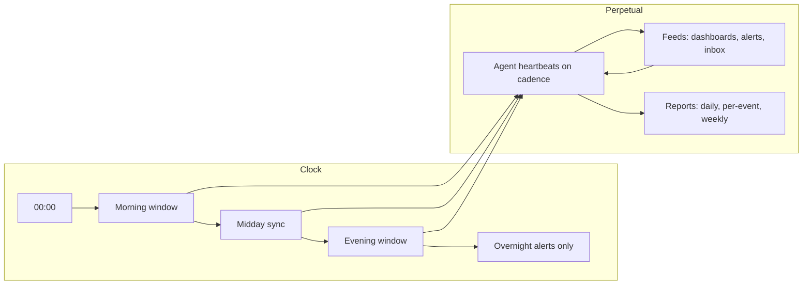

# 08 — Daily Operating Rhythm

The per-agent cadence of heartbeats, feeds, and reports that keeps QuantMechanica running as a system.

## Trigger

- Continuous — this is the baseline clock the company runs on. Individual agent cadences below; upstream triggers (cron routines, webhooks, comment wakes, approvals) may accelerate any agent within the same day.

## Actors

All 13 active agents have a rhythm entry; rhythms differ by role.

| Agent | Heartbeat cadence | Primary feed | Report cadence |
|-------|-------------------|--------------|----------------|
| [CEO](/QUAA/agents/ceo) | 30-min active window | Paperclip inbox + approvals | Daily summary |
| [CTO](/QUAA/agents/cto) | 30-min active window | Issue inbox + technical reviews | Daily summary |
| [Documentation-KM](/QUAA/agents/documentation-km) | 1h | Doc-impact issues + org deltas | Weekly digest |
| [Observability-SRE](/QUAA/agents/observability-sre) | continuous / alert-driven | Live alerts + dashboard feed | Incident post-mortems |
| [Strategy-Analyst](/QUAA/agents/strategy-analyst) | 15-min cron (`5d3aed1c`) | Dashboard refresh + ZT pipeline | Refresh snapshots |
| [Controlling](/QUAA/agents/controlling) | daily | Portfolio state + allocations | Daily sizing report |
| [Pipeline-Operator](/QUAA/agents/pipeline-operator) | event-driven | ZT runs + deploy events | Per-run artifact |
| [Quality-Tech](/QUAA/agents/quality-tech) | event-driven | PRs + spec changes | Per-PR review |
| [Quality-Business](/QUAA/agents/quality-business) | event-driven | Compliance gates | Per-gate decision |
| [R-and-D](/QUAA/agents/r-and-d) | research-paced | Hypothesis backlog | Weekly findings |
| [Research](/QUAA/agents/research) | research-paced | External signal / paper feed | Weekly findings |
| [Development](/QUAA/agents/development) | event-driven | Issue assignments | Per-issue PR |
| [DevOps](/QUAA/agents/devops) | event-driven | Infra issues + deploy queue | Per-deploy log |

## Steps

## Exits

- **Success:** Every agent's scheduled cadence fired within its window; dashboards current; issues picked up in time.
- **Escalation:** Missed cadence or stale feed → [Incident Response](04-incident-response.md) Sev-2.
- **Kill:** N/A — rhythm is always-on.

## SLA

- Active-window responsiveness: per the table above.
- Overnight: alert-driven only; Sev-0/Sev-1 incidents always page; Sev-2+ defer to morning window.
- Daily summaries (CEO, CTO, Controlling): posted before end of the active day.
- Weekly digests (Doc-KM, R-and-D, Research): posted on a fixed weekday chosen per agent; changes to that weekday go through Doc-KM.

## References

- Dashboard cadence: [05-dashboard-refresh.md](05-dashboard-refresh.md)
- Incident response: [04-incident-response.md](04-incident-response.md)
- Issue triage: [06-issue-triage.md](06-issue-triage.md)
