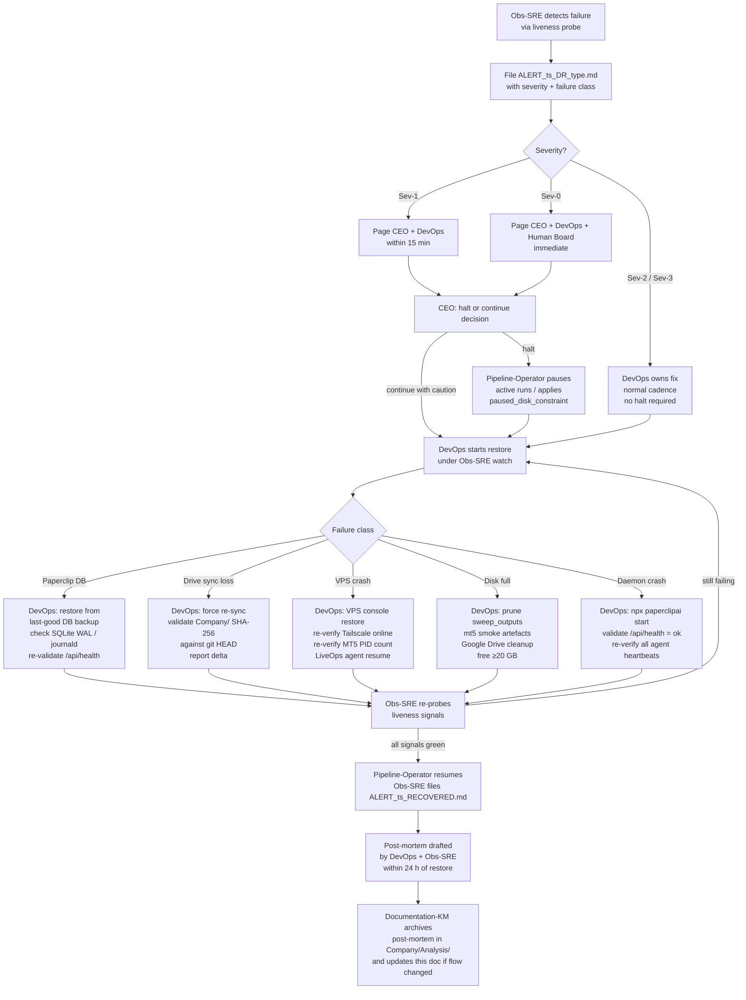

# 09 — Disaster Recovery

How QuantMechanica detects, contains, and recovers from infrastructure-level failures that exceed the scope of normal incident response.

> **Scope boundary:** This process governs infra-level failures — Paperclip DB corruption, Google Drive sync loss, VPS crash, disk-full beyond auto-pause, and daemon crashes. For live-trading strategy/data/broker anomalies use [04-incident-response.md](04-incident-response.md). For routine disk pressure managed by `paused_disk_constraint` use the proposed `11-disk-and-sync.md`. For Paperclip total failure fall back to the manual runbook in `RECOVERY.md` at repo root.

## Trigger

Any of the following events that cannot auto-heal within one Obs-SRE heartbeat:

- **Paperclip DB corruption** — agent state unreadable; API returning 5xx; issues/comments inaccessible.
- **Google Drive sync loss** — `Company/` folder desynchronised; process docs, pipeline state files, or ALERT artefacts inaccessible to agents for >15 min.
- **VPS crash** — `ftmo-hyonix` Tailscale status `offline, last seen >3× cadence`; LiveOps and MT5 terminal unresponsive.
- **Disk-full beyond auto-pause** — local disk at or near 0 GB free after `paused_disk_constraint` fires; pipeline cannot resume without manual cleanup.
- **Paperclip daemon crash** — all agent heartbeats dark; no new runs in the run log; `/api/health` non-responsive.

## Actors

| Role | Responsibility |
|------|---------------|
| [Observability-SRE](/QUAA/agents/observability-sre) | Detection via `ALERT_<ts>_DR_*.md`; severity classification; liveness re-probing during and after restore |
| [DevOps](/QUAA/agents/devops) | **Primary owner** — infra restore (VPS console, Tailscale, Paperclip daemon, disk cleanup, Drive-sync repair) |
| [Pipeline-Operator](/QUAA/agents/pipeline-operator) | Halts active pipeline runs on DR trigger; resumes only after DevOps + Obs-SRE sign-off |
| [CEO](/QUAA/agents/ceo) | Halt/rollback decision on wide-impact failures (Sev-0/Sev-1); cross-agent coordination |
| Human board (Fabian) | **Sev-0: always notified** — final authority for any live-capital halt, VPS restore, or rollback affecting real money |

## Steps

## Severity Classification

| Severity | Failure class | Detect → halt target |
|----------|--------------|---------------------|
| Sev-0 | VPS offline with live capital at risk; Paperclip DB corrupt (state unrecoverable); Drive sync corrupted beyond read | Immediate; human board notified ≤ 10 min |
| Sev-1 | VPS offline (no live capital in window); Paperclip daemon crash; Drive desync > 15 min | ≤ 15 min |
| Sev-2 | Disk full (pipeline paused but restorable); partial Drive sync lag | ≤ 1 h |
| Sev-3 | Transient daemon restart; Drive sync delay < 10 min (self-healing likely) | Normal cadence |

## Exits

- **Success:** All liveness signals green; Obs-SRE files `ALERT_<ts>_RECOVERED.md`; Pipeline-Operator confirms resume; post-mortem archived by [Documentation-KM](/QUAA/agents/documentation-km).
- **Escalation:** Sev-0 always reaches human board before any live-capital halt or rollback. CEO must confirm restore before Pipeline-Operator resumes.
- **Fallback (Paperclip total failure):** Activate the manual runbook at `RECOVERY.md` — Pipeline-Operator role reverts to this Claude Code session; CEO tasks handled directly via the assistant chat until Paperclip is restored.

## SLA

| Event | Target |
|-------|--------|
| Sev-0 detect → halt | Immediate (≤ 5 min) |
| Sev-0 detect → human board notified | ≤ 10 min |
| Sev-1 detect → halt | ≤ 15 min |
| Sev-0/1 restore — Paperclip daemon | ≤ 1 h |
| Sev-0/1 restore — VPS (Hyonix console access assumed) | ≤ 2 h |
| Sev-0/1 restore — Drive sync | ≤ 30 min |
| Sev-2 restore — disk cleanup | ≤ 1 h |
| Post-mortem filed | ≤ 24 h after restore |
| Post-mortem archived | ≤ 48 h after restore |

## References

- Manual runbook (Paperclip-total-failure fallback): `RECOVERY.md` at repo root
- Incident response (live-trading anomalies): [04-incident-response.md](04-incident-response.md)
- Alert schema: `Company/Observability/ALERT_<ts>_<type>.md` — fields: `severity`, `target`, `measurement`, `source`, `suggested-owner`, `consequence`, `evidence`, `recommended-action`, `dedupe-policy`
- Disk-pressure auto-pause policy: `paused_disk_constraint` — see `Company/state/pipeline_v2_orchestrator_state.json` and [QUAA-145](/QUAA/issues/QUAA-145)
- Delegation model: `CLAUDE.md` rule 15 — cheap-reader/expensive-closer; Obs-SRE is the cheap reader (broad liveness probes), DevOps + CEO are the expensive closers (restore decisions and execution)
- Git as canonical truth: `CLAUDE.md` rule 16 — during Drive sync loss, git HEAD is the authoritative state for `Company/` artefacts; restore validates SHA-256 against it
