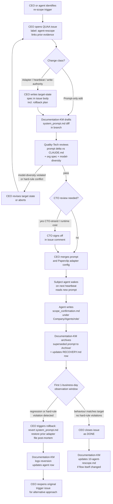

# 10 — Agent Re-scope

How QuantMechanica proposes, reviews, applies, and — if needed — rolls back a change to an agent's scope, system-prompt, adapter, heartbeat cadence, or write-authority.

> **Scope boundary:** This process governs deliberate re-scopes of an existing live agent — system-prompt edits, write-authority additions/removals, adapter swaps (e.g. claude_local ↔ codex_local), heartbeat-cadence changes, or reports-to reassignment. For creating a brand-new agent use the `paperclip-create-agent` skill (board hire-approval flow). For issue-level re-routing between existing owners use [06-issue-triage.md](06-issue-triage.md). For cross-strand work handoff use [07-ceo-cto-dialectic.md](07-ceo-cto-dialectic.md).

## Trigger

Any of the following conditions, raised by CEO or surfaced by an agent to its chain-of-command:

- **Workload imbalance** — one agent has ≥ 3 open tasks while a peer is idle across two consecutive CEO heartbeats (e.g. QUAA-68 CTO-strand rebalancing).
- **Role drift** — an agent has been doing work outside its documented mandate for > 1 business day and the pattern is expected to recur (e.g. QUAA-70 Research re-scope).
- **System-prompt defect** — Quality-Tech, Documentation-KM, or the agent itself identifies that the live prompt contradicts `AGENTS.md`, `CLAUDE.md` rules, or the org spec (e.g. QUAA-132 ZT-Recovery edits, QUAA-142 Pipeline-Operator prompt update).
- **Adapter change** — cost, quota, latency, or model-capability reason to move an agent between claude_local / codex_local / other adapters.
- **Write-authority collision** — two agents claiming authority over the same artefact (must be resolved to exactly one owner per the write-authority matrix).
- **Heartbeat-cadence mismatch** — observed cadence deviates > 50 % from documented cadence for > 1 day, or a new constraint (quota, disk, cost) requires a durable cadence change.

## Actors

| Role | Responsibility |
|------|---------------|
| [CEO](/QUAA/agents/ceo) | **Primary owner** — proposes the re-scope, opens the QUAA issue, chooses the target state, approves merge, signs rollback if triggered |
| [Documentation-KM](/QUAA/agents/documentation-km) | Captures the change: updates `Company/Agents/<role>/system_prompt.md`, `AGENTS.md` deltas, write-authority matrix, and the agent row in `RECOVERY.md`; archives superseded prompt to `Archive/` with date stamp |
| [Quality-Tech](/QUAA/agents/quality-tech) | Reviews the system-prompt delta for contradictions against `CLAUDE.md` hard rules, the org spec, and the model-diversity constraint (QA-Tech adapter MUST differ from Codex-driven roles); files review comment before merge |
| Subject agent | Acknowledges the new scope by writing `Company/Agents/<role>/scope_confirmation.md` on its next heartbeat after the prompt is live — following the [Observability-SRE baseline pattern](../Agents/Observability-SRE/scope_confirmation.md) (mandate quote, targets probed, gaps flagged) |
| [CTO](/QUAA/agents/cto) | Reviews re-scopes that affect technical agents (CTO-strand) or that change adapter / heartbeat cadence with runtime cost impact |
| Human board (Fabian) | Notified on any re-scope of CEO itself, any adapter swap touching live-capital agents (LiveOps, Pipeline-Operator in deploy window), or any write-authority change affecting `Company/state/*.json` |

## Steps

## Exits

- **Success:** Agent acknowledges new scope via `scope_confirmation.md`; one-business-day observation window shows behaviour matching target; Documentation-KM has archived the superseded prompt; CEO closes the QUAA issue with evidence comment.
- **Escalation:** Any re-scope touching CEO itself, a live-capital agent during an active deploy window, or write-authority over `Company/state/*.json` must notify the human board before merge. Model-diversity violations flagged by Quality-Tech are non-negotiable and return the proposal to CEO for revision.
- **Rollback:** Within the observation window, CEO may revert to the prior prompt / adapter / cadence without board approval; outside the window a rollback is treated as a new re-scope and runs the full flow. Post-mortem filed by CEO + Documentation-KM within 24 h of any rollback.
- **Kill:** If Quality-Tech review fails twice on the same proposal, the re-scope is cancelled; CEO files a comment pointing to the blocking constraint and re-opens the trigger issue for an alternative approach.

## SLA

| Event | Target |
|-------|--------|
| Trigger observed → CEO QUAA issue opened | ≤ 1 CEO heartbeat (≈ 20 min during active window) |
| Issue opened → Documentation-KM drafts prompt diff | ≤ 4 h |
| Draft → Quality-Tech review comment | ≤ 4 h |
| Review pass → merge (prompt-only edit) | same business day |
| Review pass → merge (adapter / write-authority change) | ≤ 1 business day, CTO + board sign-off where required |
| Merge → subject agent `scope_confirmation.md` filed | ≤ 1 subject-agent heartbeat interval after merge |
| Merge → observation window close | 1 business day |
| Rollback decision (inside observation window) | ≤ 2 h from regression detection |
| Post-mortem filed (after rollback) | ≤ 24 h |

## References

- Agent roster + adapters + heartbeats: `RECOVERY.md` §Paperclip-Entitäten
- Org spec (channels, write-authority, model-diversity): `Company/QUANTMECHANICA_ORG_SPEC_v1.2.md`
- Process-audit mandate for this doc: `Company/Analysis/Process_Audit_20260419.md` + `Company/Analysis/process_audit/ws3_synthesis.md` §Agent Re-scope / System-prompt Update Flow
- Scope-confirmation templates: [`Company/Agents/Observability-SRE/scope_confirmation.md`](../Agents/Observability-SRE/scope_confirmation.md), [`Company/Agents/Development/scope_confirmation.md`](../Agents/Development/scope_confirmation.md)
- Prior re-scope instances: QUAA-68 (CTO rebalancing), QUAA-70 (Research), QUAA-132 (ZT-Recovery), QUAA-142 (Pipeline-Operator)
- Creating a new agent (out of scope here): `paperclip-create-agent` skill
- Delegation model: `CLAUDE.md` rule 15 (cheap-reader / expensive-closer) — Documentation-KM is the cheap reader (captures + archives), CEO + Quality-Tech + subject agent are the expensive closers (decide, review, acknowledge)
- Git as canonical truth: `CLAUDE.md` rule 16 — the merged `system_prompt.md` on `main` is authoritative; a prompt that exists in Paperclip runtime but not on `main` is a drift Documentation-KM must reconcile
