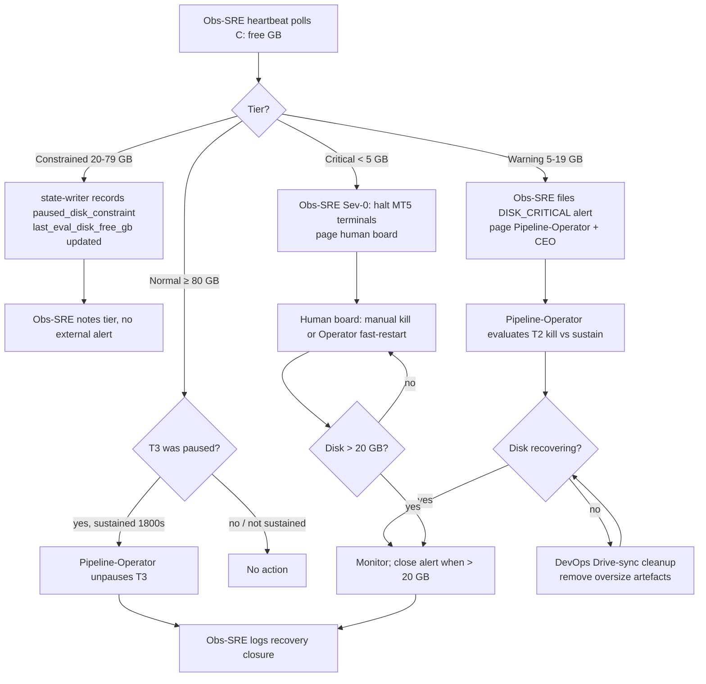
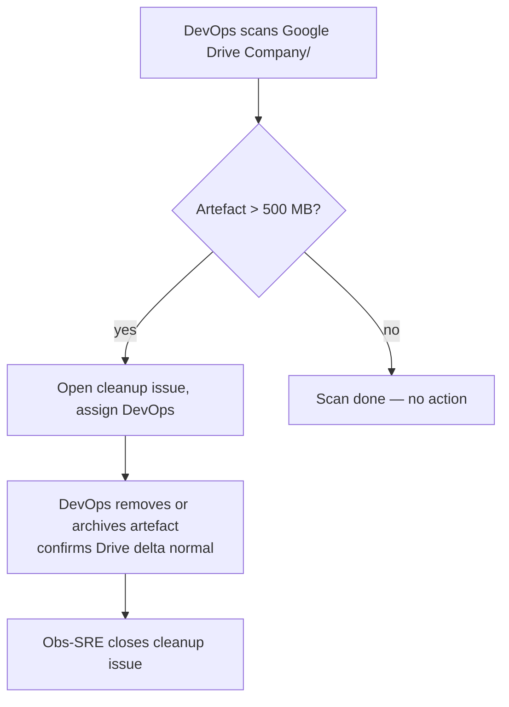

# 11 — Disk-Management and Drive-Sync-Maintenance

How disk pressure on the local workstation (C: drive) and oversize artefacts on Google Drive are detected, throttled, and cleaned up to keep the pipeline running.

## Trigger

- [Observability-SRE](/QUAA/agents/observability-sre) heartbeat detects C: free GB falling below a tier threshold
- [Pipeline-Operator](/QUAA/agents/pipeline-operator) state-writer emits `paused_disk_constraint` in `last_check_state.json` (`t3_disk_pause_policy.active = true`)
- [DevOps](/QUAA/agents/devops) Drive-sync scan detects a single artefact exceeding 500 MB or a Drive write-delta exceeding 2 GB in 1 h

## Actors

- [Observability-SRE](/QUAA/agents/observability-sre) — threshold polling, `ALERT_*.md` emission, escalation decisions, recovery closure and post-mortem
- [Pipeline-Operator](/QUAA/agents/pipeline-operator) — enforces `paused_disk_constraint` policy on T3; evaluates T2 in-flight kills at warning tier; unpauses T3 when sustained recovery is met
- [DevOps](/QUAA/agents/devops) — Google Drive sync health; identifies and removes oversize artefacts (smoke test packages, bulk `.htm` report dumps); structural cleanup on repeat incidents
- Human board — final call when disk < 5 GB and automated recovery paths are unavailable

## Disk Tiers

| Tier | C: free | Automated action | Alert level |
|------|---------|------------------|-------------|
| **Normal** | ≥ 80 GB | None; T3 eligible to run | — |
| **Constrained** | [20 GB, 80 GB) | T3 auto-paused (`paused_disk_constraint`); no new baseline runs queued | No external alert; state-writer records tier |
| **Warning** | [5 GB, 20 GB) | `ALERT_*.md` filed; Pipeline-Operator + CEO paged; T2 candidate kill evaluated | DISK_CRITICAL (Sev-1 class) |
| **Critical** | < 5 GB | All MT5 terminals halted; human board paged | Sev-0 |

The Constrained tier exists to protect headroom before a Warning alert fires. Recovery from Constrained requires C: free ≥ 80 GB sustained for 1800 s (30 min); a brief spike above 80 GB does not immediately unpause T3.

## Steps

## Drive-Sync Cleanup Sub-flow

Runs independently of the disk-pressure path, typically on DevOps on-demand scan or after any DISK_CRITICAL event.

Known high-risk artefact classes:

- MT5 smoke test packages (e.g. `sm261_smoke_mt5` = 754 MB on Drive, flagged 2026-04-18)
- Bulk `.htm` baseline report dumps not yet pruned by `pipeline_feed_guard.py`
- Stale `ex5` compiled binaries from cancelled sweeps

## Repo-Root Garbage Sentinel (DL-028)

- DevOps commit path MUST enforce a repo-root zero-byte guard before `git commit`.
- Guard implementation: `infra/scripts/Invoke-GitWithMutex.ps1` calls `infra/scripts/Assert-CommitAllowlist.ps1 -FailOnRepoRootZeroByte`.
- On detection, the guard exits non-zero and prints `ref=DL-028(worktree_discipline)` to force cleanup before commit.
- Operator probe command:
  - `powershell -NoProfile -ExecutionPolicy Bypass -File C:\QM\repo\infra\scripts\Assert-CommitAllowlist.ps1 -RepoRoot C:\QM\repo -FailOnRepoRootZeroByte`

## Exits

- **Constrained resolved:** C: free ≥ 80 GB sustained for 1800 s. Pipeline-Operator unpauses T3 and updates `last_check_state.json` (`t3_disk_pause_policy.active = false`). Obs-SRE logs recovery note.
- **Warning resolved:** C: free recovers above 20 GB. DISK_CRITICAL alert closed. T2/T3 runs resume per normal policy.
- **Sev-0 resolved:** All terminals restarted, C: free > 20 GB, human board confirms clear. Post-mortem required (see [04-incident-response.md](04-incident-response.md)).
- **Drive cleanup resolved:** Oversize artefact removed, Drive write-delta normal, cleanup issue closed.
- **Repeat-incident escalation:** Three or more Sev-1 DISK_CRITICAL alerts in any 24 h window → Obs-SRE opens a structural root-cause issue assigned to [CTO](/QUAA/agents/cto) (pattern: QUAA-142/144/145).

## SLA

| Event | Detection lag | Response target |
|-------|--------------|----------------|
| C: enters Constrained (< 80 GB) | ≤ 1 Obs-SRE heartbeat (~3 min) | T3 auto-paused within same heartbeat |
| C: enters Warning (< 20 GB) | ≤ 1 heartbeat (~3 min) | Pipeline-Operator action within 1 Pipeline-Operator heartbeat (5 min); disk > 20 GB target within 30 min |
| C: enters Critical (< 5 GB) | Immediate (Sev-0) | Human board paged; terminals halted ≤ 10 min |
| T3 Constrained → Normal recovery | 1800 s sustained above 80 GB | T3 unpaused within 1 Pipeline-Operator heartbeat after sustain window closes |
| Drive artefact > 500 MB | DevOps daily scan or post-incident trigger | Cleanup issue filed within 1 DevOps heartbeat; artefact removed within 1 business day |

## References

- `last_check_state.json` (`t3_disk_pause_policy` block) — live T3 pause state, thresholds, eval timestamps
- `Company/Observability/ALERT_*.md` — historical disk-critical alert record
- [04-incident-response.md](04-incident-response.md) — severity framework, post-mortem protocol
- QUAA-142 — `paused_disk_constraint` policy (Pipeline-Operator system-prompt update)
- QUAA-144 — T3-orphan suppression rule (Obs-SRE)
- QUAA-145 — State-writer `paused_disk_constraint` field (Development)
