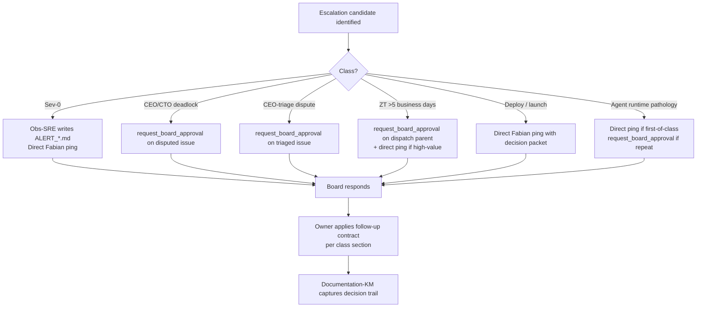

# 12 — Board Escalation Contract

> **V5 audit (2026-04-29, [QUA-213](/QUA/issues/QUA-213) → consolidated role-rename child).** Namespace `/QUAA/` → `/QUA/`. LiveOps annotated as Wave 4 deferred (class 5 follow-up contract). V4 issue references (QUAA-189, QUAA-177) kept as historical examples. **Class 4 prose left unchanged** because it cross-references `02-zt-recovery.md` (full-rewrite scope under sister child of QUA-213) — class 4 will be re-synced when the ZT-recovery rewrite lands. Class 6 (agent runtime pathology) was added 2026-04-29 in commit `2d37da30` — see [DL-042](../decisions/2026-04-29_runtime_health_doc_propagation.md).

Canonical index of every path that puts the human board (Fabian) on the hook. Consolidates rules already living in processes 02/04/06/07 and the root `CLAUDE.md` / `RECOVERY.md` — **this doc does not invent new escalation rules**, it names the contract so agents don't have to re-derive it from five source files.

## Board identity

"Board" in this contract means the human decision-maker (Fabian). Paperclip-CEO is **not** the board — it is the highest autonomous agent and can itself be the *source* of a board escalation. Per `CLAUDE.md` §13, the board is final authority for PASS / FAIL / REJECT and priorities. Per `RECOVERY.md`, the board is sole authority for deploy / launch decisions.

## Channels

Two channels exist. Use the one named in the per-class section below; do not pick a channel ad-hoc.

- **Paperclip `request_board_approval`** — structured approval request raised on a Paperclip issue. Creates an audit trail inside the tool, preferred whenever the decision belongs to an issue thread.
- **Direct Fabian ping** — out-of-band signal (chat window, ALERT file pickup, dashboard Sev-0 banner). Reserved for time-critical incidents where waiting for an approval-UI round-trip is unsafe.

## Escalation classes

### 1. Sev-0 incident

- **Trigger** — Disk Critical (< 5 GB), MT5 terminal halt, broker disconnect with open positions, or any Sev-0 condition enumerated in [04-incident-response.md](04-incident-response.md) § SLA. Also: three-plus Sev-1 DISK_CRITICAL alerts in any 24 h window per [11-disk-and-sync.md](11-disk-and-sync.md).
- **Channel** — **Direct Fabian ping.** An ALERT file (`Company/Observability/ALERT_*.md`) is written first; Obs-SRE then signals out-of-band. Paperclip approval is skipped — the board is being *informed*, not asked.
- **Required payload** — severity tag, affected surface (terminal IDs / EAs / infra), current state snapshot (`last_check_state.json` excerpt or equivalent), automated mitigation already in-flight, specific decision the board is asked to confirm (halt / resume / roll back).
- **Response SLA** — immediate initial response; ≤ 1 h mitigation target per [04-incident-response.md](04-incident-response.md) § SLA (Sev-0 row).
- **Follow-up contract** — Obs-SRE owns the post-mortem; [Documentation-KM](/QUA/agents/documentation-km) archives it per [04-incident-response.md](04-incident-response.md) § Exits.

### 2. CEO ↔ CTO second-round disagreement

- **Trigger** — Per [07-ceo-cto-dialectic.md](07-ceo-cto-dialectic.md) § Steps, a strategic-vs-technical proposal remains unresolved after one dialectic round; second-round resolution window (3 business days) has elapsed or the two strands have explicitly deadlocked.
- **Channel** — **Paperclip `request_board_approval`** on the disputed issue.
- **Required payload** — both CEO and CTO position comments already on the issue (no hidden state), the specific trade-off being arbitrated (named in one sentence), the two options the board is choosing between, and the downstream executor that will be unblocked by the decision.
- **Response SLA** — board decision ≤ 3 business days from approval request (matches the auto-escalate clock in [07-ceo-cto-dialectic.md](07-ceo-cto-dialectic.md) § SLA).
- **Follow-up contract** — CEO records the board verdict as an issue comment, reassigns the issue to the executor named in the payload; [Documentation-KM](/QUA/agents/documentation-km) captures the decision per [07-ceo-cto-dialectic.md](07-ceo-cto-dialectic.md) § Steps (node O).

### 3. CEO-dispute on triaged issue

- **Trigger** — Per [06-issue-triage.md](06-issue-triage.md) § Exits: the triage chain disputes ownership, CEO tie-breaks, **and the CEO tie-break itself is disputed** by the receiving agent or by the reporter.
- **Channel** — **Paperclip `request_board_approval`** on the disputed issue.
- **Required payload** — triage history (which agents refused, why), CEO's tie-break reasoning, the concrete assignment decision the board is asked to ratify, names of the two or more candidate owners, expected impact on other heartbeats if the board delays.
- **Response SLA** — board decision same business day (triage SLA anchor from [06-issue-triage.md](06-issue-triage.md) § SLA).
- **Follow-up contract** — CEO moves the issue to the board-chosen owner, leaves a comment quoting the board verdict verbatim. No further appeals on the same issue without new information.

### 4. ZT recovery stalled > 5 business days

- **Trigger** — Per [02-zt-recovery.md](02-zt-recovery.md) § SLA: total budget of 5 business days (from `ZT_RootCause_<YYYYMMDD>.md` to pass / `no v2 indicated` / kill) exceeded without a terminal verdict.
- **Channel** — **Paperclip `request_board_approval`** on the ZT Recovery dispatch parent issue; simultaneous direct Fabian ping if the EA is in V5 / V6 sleeve or top-20 PF (the high-value gate).
- **Required payload** — dispatch parent ID, linked `ZT_RootCause` and any partial `v1_vs_v2` artefacts, specific blocker identified (Research / R-and-D / Development / Pipeline-Operator), the board's decision options (extend budget / force kill / down-prioritise the EA), and a one-line justification for any budget extension requested.
- **Response SLA** — board decision ≤ 2 business days from escalation (the 5-day budget already represents the soft limit; the board is the hard limit).
- **Follow-up contract** — CEO updates the dispatch parent with the verdict and either reassigns the unblocking task or closes the parent per the chosen outcome. If killed, [Documentation-KM](/QUA/agents/documentation-km) archives learnings per [02-zt-recovery.md](02-zt-recovery.md) § Exits (Kill).

### 5. Deploy / launch decision

- **Trigger** — Any candidate portfolio (V5 / V6 / future) reaches deploy-gate readiness (P9b operational-readiness gate clean in [01-ea-lifecycle.md](01-ea-lifecycle.md)); any public launch (YouTube EP01, marketing push, Myfxbook link activation) is proposed; or any step that irreversibly exposes QuantMechanica to external eyes or live capital.
- **Channel** — **Direct Fabian ping.** Per `RECOVERY.md` the board holds sole authority here; Paperclip-CEO prepares the decision packet but does **not** use `request_board_approval` as a substitute for the human conversation.
- **Required payload** — gate-readiness evidence (P7 stats, P9 portfolio construction output, P9b checklist), V-portfolio deploy preconditions per [03-v-portfolio-deploy.md](03-v-portfolio-deploy.md), risk cap reminder (≤ 0.50 % per `CLAUDE.md` anchors), and the explicit ask ("deploy V5 sleeve of 5 EAs to DarwinexZero Demo").
- **Response SLA** — board at own cadence; no auto-timeout. Agents do not deploy on silence.
- **Follow-up contract** — on approval, [Pipeline-Operator](/QUA/agents/pipeline-operator) hands off to [LiveOps](/QUA/agents/liveops) *(Wave 4 deferred — interim: OWNER + [DevOps](/QUA/agents/devops) manual)* / [DevOps](/QUA/agents/devops) for VPS file-copy per [03-v-portfolio-deploy.md](03-v-portfolio-deploy.md); on reject, CEO records the objection verbatim on the deploy-gate issue and re-queues the gap for the next cycle.

### 6. Agent runtime pathology (added 2026-04-29)

- **Trigger** — Per [17-agent-runtime-health.md](17-agent-runtime-health.md) § Trigger, the runtime detector fires twice within 24h on the same agent without CEO autonomous resolution. Classes covered: hot-poll loops, stuck Codex/Claude session, bottleneck agent (≥2 P0 in_progress AND <5 runs/4h), token-budget pressure (>90% provider cap forecast), recursive self-wake.
- **Channel** — **Direct Fabian ping** for first occurrence of any new pattern class; **Paperclip `request_board_approval`** for repeated pattern classes already seen and codified.
- **Required payload** — agent name + ID, trigger class, evidence (run-rate count, stuck-time, P0 issue list, cost forecast, or recursive-comment fingerprint), Board Advisor / CEO actions already taken (PATCH heartbeat, /pause, /resume, terminate-rehire), proposed remediation, and the specific decision OWNER is asked to confirm (continue mitigation / authorize re-hire / authorize budget top-up / accept role pause).
- **Response SLA** — same business day for first occurrence; ≤ 4h for repeat occurrences (the pattern is now known and the cost of inaction is clearer).
- **Follow-up contract** — Documentation-KM authors `lessons-learned/<date>_<agent>_<pattern>.md` per [17-agent-runtime-health.md](17-agent-runtime-health.md) § Exits. CEO updates the affected agent's BASIS prompt if the pattern is filterable at prompt level (e.g. self-author check). Board Advisor reverts any emergency runtime overrides (heartbeat throttle, pause, etc.) once stability is proven.

## Steps (flow overview)

## Exits

- **Success:** board decision recorded in the named artefact (issue comment, dispatch parent, or ALERT post-mortem); follow-up contract executed by the escalation owner.
- **No response past SLA:** Sev-0 stays in automated-mitigation mode with Obs-SRE re-pinging until the board acknowledges and the ≤ 1 h mitigation window closes; other classes fall back to the source-process SLA (e.g. ZT 5-day budget's hard outcome, CEO/CTO 3-day auto-escalate). No silent timeouts — the lack of board response is itself logged.
- **Withdrawal:** escalator may withdraw before the board responds, with a comment explaining why (e.g. root cause self-resolved). Withdrawal is not a silent close — it is recorded.

## SLA summary

| Class | Channel | Board SLA |
|-------|---------|-----------|
| 1. Sev-0 incident | Direct ping | Immediate ack; ≤ 1 h mitigation |
| 2. CEO↔CTO second-round | `request_board_approval` | ≤ 3 business days |
| 3. CEO-triage dispute | `request_board_approval` | same business day |
| 4. ZT > 5 business days | `request_board_approval` (+ ping for high-value) | ≤ 2 business days |
| 5. Deploy / launch | Direct ping | Board cadence (no auto-timeout) |
| 6. Agent runtime pathology | Direct ping (first-of-class) / `request_board_approval` (repeat) | Same business day (first) / ≤ 4 h (repeat) |

## References

- [02-zt-recovery.md](02-zt-recovery.md) § SLA — 5-day recovery budget
- [04-incident-response.md](04-incident-response.md) § SLA — Sev-0/1/2/3 windows
- [06-issue-triage.md](06-issue-triage.md) § Exits — CEO tie-break and board appeal
- [07-ceo-cto-dialectic.md](07-ceo-cto-dialectic.md) § Steps — second-round → `request_board_approval`
- [03-v-portfolio-deploy.md](03-v-portfolio-deploy.md) — deploy preconditions
- [11-disk-and-sync.md](11-disk-and-sync.md) — repeat-incident structural escalation
- `CLAUDE.md` §13 — CEO is final decision authority for PASS/FAIL/REJECT and priorities
- `RECOVERY.md` — board (Fabian) is sole authority for deploy/launch; Paperclip-CEO prepares the packet
- Parent issue: [QUAA-189](/QUAA/issues/QUAA-189); grandparent audit: [QUAA-177](/QUAA/issues/QUAA-177) — *both V4 historical examples; V5 escalation governance lives under [QUA-213](/QUA/issues/QUA-213) and successors*
