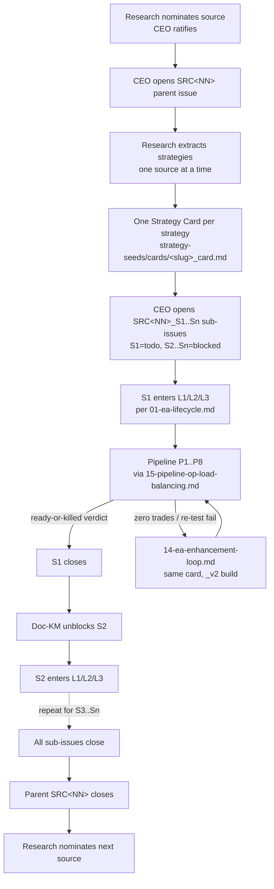

# 13 — Strategy Research Workflow

How V5 turns a research resource (book / paper / blog / video / forum) into approved Strategy Cards, each of which feeds the EA Life-Cycle ([01-ea-lifecycle.md](01-ea-lifecycle.md)) at L0/L1.

> **Binding source:** OWNER directive 2026-04-27 ~14:30 local, captured in QUA-236. The flow is opinionated, sequential, and low-parallel by design — to save tokens, keep the company focused, and reuse V4's prior taxonomy work. It supersedes any improvised research flow.

## Trigger

- CEO + Research nominate a new source (Research proposes from `seed_assets/sources/` queue; CEO ratifies).
- OWNER drops a source via comment on a QUA issue or in a Drive seed location.
- A previously-extracted source needs re-mining for a missed strategy (rare; CEO reopens parent).

## Actors

| Step | Owner | Support | Interim (until hired) |
|------|-------|---------|-----------------------|
| Source nomination | [Research](/QUA/agents/research) | [CEO](/QUA/agents/ceo) | — |
| Parent issue open | [CEO](/QUA/agents/ceo) | — | — |
| Strategy extraction | [Research](/QUA/agents/research) | [CEO](/QUA/agents/ceo) | — |
| Card review / approval | [CEO](/QUA/agents/ceo) | Quality-Business *(Wave 2)* | CEO covers Quality-Business until Wave 2 |
| Framework-alignment check | [CTO](/QUA/agents/cto) | [Research](/QUA/agents/research) | — |
| Build (L2 prototype) | Development *(Wave 2)* | [CTO](/QUA/agents/cto) | CTO until Development hired |
| Pipeline backtests (P1..P8) | [Pipeline-Operator](/QUA/agents/pipeline-operator) | Quality-Tech *(Wave 2)* | CTO covers gate review until Wave 2 |
| Gate verdicts | Quality-Tech *(Wave 2)* | [Pipeline-Operator](/QUA/agents/pipeline-operator) | CTO until Wave 2 |
| Issue tree maintenance | [Documentation-KM](/QUA/agents/documentation-km) | [CEO](/QUA/agents/ceo) | — |

## Issue tree shape (binding)

The shape is fixed. Do not improvise a different decomposition.

```
SRC<NN> — <Source citation>            (parent, status: in_progress while any sub is open)
├── SRC<NN>_S1 — <slug>                (sub, status: todo — first strategy actively worked)
├── SRC<NN>_S2 — <slug>                (sub, status: blocked — unblocks when S1 closes)
├── SRC<NN>_S3 — <slug>                (sub, status: blocked)
└── ...
```

Rules:

- **Per resource = ONE parent Issue.** Title pattern: `SRC<NN> — <Source citation>`. CEO opens it.
- **Per strategy found in that resource = ONE sub-Issue under that parent.** Title pattern: `SRC<NN>_S<n> — <strategy-slug>`.
- **All sub-issues are created `blocked` EXCEPT the first.** First is `todo` and gets actively worked.
- **The next sub-issue unblocks only when the prior strategy completes its end-to-end pipeline:** Programmer → P1 Build → P2..P8 backtest gates → Quality-Tech sign-off → ready-or-killed verdict.
- **The parent source-issue closes** when ALL sub-issues under it close.
- **One source actively worked at a time.** One strategy from that source actively worked at a time. No parallel-source extraction (mirrors `paperclip-prompts/research.md` § THE CORE RULE).

### Why sequential (not parallel)

Per OWNER directive 2026-04-27: parallel research mining bleeds tokens, fragments review attention, and produces near-duplicate cards. Sequential keeps the lessons-feedback loop tight — what we learn from S1 in the pipeline can sharpen extraction for S2 before S2 even leaves Research.

## Strategy Card discipline (binding)

One `.md` file per strategy at:

```
strategy-seeds/cards/<slug>_card.md
```

(Renamed from the legacy `QM5_NNNN_<slug>_card.md` pattern. Slug is allocated at extraction time; the EA-ID is allocated later by CEO + CTO at the APPROVED → IN_BUILD transition.)

The card uses `strategy-seeds/cards/_TEMPLATE.md` (V5 schema, updated under QUA-243). Mandatory new fields:

- **`source_citations: []`** — one or more entries. A strategy that combines insights from two papers cites BOTH. Each entry mirrors the parent source's `## 4. Citation header` block.
- **`strategy_type_flags: []`** — multi-select from the controlled vocabulary at `strategy-seeds/strategy_type_flags.md` (mined from V4 archives under QUA-244). Examples: `mean-reversion`, `breakout`, `momentum`, `news-pause`, `seasonality`, `martingale`, `grid`, `scalping`. **No new flags invented in V5** — if a strategy doesn't fit the vocabulary, raise it with CEO before adding to the list.
- **`framework_alignment` section** — which 4-Module hooks the strategy uses (`Strategy_NoTrade`, `Strategy_EntrySignal`, `Strategy_ManageOpenPosition`, `Strategy_ExitSignal`) and which V5 Hard Rules are at risk (e.g., Friday-Close, ML-ban, gridding 1%-cap fallback). CTO fills this in at the APPROVED → IN_BUILD transition.

Cards land in `DRAFT` status, advance to `IN_REVIEW` (Research → CEO), then `APPROVED` (CEO sign-off, CTO framework-alignment block filled), then `IN_BUILD` (handoff to Development / CTO). See template § Card Header for the full status ladder.

## Extraction Discipline (binding — DL-033)

OWNER addendum 2026-04-27 ~20:00 local (QUA-236 comment `95ea3bde…`, ratified as DL-033).

### Rule 1 — No strategy-level prioritization within a source

Within a source, Research extracts **every distinct mechanical strategy that passes V5 hard rules**. No tiering, no quality-pre-judgment, no "skip the weaker ones to save tokens". The pipeline gates (G0 → P1 → P2 → … → P10) are the filter. Research's job is exhaustive extraction *within hard rules*.

If a source contains 12 distinct mechanical strategies that pass V5 hard rules, Research produces 12 Strategy Cards. Period. The pipeline kills the weak ones at G0 (mechanical-only check), at P2 (PF / DD / trade-count gate), at P3.5 (cross-sectional robustness), at P7 (PBO < 5% hard gate), or wherever they fail.

What this changes vs prior practice:

- **Source-level tiering still applies** (A/B/C/D source quality + which source CEO picks NEXT — that remains CEO's call per `strategy-seeds/SOURCE_QUEUE.md` and the QUA-188 v3 waiver). Source-level prioritization is about *order of extraction* across sources, not *which strategies* inside a chosen source get extracted.
- **Strategy-level pre-filtering is OUT.** The author's own emphasis ("flagship strategy" vs "throwaway example") does not justify pre-filtering. If it's mechanical, it gets a card.

What still applies (not prioritization — V5 boundary constraints):

- **V5 hard-rule extraction filters.** No ML strategies, no discretionary judgment, no martingale without 1%-cap fallback, no scalping without acknowledged P5b stress requirement, no paywall bypass. Hard-rule failures produce **no card** — they are out-of-V5-scope concepts, not "deprioritized strategies".
- **Author-claim quoting verbatim** per [`paperclip-prompts/research.md`](../paperclip-prompts/research.md) § ANTI-PATTERNS.
- **Citation precision** per the multi-citation `source_citations[]` schema.
- **Sub-issue blocking convention** above — ONE source actively worked at a time, ONE strategy from that source actively worked at a time. The "every strategy → pipeline" rule expands the *count* of cards Research produces; it does not authorise parallel sub-issue work.

### Rule 2 — Canonical lifecycle (every G0-passing card walks this path)

```
Research → Strategy Built → Pipeline Backtest → Ready for Portfolio (or not)
```

In V5 terms:

| OWNER label | V5 phase set | Owner |
|---|---|---|
| **Research** | G0 Research Intake — Strategy Card authored, source-cited, V5-hard-rule-passing | Research → CEO + Quality-Business approval (CEO interim) |
| **Strategy Built** | P1 Build Validation — Development copies `EA_Skeleton.mq5`, fills in 4 modules, compiles strict | Development *(Wave 2)* → CTO review (CTO interim) |
| **Pipeline Backtest** | P2 → P3 → P3.5 → P4 → P5 → P5b → P5c (optional) → P6 → P7 → P8 | Pipeline-Operator runs, Quality-Tech reviews verdicts (CTO interim) |
| **Ready for Portfolio (or not)** | P9 Portfolio Construction + P9b Operational Readiness — portfolio decision based on per-EA results vs portfolio constraints | OWNER (manual phases per `PIPELINE_PHASE_SPEC.md`) |
| *(Live)* | P10 Live Burn-In on T6 (DXZ) — minimum lot, KS-test kill-switch | OWNER manifest approval per `LIVE_T6_AUTOMATION_RUNBOOK.md` |

Every Strategy Card that passes G0 walks all the way through P9 / P9b. The portfolio decision is made AT THE END based on backtest evidence + portfolio constraints, NOT pre-filtered at Research's desk. Pre-filtering at Research level imposes Research's biases on what reaches Quality-Tech / OWNER; OWNER wants portfolio decisions made on real backtest distributions, not Research's prior beliefs about which ideas "feel promising".

### Rule 3 — Zero-trades = `_v<n>` enhancement loop is part of the canonical lifecycle

Reaffirming for completeness (already ratified under DL-029 / QUA-245). A pipeline failure that points to the EA implementation rather than the strategy concept (zero-trades, input-rule change, parameter-set change beyond sweep, news-mode change) returns to Development as `_v<n>`. The Strategy Card lineage is preserved; a new `_v<n>` row appears in the card's § 13 Pipeline History; the new build re-runs the full P1 → P8 from scratch. This is part of the canonical lifecycle, not a deviation from it. See [14-ea-enhancement-loop.md](14-ea-enhancement-loop.md) for the full trigger list and mechanics.

## Strategy lineage = Source linkage (binding)

Two distinct enhancement paths — choose by *where the new insight came from*:

- **New insight from a DIFFERENT source.** This is a new strategy, not an enhancement. Open a new sub-issue under the *new* source's parent. New `strategy_id`, new card file, new pipeline run from P1. Cross-reference the prior strategy in the new card's `framework_alignment` section.
- **New insight from in-pipeline learning on the SAME source's strategy.** This is a `_v2` of the same `strategy_id`. Same card file, new row in the card's § 13 Pipeline History table, new file version (`<slug>_card.md` stays the canonical path; the EA build versions as `_v2`, `_v3`, ...). The `_v2` is treated as a NEW EA for backtesting purposes — it re-runs the full P1 → P8 pipeline from scratch. See [14-ea-enhancement-loop.md](14-ea-enhancement-loop.md) for the version mechanics.

The test is "where did the insight come from?", not "does the new EA look similar to the old one?" Same source = `_v2`; different source = new card.

## Steps



### Per-step responsibilities

1. **Source nomination.** Research proposes one source from the seed queue. CEO approves in writing (issue comment) before extraction starts. Drop-path conventions live in each source's `strategy-seeds/sources/SRC<NN>/source.md`.
2. **Parent issue.** CEO opens `SRC<NN> — <citation>`. Description includes: source identity block, expected number of strategies (best estimate from TOC scan), v0 filter rules. Parent assignee = Research; CEO is reviewer.
3. **Extraction.** Research reads the source end-to-end, produces one card per distinct strategy at `strategy-seeds/cards/<slug>_card.md`. Per-chapter (or per-section) progress comments on the parent issue. Verbatim author-claims with page/timestamp citations — no paraphrased numbers.
4. **Card review.** CEO reviews each card. APPROVE / REJECT / REQUEST_CHANGES. APPROVE moves the card from `DRAFT` → `APPROVED`. CTO fills the `framework_alignment` block at APPROVE.
5. **Sub-issue dispatch.** Once Research closes extraction (or finishes a batch CEO is willing to start), CEO opens `SRC<NN>_S1..S<n>` sub-issues — S1 `todo`, the rest `blocked`. Sub-issue assignee progression follows [01-ea-lifecycle.md](01-ea-lifecycle.md): Development → Pipeline-Operator → Quality-Tech.
6. **Pipeline run.** Pipeline-Operator dispatches P1..P8 across T1-T5 per [15-pipeline-op-load-balancing.md](15-pipeline-op-load-balancing.md). Quality-Tech (or interim CTO) signs each gate.
7. **Verdict.** Either the strategy reaches L5 (V-Portfolio candidate) or it's killed at a gate. Either is a "verdict"; both close the sub-issue.
8. **Unblock next.** Documentation-KM (or whichever agent is watching the parent issue) flips S<n+1> from `blocked` to `todo` immediately after S<n> closes. Append a one-line comment to the parent: `S<n> closed (verdict=<ready|killed at P<X>>); S<n+1> unblocked.`
9. **Parent close.** When all sub-issues close, CEO closes the parent and Research nominates the next source.

## Exits

- **Success (sub-issue):** Strategy reaches L5 candidate or is killed with a documented gate verdict. Sub-issue closes; next sibling unblocks.
- **Success (parent):** All sub-issues closed. Source's `completion_report.md` committed (per `strategy-seeds/sources/SRC<NN>/source.md` § 7).
- **Escalation:** Research blocked on missing source text → mark sub-issue `blocked` and name OWNER as unblock-owner with the drop path. Card schema gap (a real strategy doesn't fit the controlled vocabulary or template) → escalate to CEO + CTO before forcing a fit.
- **Kill (sub-issue):** Pipeline gate fail at any of P2..P8, or zero-trades not recoverable via the [enhancement loop](14-ea-enhancement-loop.md). Verdict + evidence path captured in the card's § 13 Pipeline History.

## SLA

- **Source nomination → parent open:** within 1 business day of CEO ratification.
- **Extraction:** Research-paced; per-chapter progress comment cadence on the parent issue.
- **Card review (CEO):** within 2 business days of card landing in `IN_REVIEW`.
- **Sub-issue unblock latency:** within 1 hour of the prior sub-issue closing (Doc-KM watches the parent).
- **Parent close → next source nomination:** within 1 business day.

## Hard rules (do not break)

- One source actively worked at a time. One strategy from that source actively worked at a time. No parallel-source extraction.
- **No strategy-level pre-filtering within a source.** Every distinct mechanical strategy that passes V5 hard rules gets a card. The pipeline gates are the filter, not Research's judgment of "feel". (DL-033)
- **Every G0-passing card walks the canonical lifecycle.** Research → Strategy Built → Pipeline Backtest → Ready for Portfolio (or not). Portfolio selection happens at P9/P9b on real backtest evidence, not pre-filtered at extraction. (DL-033)
- No new strategy types invented in V5 — controlled vocabulary mined from V4 first (`strategy-seeds/strategy_type_flags.md`).
- No card lands in `IN_REVIEW` without verbatim author-claims with page/timestamp citations.
- No EA enters L2 build without an APPROVED card.
- Sub-issue blocking convention is enforced — Doc-KM unblocks; Pipeline-Op does not pull blocked sub-issues even if a terminal is idle.
- Same-source enhancement = `_v2` (same card). Different-source enhancement = new card. The test is *where the insight came from*, not how similar the EA looks.

## References

- **Parent directive:** [QUA-236](/QUA/issues/QUA-236) (OWNER 2026-04-27 ~14:30 local)
- **EA Life-Cycle (downstream of card APPROVED):** [01-ea-lifecycle.md](01-ea-lifecycle.md)
- **Enhancement loop (`_v2` mechanics):** [14-ea-enhancement-loop.md](14-ea-enhancement-loop.md)
- **Pipeline-Op load balancing across T1-T5:** [15-pipeline-op-load-balancing.md](15-pipeline-op-load-balancing.md)
- **Strategy Card template:** [`strategy-seeds/cards/_TEMPLATE.md`](../strategy-seeds/cards/_TEMPLATE.md)
- **Controlled vocabulary (V4 mining):** [`strategy-seeds/strategy_type_flags.md`](../strategy-seeds/strategy_type_flags.md)
- **Source header convention:** `strategy-seeds/sources/SRC<NN>/source.md` (e.g. [SRC01](../strategy-seeds/sources/SRC01/source.md))
- **Research role scope (CORE RULE — one source at a time):** [`paperclip-prompts/research.md`](../paperclip-prompts/research.md)
- **Methodological pipeline (G0..P10):** [`docs/ops/PIPELINE_PHASE_SPEC.md`](../docs/ops/PIPELINE_PHASE_SPEC.md)
- **DL ratification of this workflow:** [`decisions/DL-029_strategy_research_workflow.md`](../decisions/DL-029_strategy_research_workflow.md)
- **DL ratification of extraction discipline + canonical lifecycle:** [`decisions/DL-033_no_strategy_prioritization_and_canonical_lifecycle.md`](../decisions/DL-033_no_strategy_prioritization_and_canonical_lifecycle.md) (OWNER addendum 2026-04-27 ~20:00 local; recorded under QUA-272)
- **Process registry:** [`process_registry.md`](process_registry.md)
