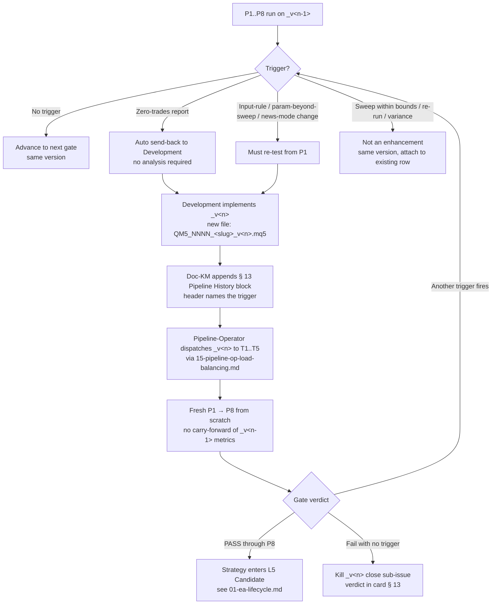

# 14 — EA Enhancement Loop

How V5 versions an EA when in-pipeline learning (or a hard "must re-test from P1" trigger) forces a fresh build. The card stays the same; the EA file gains a `_v<n>` suffix; the new version re-runs the full P1 → P8 pipeline from scratch.

> **Binding source:** OWNER directive 2026-04-27 (QUA-236) + QUA-245. Pairs with [13-strategy-research.md](13-strategy-research.md) § Strategy lineage and the card's § 13 Pipeline History block. This file supersedes any improvised `_v2` flow inherited from V4 (the V4 ZT-recovery v2/v3/v4-cap mechanism in [02-zt-recovery.md](02-zt-recovery.md) is legacy reference only — V5 uses the rules below).

> **Canonical lifecycle integration (DL-033).** A `_v<n>` rebuild is **part of the canonical lifecycle**, not a deviation from it. Per OWNER addendum 2026-04-27 ~20:00 local (QUA-236 / DL-033), every G0-passing Strategy Card walks `Research → Strategy Built → Pipeline Backtest → Ready for Portfolio (or not)`. When a pipeline failure points to the EA implementation rather than the strategy concept (zero-trades, input-rule change, parameter-set change beyond sweep, news-mode change), the card re-enters the **Strategy Built** leg as `_v<n>` and walks **Pipeline Backtest** again from P1. The card itself never leaves the lifecycle — only the *build* gets re-issued. Kill verdicts close the card's lifecycle; rebuild verdicts continue it. See [13-strategy-research.md](13-strategy-research.md) § Extraction Discipline for the canonical-lifecycle table and [`decisions/DL-033_no_strategy_prioritization_and_canonical_lifecycle.md`](../decisions/DL-033_no_strategy_prioritization_and_canonical_lifecycle.md) for the OWNER addendum.

## Trigger

A new `_v<n>` is created when one of the following occurs on an in-flight EA at any pipeline phase P1..P8:

1. **Zero-trades backtest report.** A P1..P8 run that produces a backtest with zero trades on the declared baseline cohort (or symbol-set the gate is testing) is an **automatic send-back to Development**. No analysis required to authorize the rebuild — zero trades is itself the verdict that the previous build's trade-generation logic is broken or mis-configured. Pipeline-Operator files the send-back; Quality-Tech (interim CTO until Wave 2) confirms the verdict.
2. **"Must re-test from P1" failure.** Any change that invalidates the prior backtest's signal generation requires a new build and a fresh pipeline run. The binding triggers are:
   - **Input-rule change** — entry condition, exit condition, no-trade filter, or session-window logic is modified.
   - **Parameter-set change beyond sweep** — a default parameter is changed *outside* the bounds declared for the P3 sweep (i.e., it's not a sweep selection, it's a redefinition of the strategy's parameter envelope).
   - **News-mode change** — switching the news-handling policy (pause vs trade-through; high-impact-only vs all-impact; widened SL during news; etc.).

If a change does **not** fit one of these triggers (e.g. a sweep selection within declared bounds, a multi-seed variance check at P6, a CSR re-run at P3.5 with the same code), it is **not** an enhancement and **must not** create a `_v<n>`. Re-runs of the same build at the same gate stay attached to the existing version row in § 13 Pipeline History.

> **Why the trigger list is closed.** OWNER directive 2026-04-27: avoid `_v<n>` proliferation. If a candidate trigger isn't in the list above, escalate to CEO + CTO before creating a new version. Adding triggers requires a DL-NNN.

## Actors

| Step | Owner | Support | Interim (until hired) |
|------|-------|---------|-----------------------|
| Detect trigger (zero-trades / re-test signal) | [Pipeline-Operator](/QUA/agents/pipeline-operator) | Quality-Tech *(Wave 2)* | CTO covers Quality-Tech until Wave 2 |
| File send-back to Development | [Pipeline-Operator](/QUA/agents/pipeline-operator) | [CEO](/QUA/agents/ceo) | — |
| Implement `_v<n>` build | Development *(Wave 2)* | [CTO](/QUA/agents/cto) | CTO until Development hired |
| Append Pipeline History row | [Documentation-KM](/QUA/agents/documentation-km) | [Pipeline-Operator](/QUA/agents/pipeline-operator) | — |
| Re-run P1 → P8 from scratch | [Pipeline-Operator](/QUA/agents/pipeline-operator) | Quality-Tech *(Wave 2)* | CTO covers gate review until Wave 2 |
| Approve/kill `_v<n>` verdict | Quality-Tech *(Wave 2)* | [Pipeline-Operator](/QUA/agents/pipeline-operator) | CTO until Wave 2 |

## Versioning rules (binding)

### File naming

The Strategy Card is **canonical and unversioned**:

```
strategy-seeds/cards/<slug>_card.md
```

The EA build is **versioned**. `_v1` is implicit (no suffix); `_v2`, `_v3`, ... are explicit:

```
framework/EAs/QM5_NNNN_<slug>/QM5_NNNN_<slug>.mq5         # _v1 (implicit)
framework/EAs/QM5_NNNN_<slug>/QM5_NNNN_<slug>_v2.mq5      # _v2
framework/EAs/QM5_NNNN_<slug>/QM5_NNNN_<slug>_v3.mq5      # _v3
```

The compiled `.ex5`, set-files, and reports follow the same suffix convention. Set-file pattern stays as in [`framework/V5_FRAMEWORK_DESIGN.md`](../framework/V5_FRAMEWORK_DESIGN.md) § Set file naming, with `_v<n>` appended before the `<ENV>` token when needed:

```
QM5_NNNN_<SYMBOL>_<TF>_v2_backtest.set
```

### `ea_id`, magic numbers, and slug

- **`slug` stays the same** across versions. Same strategy, same slug.
- **`ea_id` stays the same** across versions. The `_v<n>` is the same EA at the framework / magic-registry level; the version suffix is a *build* discriminator, not an identity discriminator.
- **Magic numbers** (`ea_id * 10000 + symbol_slot`) are unchanged. Consequence: only one version of a given EA can be live at a time — `_v<n>` **supersedes** `_v<n-1>` on promotion. A `_v<n>` in factory backtest may run concurrently with a `_v<n-1>` in P10 shadow on T6 (different terminals, no magic collision in practice), but at the L7 → L8 transition the prior version must be retired.
- **Strategy Card `strategy_id` and `ea_id` rows are not duplicated.** The card has a single header; versions live in § 13 Pipeline History.

### `_v<n>` is a NEW EA for backtesting

When `_v<n>` enters the pipeline it runs **P1 → P8 from scratch**:

- No metric is carried forward from `_v<n-1>`.
- No baseline (P2), sweep (P3), CSR (P3.5), walk-forward (P4), stress (P5/P5b/P5c), multi-seed (P6), StatVal (P7), or news-impact (P8) result is reused.
- The factory pipeline treats `_v<n>` as if it had never been seen — it gets a fresh sweep grid and fresh seed plan.
- P10 shadow is *not* re-run automatically — promotion of `_v<n>` to L7/L8 follows [01-ea-lifecycle.md](01-ea-lifecycle.md) like any other build.

### Card lineage (same card, version table)

The card at `strategy-seeds/cards/<slug>_card.md` is the **single source of truth for the strategy's lineage across all versions**. Every version appends a row block to § 13 Pipeline History, like:

```markdown
## 13. Pipeline History

### v1 (initial build — 2026-MM-DD)

| Phase | Date | Verdict | Evidence path |
|---|---|---|---|
| G0 Research Intake | 2026-MM-DD | APPROVED | this card |
| P1 Build Validation | 2026-MM-DD | PASS | <path> |
| ...
| P3 Parameter Sweep | 2026-MM-DD | FAIL — zero trades on EURUSD/GBPUSD | <path> |

**Verdict:** sent back to Development for `_v2` (zero-trades trigger).

### v2 (rebuild — 2026-MM-DD; trigger: zero-trades on v1 P3)

| Phase | Date | Verdict | Evidence path |
|---|---|---|---|
| P1 Build Validation | 2026-MM-DD | PASS | <path> |
| ... continues fresh ...
```

Rules:

- One block per version, in chronological order.
- The block header names the **trigger** that produced this version (zero-trades / input-rule change / parameter-set change beyond sweep / news-mode change).
- Verdicts and evidence paths are required at each phase, exactly as for `_v1`.
- The card's `last_updated` field bumps to the date the latest version row was appended.
- The card's `status` reflects the **highest version's** state in the lifecycle (e.g., `IN_PIPELINE` if `_v2` is mid-pipeline even though `_v1` was killed).

### Same source = `_v<n>`. Different source = new card.

This is the lineage test, restated from [13-strategy-research.md](13-strategy-research.md) § Strategy lineage:

- New insight came from **in-pipeline learning on the same source's strategy** → `_v<n>` of the same `strategy_id`. Same card.
- New insight came from a **different source** → new sub-issue under that source's parent, new `strategy_id`, new card. Cross-link the prior strategy in the new card's `framework_alignment` block, but do **not** treat it as a `_v<n>`.

The test is *where the insight came from*, not *how similar the EA looks*.

## Steps



### Per-step responsibilities

1. **Trigger detection.** Pipeline-Operator (or Quality-Tech, when hired) classifies the failure as zero-trades / re-test / not-an-enhancement, citing the binding trigger list above. Borderline cases escalate to CEO + CTO before any rebuild.
2. **Send-back to Development.** Pipeline-Operator opens an issue comment on the active sub-issue (or a child issue) titled `_v<n> rebuild — <trigger>`, naming the trigger and pointing to the failing report path. CEO is reviewer.
3. **Build `_v<n>`.** Development (interim: CTO) implements the change, commits as `QM5_NNNN_<slug>_v<n>.mq5`, and runs the framework's local build-check (compile + magic-collision + setfile-schema). Same `ea_id`, same `slug`, same magic registry rows.
4. **Append Pipeline History block.** Doc-KM appends a fresh `### v<n>` block to the card's § 13, headed with the trigger. The block starts empty (only the header date + trigger filled) and is populated by Pipeline-Operator as gates complete.
5. **Pipeline run.** Pipeline-Operator dispatches `_v<n>` to T1..T5 per [15-pipeline-op-load-balancing.md](15-pipeline-op-load-balancing.md) and runs P1 → P8 fresh. No prior metric is reused.
6. **Verdict.** Either `_v<n>` reaches L5 (V-Portfolio candidate) or it's killed at a gate, or it triggers another `_v<n+1>`. Loop until reach-or-kill, with no hard cap on `n` in V5 (CEO judgement; if `n` ≥ 4 without a clear convergence path, CEO + CTO must justify continuing).
7. **Promotion.** A passing `_v<n>` enters L5..L7 like any other build per [01-ea-lifecycle.md](01-ea-lifecycle.md). At L7 → L8 transition (live promotion), `_v<n-1>` is retired from any live or shadow allocation — only one version live at a time.

## Exits

- **Success:** `_v<n>` passes P1 → P8, enters L5 Candidate, and the sub-issue closes with verdict `ready` (per [13-strategy-research.md](13-strategy-research.md) § Verdict).
- **Kill:** `_v<n>` fails at a gate with no trigger qualifying for `_v<n+1>` → sub-issue closes with verdict `killed at P<X>`. Card's status flips to `RETIRED` (or `REJECTED` if it never reached L5).
- **Escalation:** Borderline trigger classification (is this really a "must re-test from P1" change, or could P3 absorb it?) → CEO + CTO joint call before rebuild. Repeated rebuilds without convergence (`n` ≥ 4) → CEO + CTO post-mortem in `lessons-learned/` before authorizing `_v5`.

## SLA

- **Trigger → send-back filed:** within 1 business day of the failing report.
- **Send-back → `_v<n>` build committed:** Development-paced; per-strategy SLA, no global rule.
- **`_v<n>` build committed → P1 dispatch:** within 1 business day.
- **§ 13 Pipeline History block append:** within 1 hour of the `_v<n>` build commit (Doc-KM watches the parent sub-issue).

## Hard rules (do not break)

- **Card stays canonical.** No `<slug>_card_v2.md` files. Versions live in § 13 of the single card.
- **`ea_id` and `slug` are stable across versions.** Different `ea_id` = different EA = different card.
- **`_v<n>` re-runs P1 → P8 from scratch.** No metric carry-forward.
- **Trigger list is closed.** Zero-trades, input-rule change, parameter-set change beyond sweep, news-mode change. Anything else escalates before creating `_v<n>`.
- **Sweep selections within declared bounds are not enhancements.** They are P3's normal output; treat as continuation of the existing version, not a `_v<n>`.
- **One version live at a time.** `_v<n>` supersedes `_v<n-1>` at L7 → L8.
- **Same-source enhancement only.** Different-source insight = new card per [13-strategy-research.md](13-strategy-research.md) § Strategy lineage.

## References

- **Parent directive:** QUA-236 (OWNER 2026-04-27) — sequencing rule that this loop must land before Phase 3 P2 backtest ramp.
- **OWNER addendum (canonical-lifecycle integration):** QUA-272 + [`decisions/DL-033_no_strategy_prioritization_and_canonical_lifecycle.md`](../decisions/DL-033_no_strategy_prioritization_and_canonical_lifecycle.md) — `_v<n>` rebuilds are part of the canonical lifecycle.
- **Strategy research workflow (lineage rules + extraction discipline + canonical-lifecycle table):** [13-strategy-research.md](13-strategy-research.md)
- **EA Life-Cycle (where `_v<n>` slots into L2..L7):** [01-ea-lifecycle.md](01-ea-lifecycle.md)
- **Pipeline-Op load balancing across T1-T5:** [15-pipeline-op-load-balancing.md](15-pipeline-op-load-balancing.md)
- **Strategy Card template (§ 13 Pipeline History format):** [`strategy-seeds/cards/_TEMPLATE.md`](../strategy-seeds/cards/_TEMPLATE.md)
- **EA / set-file naming + magic registry:** [`framework/V5_FRAMEWORK_DESIGN.md`](../framework/V5_FRAMEWORK_DESIGN.md) § EA naming, § ea_id range, § Magic-Number Schema
- **Methodological pipeline (P1..P8 definitions):** [`docs/ops/PIPELINE_PHASE_SPEC.md`](../docs/ops/PIPELINE_PHASE_SPEC.md)
- **Legacy V4 ZT recovery (reference only — superseded by this doc for V5):** [02-zt-recovery.md](02-zt-recovery.md)
- **Process registry:** [`process_registry.md`](process_registry.md)
