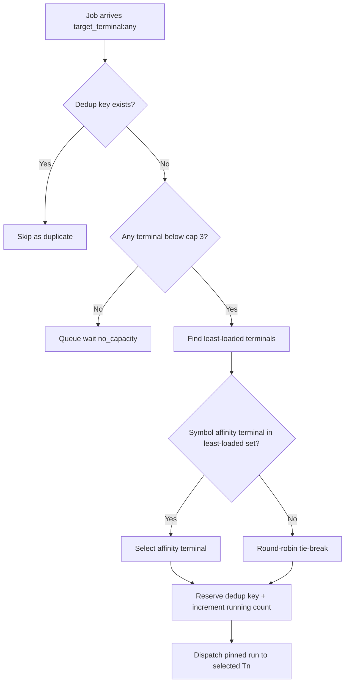

# 15. Pipeline-Op Load Balancing (T1-T5)

## Trigger

Pipeline-Operator receives one or more runnable backtest jobs with `target_terminal: any` in factory scope (T1-T5 only).

## Actors

- [Pipeline-Operator](/QUA/agents/pipeline-operator)

## Guardrails

- T6 is out-of-scope for all dispatch and telemetry writes.
- Max concurrency is **3 active jobs per terminal**.
- Dedup key is `(ea_id, version, symbol, phase, sub_gate_config_hash)`.
- Filesystem remains truth for report counts and NO_REPORT checks.

## State + Evidence Paths

- Queue + dedup state root: `D:\QM\Reports\pipeline\`
- Dispatch state: `D:\QM\Reports\pipeline\dispatch_state.json`
- Scheduler implementation: `framework/scripts/pipeline_dispatcher.py`
- Scheduler tests: `framework/scripts/tests/test_pipeline_dispatcher.py`
- Launcher hooks: `framework/scripts/run_backtest_smoke.ps1`, `framework/scripts/run_smoke.ps1`

## Scheduling Policy

1. Reject duplicates when dedup key already exists in `dispatch_state.json`.
2. Build eligible terminal set from T1-T5 where running count `< 3`.
3. Pick least-loaded terminal(s) from eligible set.
4. If symbol affinity exists for same symbol within 24h and terminal is in least-loaded set, pick that terminal.
5. Otherwise, from least-loaded set, pick the terminal with the lowest run-count in the last 24h.
6. If still tied, round-robin across the tied terminals (stable progression by previous selection index).
7. Write reservation into dedup index and increment running count for selected terminal.
8. On run completion, call completion event and decrement running count for the assigned terminal.

## Steps

## Exits

- `scheduled`: terminal selected and reservation written.
- `duplicate`: job skipped due to existing dedup tuple.
- `no_capacity`: all factory terminals at cap; keep queued.
- `released`: completion recorded and terminal capacity decremented.

## SLA

- Dispatch decision for a single queued job: target `< 1s` local scheduler overhead.
- Recovery from dispatcher restart: reload dedup index before accepting new queue work.
