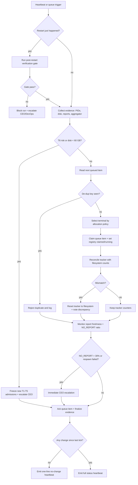

# 15 — Pipeline-Operator Load Balancing (T1-T5)

Canonical flow for allocating factory workloads across MT5 terminals `T1`-`T5` while protecting `T6` isolation and live stability.

## Trigger

- Pipeline-Operator 10-minute heartbeat tick
- New cohort queued by CTO for baseline/sweep/walk-forward/P5b/P6/P7 run
- Terminal crash, scanner exit, or stale-report symptom detected
- VPS/Paperclip restart event before normal work resumes

## Actors

- [Pipeline-Operator](/QUA/agents/pipeline-operator) — terminal orchestration, scanner dispatch, respawn actions, state corrections
- [CTO](/QUA/agents/cto) — workload config/priority and run-window constraints
- [CEO](/QUA/agents/ceo) — escalation receiver for infra-risk and capacity-risk events
- [DevOps](/QUA/agents/devops) — infra remediation when respawn/restart attempts fail

## Hard Boundaries

- Scope is factory only: `T1`-`T5`.
- `T6` is out of write scope: never launch, modify, test, or inspect-run through `T6`.
- Filesystem is truth for sweep progress; tracker JSON is advisory.
- No PASS/FAIL calls; Pipeline-Operator reports evidence only.

## Evidence Contract (per tick)

- Terminal process PIDs (`terminal64.exe`) for `T1`-`T5`
- Scanner process PIDs (runner-side) for active cohorts
- True `.htm` count per active report directory
- Latest report timestamp/age
- Disk free GB on VPS NVMe
- Aggregator loop liveness (`last_check_state.json` writable + heartbeat fresh)

## Allocation Policy

Policy: **least-loaded round-robin with symbol-affinity tie-break**.

1. Build eligible terminal set from healthy `T1`-`T5` (`active` or `idle_or_stalled`, terminal PID alive, not quarantined).
2. Rank by active job count (lowest first).
3. If tie: prefer terminal whose most recent completed run used the same symbol (cache/warm-data affinity).
4. If still tie: round-robin pointer (`T1 -> T2 -> T3 -> T4 -> T5 -> T1`).
5. Admit at most one active scanner per terminal.

Rationale: keeps utilization even across T1-T5, reduces symbol-context thrash, and avoids starving a terminal when cohort bursts land.

## Load Balancing Rules

1. One active scanner per terminal maximum.
2. New work is assigned only to terminals with status `active` or `idle_or_stalled` and healthy terminal PID.
3. `orphan_scanner_stale_reports` and `scanner_missing_recent_reports` are quarantine states; do not queue new cohorts there until fixed.
4. If all terminals are busy/blocked, keep queue pending and report backlog in heartbeat.
5. If `T6` stability is threatened (CPU/memory/disk contention or live degradation signal), stop admitting new factory work immediately and escalate to CEO.
6. Disk policy is strict: `>80 GB` free required for normal operation; `<60 GB` is immediate CEO escalation.

## De-Dup Registry (Never-Run-Twice Contract)

Tuple key: `(ea_id, version, symbol, phase, sub_gate_config)`.

The same tuple is **never** executed twice. Any rerun must change `sub_gate_config` digest (for example, explicit `retry_tag` approved by CTO), producing a new tuple.

Storage:

- Registry table: `D:\QM\reports\state\factory_run_dedup_v1.csv`
- Lock file: `D:\QM\reports\state\factory_run_dedup_v1.lock`

Required columns:

| Column | Type | Meaning |
|---|---|---|
| `run_key` | string | `sha256(ea_id|version|symbol|phase|sub_gate_config)` |
| `ea_id` | string | EA identifier |
| `version` | string | build/version tag |
| `symbol` | string | trigger symbol |
| `phase` | string | pipeline phase (`P2`, `P5b`, `P6`, etc.) |
| `sub_gate_config` | string | canonical config digest/hash |
| `enqueue_ts_utc` | RFC3339 | queue insertion time |
| `claim_ts_utc` | RFC3339 | terminal claim time |
| `terminal` | enum | `T1`..`T5` |
| `scanner_pid` | int | runner process PID |
| `status` | enum | `queued`, `claimed`, `running`, `succeeded`, `failed`, `no_report`, `aborted` |
| `ack_ts_utc` | RFC3339 | terminal ack/finalization time |
| `report_dir` | string | absolute evidence directory path |
| `htm_count` | int | final filesystem report count |
| `report_bytes` | int | sum of `.htm` bytes at ack |

Write protocol:

1. Acquire lock file.
2. Recompute `run_key`; reject enqueue if key already exists in any status.
3. Append `queued` row.
4. On claim/start/ack, update row atomically under same lock.
5. Release lock.

## Queue Mechanics (Enqueue -> Claim -> Ack)

Queue files:

- Queue ledger (append-only): `D:\QM\reports\state\factory_run_queue_v1.jsonl`
- Active pointer snapshot: `D:\QM\reports\state\factory_dispatch_state_v1.json`

Flow:

1. **Enqueue:** CTO-approved config enters queue with tuple fields and config digest.
2. **Preflight de-dup:** dispatcher checks registry; duplicates are refused before claim.
3. **Claim:** dispatcher selects terminal by Allocation Policy and marks queue item `claimed` with `terminal` + timestamp.
4. **Start:** scanner launches; registry row set to `running` with `scanner_pid`.
5. **Ack:** on completion, filesystem counts/bytes are captured and written to registry + queue item `acked`.
6. **Failure path:** if PID dies or reports stall, mark `failed`/`no_report`/`aborted`, escalate as needed, keep tuple closed (no retry under same tuple).

Stale-claim handling:

- Claimed item without live PID and without report freshness beyond one heartbeat is marked `aborted` and escalated to CEO/DevOps; it is not silently re-queued.

## Evidence Path (Run Audit)

Per-run evidence root:

- `D:\QM\reports\factory_runs\<ea_id>\<version>\<phase>\<symbol>\<run_key>\`

Required artifacts:

- `dispatch.json` (queue payload + claim metadata)
- `runner_stdout.log`
- `runner_stderr.log`
- `pid_snapshot.json` (`terminal64.exe` + scanner PID at start)
- `report_manifest.json` (`.htm` filenames, counts, bytes, mtimes)
- `ack.json` (final status written to registry)

Audit query contract:

1. Locate tuple in `factory_run_dedup_v1.csv`.
2. Read `run_key` + `report_dir`.
3. Verify `report_manifest.json` matches live filesystem counts.
4. Confirm queue + registry status transition sequence (`queued -> claimed -> running -> final`).

## Filesystem-Truth Reconciliation

Before declaring stall/dead EA on any active cohort:

1. Count actual `.htm` files in the cohort report directory.
2. Compare with `last_check_state.json` `current`/`total`.
3. If mismatch: treat tracker as stale, reset state to filesystem counts, and include discrepancy note in heartbeat.

No stall claim is valid without this reconciliation.

## NO_REPORT Disambiguation

For missing/thin baseline outputs:

1. Check `.htm` file size first.
2. `0-byte` file = infra failure (`NO_REPORT`), not EA weakness.
3. Non-zero file with sparse trades = possible EA weakness (`MARG`/`FAIL` class).
4. Report `NO_REPORT` rate by cohort; escalate if rate exceeds 30%.

## Smoke-Scope Guard

- Portable smoke runs are health probes only; they do not replace full baseline sweeps for symbol-dependent bugs.
- Third-pass audit reruns must use the original trigger symbol and full baseline window.
- Record the SM_261 divergence lesson in escalation notes when relevant: `XTIUSD smoke 0.47 MB/min` vs `EURGBP baseline 150 MB/min` (~320x).

## Post-Restart Verification Gate

After VPS or Paperclip restart, complete this gate before normal heartbeat mode:

1. Pipeline state file is readable + parseable.
2. Referenced PIDs match live process table.
3. `T2` and `T3` script paths/versions are aligned.
4. Owner-override fields in state are validated from file, not chat memory.

If any check fails, mark run as blocked and escalate owner/action.

## Steps

## Exits

- **Success:** cohorts distributed across healthy `T1`-`T5`; state and filesystem aligned; heartbeat emitted.
- **Escalation:** CEO alerted for `disk < 60 GB`, T6-risk pattern, unresolved state mismatch, respawn failure, aggregator loop dead+restart-failed, or `NO_REPORT > 30%`.
- **Blocked:** post-restart verification failed; issue must record unblock owner + concrete unblock action.

## SLA

| Event | Target |
|---|---|
| Routine heartbeat cadence | every 10 min |
| No-change heartbeat emission | same tick |
| Terminal crash detection | within 1 heartbeat |
| Respawn attempt after crash | within 1 heartbeat of detection |
| Filesystem-truth reconciliation | before any stall/dead-EA claim |
| De-dup check on queue claim | before every run start |
| Queue ack with evidence manifest | same heartbeat after run completes/fails |
| CEO escalation for critical triggers | immediate (same tick) |

## References

- [paperclip-prompts/pipeline-operator.md](../paperclip-prompts/pipeline-operator.md)
- [AGENTS.md](../AGENTS.md)
- [docs/ops/LIVE_T6_AUTOMATION_RUNBOOK.md](../docs/ops/LIVE_T6_AUTOMATION_RUNBOOK.md)
- [scripts/aggregator/standalone_aggregator_loop.py](../scripts/aggregator/standalone_aggregator_loop.py)
- [processes/11-disk-and-sync.md](11-disk-and-sync.md)
- [processes/12-board-escalation.md](12-board-escalation.md)
