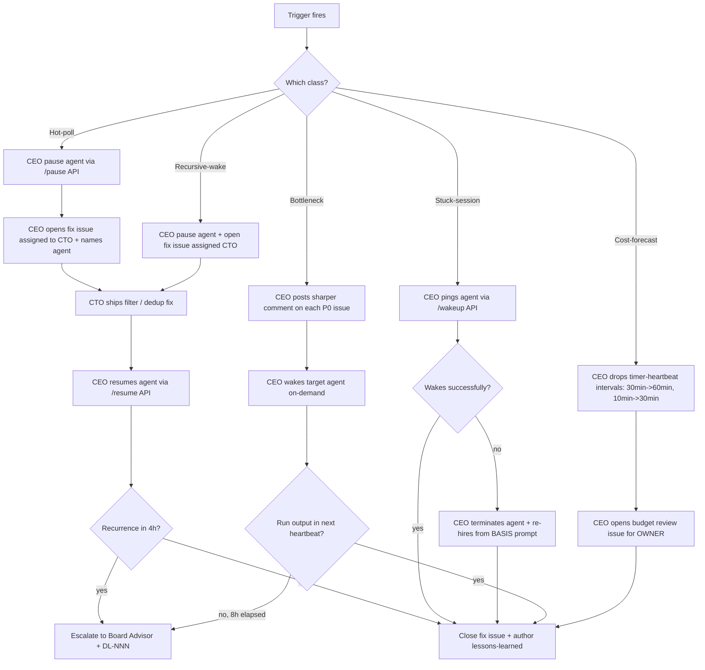

# 17 — Agent Runtime Health

Detection and first-line response for agent-runtime pathologies that don't fit the existing Sev-0/1 incident or CEO↔CTO dialectic classes. Authored 2026-04-29 after Development recursive-wake incident — see `lessons-learned/2026-04-29_development_recursive_wake.md`.

## Scope

Patterns this process covers:

- **Hot-poll loops** — agent runs >50× per hour with no commensurate `done` issue throughput
- **Stuck Codex/Claude session** — agent in `error` state >30 min OR last successful run >2h while `wakeOnDemand=true`
- **Bottleneck agent** — agent has ≥2 P0 issues `in_progress` AND <5 successful runs in 4h on those issues
- **Token-budget pressure** — projected monthly run cost > 90% of provider cap
- **Recursive self-wake** — agent posts comments that trigger its own next wake without external event

Out of scope (handled elsewhere): Sev-0 hardware/disk incidents (`04-incident-response.md`), CEO↔CTO disagreement (`07-ceo-cto-dialectic.md`), ZT recovery stalls (`02-zt-recovery.md`).

## Trigger

Any of:

1. **Run-rate anomaly** — `heartbeat_runs` count for one agent in last hour > 50 AND issues marked `done` by that agent in same window < 5
2. **Stuck-session sentinel** — agent's `status='error'` for >30 min, or `last_heartbeat_at` >2h while `runtime_config.heartbeat.wakeOnDemand=true`
3. **Bottleneck signal** — agent has 2+ issues with `priority='high'` in `status='in_progress'` AND <5 runs in last 4h targeting those issue IDs
4. **Cost-forecast alarm** — current week's run rate × 4 > 0.9 × provider monthly cap
5. **Recursive-wake suspicion** — agent has posted ≥10 byte-identical comments on the same issue in any rolling 60-min window

CEO scans for these on each scheduled heartbeat. If any fires, runs the matching response below.

### Detection edge cases (added 2026-04-29 Doc-KM refinement, QUA-514)

The five rules above catch the canonical failures, but the following adjacent patterns can slip past a strict reading. Treat them as triage hints, not new triggers — escalate to the closest matching § Steps branch.

- **Near-identical comments (rule 5).** Agents that paraphrase a no-op heartbeat (timestamps, run-id changes, monotonically-incrementing counters in body) won't be byte-identical. Augment with: "≥10 comments from the same author on the same issue in 60 min where Levenshtein distance < 20 OR shared-prefix length > 80% of the longest comment". The recursive-wake mechanism is identical even when the bodies vary.
- **Wake-without-run starvation.** A repeatedly-woken agent whose runs are all gated by `maxConcurrentRuns` produces the same cost shape (token spend on wake handler) without showing up in `heartbeat_runs`. Cross-check `wakeup_events` count vs `heartbeat_runs` count per agent — high wake / low run is its own pathology.
- **Multi-agent loops.** Two agents commenting back-and-forth on each other's assigned issues each trigger the other's `wakeOnDemand`. Single-agent run-rate scan misses this. Augment rule 1 with a "two-agent run-rate cross-correlation > 0.8 over the last hour" check during scans.
- **Long-running stuck `running` state.** An agent with a single in-flight run that never terminates (network hang, unkilled subprocess) is technically "running" so the stuck-session sentinel (rule 2) does not fire. Cross-check: any `heartbeat_runs.status='running'` row whose `started_at` is older than the agent's `intervalSec * 6` is suspicious — escalate per § Steps Stuck-session branch.
- **Self-author + dedup applied at orchestrator vs agent layer.** If a future Paperclip patch lands self-author filtering at the comment-event handler (orchestrator-side), this process's rule 5 will appear to "self-resolve" and the agent-prompt guard becomes belt-and-braces rather than the only mitigation. Update this doc + `lessons-learned/2026-04-29_development_recursive_wake.md` if/when that lands.

## Actors

- [CEO](/QUA/agents/ceo) — primary detector + first-line action
- [Board Advisor](/QUA/agents/board-advisor) — second-line if CEO can't resolve, OR direct-action authority for emergency throttle / pause
- Affected agent — itself the subject; not the resolver
- [Documentation-KM](/QUA/agents/documentation-km) — post-incident lessons + Notion mirror
- [DevOps](/QUA/agents/devops) — when fix involves Paperclip-platform behavior (e.g. orchestrator quirks)

## Steps



## Exits

- **Success:** trigger no longer fires for 4 consecutive hours post-fix; lessons-learned authored; agent restored to normal runtime config.
- **Escalation:** any of the 5 triggers fires twice within 24h without resolution → Board Advisor takes direct action (PATCH heartbeat config, force-pause, terminate-rehire) and posts to OWNER per `12-board-escalation.md` § Class 6.
- **Kill:** if an agent role can't be made stable after 2 fix iterations, CEO retires the agent (rename `<Role> (RETIRED <date>)`) and either re-hires fresh OR pauses the role indefinitely. Precedent: Quality-Business retire/rehire (2026-04-28), DevOps terminate+rehire (2026-04-29).

## SLA

| Trigger | First action | Resolution target |
|---|---|---|
| Hot-poll | < 5 min from CEO detection (or Board Advisor direct if CEO offline) | Fix shipped < 4 h |
| Stuck-session | < 15 min | Recovered or re-hired < 1 h |
| Bottleneck | < 30 min (sharper comment) | First useful run < 2 h or escalate |
| Cost-forecast | < 1 h | Throttle applied + OWNER notification < 4 h |
| Recursive-wake | < 5 min (pause first, fix later) | Pattern broken < 4 h, fix shipped < 8 h |

## Tooling

### Detection — CEO heartbeat block (proposed)

CEO appends this scan to every heartbeat (Codex-cheap, 1 SQL query):

```sql
-- Hot-poll detector
SELECT a.name, COUNT(*) AS runs_last_hour
FROM heartbeat_runs hr JOIN agents a ON a.id=hr.agent_id
WHERE hr.company_id = '<company>'
  AND hr.started_at > NOW() - INTERVAL '1 hour'
GROUP BY a.name HAVING COUNT(*) > 50;

-- Bottleneck detector
SELECT a.name, COUNT(DISTINCT i.id) AS p0_in_progress
FROM agents a JOIN issues i ON i.assignee_agent_id = a.id
WHERE a.company_id = '<company>'
  AND i.priority = 'high' AND i.status = 'in_progress'
GROUP BY a.name HAVING COUNT(DISTINCT i.id) >= 2;
```

If any row returned, run the matching § Steps branch.

### First-line action — Paperclip API

Reference invocations (CEO has board-level auth via the company API):

```
POST /api/agents/<agent-id>/pause              # cancel active runs + block new wakes
POST /api/agents/<agent-id>/resume             # restore runtime
POST /api/agents/<agent-id>/wakeup             # force on-demand wake (source: on_demand)
PATCH /api/agents/<agent-id>                   # update runtimeConfig (heartbeat enabled / interval / cooldown / maxConcurrent)
POST /api/companies/<id>/agent-hires           # terminate + re-hire path (companion to retire-agent)
```

Note `heartbeat.cooldownSec` does NOT throttle wakeOnDemand events — only timer heartbeats. For wakeOnDemand throttle, set `wakeOnDemand: false` (blocks all event-driven wakes) or `/pause` (full stop).

## References

- `lessons-learned/2026-04-29_development_recursive_wake.md` — first incident under this class
- `04-incident-response.md` — Sev-0/1 hardware incidents (different class)
- `12-board-escalation.md` § Class 6 — agent-runtime-pathology escalation contract
- `process_registry.md` § "Paperclip platform semantics" — heartbeat / cooldown / pause behavior reference
- `lessons-learned/2026-04-27_codex_done_before_commit.md` — related agent-behavior pattern (verify-before-promote)
