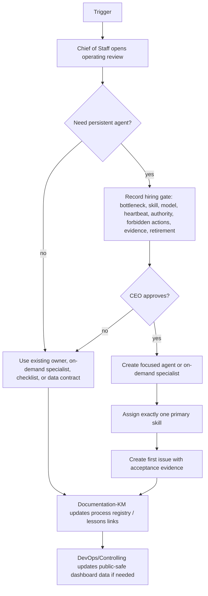

# 18 — Company Operating System

How QuantMechanica decides roles, processes, dashboards, lessons, and continuous improvement without letting the Paperclip company sprawl or imitate a human org chart unnecessarily.

## Scope

This process governs:

- AI-native capability design: persistent agents vs on-demand specialists vs checklists/data contracts
- agent hiring and retirement proposals
- one-primary-skill-per-agent discipline
- model-tier routing and token control
- bottleneck review
- lessons learned entering processes
- company dashboard/menu data
- public-safe operating model snapshots

Out of scope: live-money/T6 deploy approvals, EA implementation details, single backtest execution discipline.

## Trigger

Any of:

1. OWNER gives a new company-design directive.
2. An agent has 2+ high-priority blockers or is repeatedly overloaded.
3. Token-budget projection crosses 80% of monthly allowance.
4. A lesson learned implies a process or routing change.
5. A new dashboard/menu section is requested.
6. A proposed new agent has no existing process owner.

## Actors

- [CEO](/QUAA/agents/ceo) — accountable decision-maker and hire approver
- Chief of Staff / OS Controller — control tower, token/model routing, bottleneck recommendations, OWNER high-altitude view
- [Documentation-KM](/QUAA/agents/documentation-km) — process registry, lessons archive, Notion/Git sync
- [DevOps](/QUAA/agents/devops) — data export and scheduler wiring
- [Controlling](/QUAA/agents/controlling) — dashboard/KPI correctness when hired
- [CTO](/QUAA/agents/cto) — technical feasibility review where code, infra, or model routing affects implementation

## Steps

## Hiring Gate

CEO cannot approve a new persistent agent until the proposal proves that a checklist, data contract, dashboard panel, or on-demand specialist is insufficient.

The proposal must include:

| Field | Required answer |
|---|---|
| Bottleneck | What recurring queue or failure does this solve? |
| Primary skill | The one skill this agent is allowed to optimize for |
| Model tier | Lightweight, mid, strong, or strong-on-demand |
| Heartbeat | Timer, on-demand, or paused-by-default |
| Write authority | Exact folders/APIs/surfaces allowed |
| Forbidden actions | Especially T6/live, destructive ops, public claims, prompt hot-reload |
| Evidence | What proves the agent helped within 7 days? |
| Retirement | When to pause, merge back, or terminate the role |

## Token Control

Default routing:

- Lightweight: monitoring, inbox link extraction, schema checks, status summarization.
- Mid: dashboard summaries, process updates, routine research notes.
- Strong: source interpretation, strategy judgment, architecture review, PASS/FAIL reasoning.
- Codex strong: code, MQL5, build/test harness, infra debugging.

Rules:

- Timer heartbeats are disabled unless the role owns a recurring monitor.
- On-demand specialists sleep after delivery.
- No-op heartbeats do not post comments.
- Chief of Staff flags agents with high run count and low completed output.
- CEO reduces heartbeat frequency before asking OWNER for more budget.

## Continuous Improvement Loop

1. Lesson candidate is created from incident, waste, duplicate work, or failed gate.
2. Documentation-KM normalizes the lesson.
3. Chief of Staff determines impact: process, checklist, routing, model tier, skill, or no-change.
4. CEO approves the action.
5. Documentation-KM links the lesson to the changed artifact or explicit no-change decision.

## Dashboard Data

Company operating model data is public-safe and exported via:

- `public-data/company-operating-model.schema.json`
- `public-data/company-operating-model.json`

Dashboard/menu consumers should show:

- role roster and status
- operating principles
- process loop
- active dashboard sections
- first 48h action list

Do not expose raw Paperclip issue links, credentials, private mailbox contents, T6 account data, or unredacted trading claims.

## Exits

- **Success:** role/process/dashboard change is recorded, owner assigned, evidence standard clear, public-safe snapshot updated if needed.
- **Escalation:** budget step-change, T6/live authority, legal/compliance wording, or hard-rule changes go to OWNER.
- **Kill:** if a new role produces no accepted evidence within 7 days, CEO pauses or retires it and routes tasks back to the prior owner.

## SLA

| Item | Target |
|---|---|
| Bottleneck review after trigger | < 1 CEO heartbeat |
| Hire proposal completeness check | < 24h |
| First useful output from new role | < 7 days |
| Lesson-to-process decision | < 72h after lesson accepted |
| Dashboard data update after model change | < 24h |

## References

- `docs/ops/PAPERCLIP_COMPANY_REBOOT_PLAN_2026-04-30.md`
- `docs/ops/PAPERCLIP_COMPANY_REBOOT_ISSUES_2026-04-30.md`
- `processes/17-agent-runtime-health.md`
- `processes/process_registry.md`
- `docs/ops/AGENT_SKILL_MATRIX.md`
