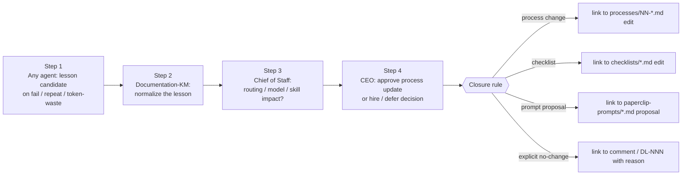
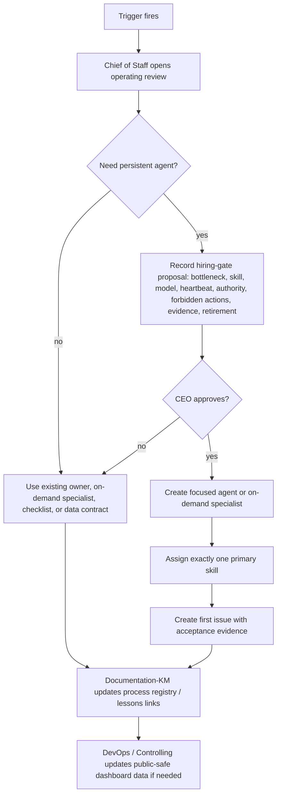

# 18 — Company Operating System

How QuantMechanica decides roles, processes, model-tier routing, dashboards, and continuous improvement without letting the Paperclip company sprawl or imitate a human org chart unnecessarily.

This is the canonical anchor for the **lessons-to-process loop**: every lesson candidate raised by an agent must close against a concrete artifact change (process, checklist, prompt-proposal) or an explicit no-change decision.

## Scope

In scope:

- AI-native capability design — persistent agents vs on-demand specialists vs checklists / data contracts
- agent hiring and retirement proposals (hiring gate)
- one-primary-skill-per-agent discipline
- model-tier routing and token control
- weekly bottleneck review (Chief of Staff)
- lessons learned entering processes (closure rule)
- company dashboard / menu data (`public-data/company-operating-model.json`)
- public-safe operating-model snapshots

Out of scope: live-money / T6 deploy approvals, EA implementation details, single-backtest execution discipline (that lives in [`16-backtest-execution-discipline.md`](16-backtest-execution-discipline.md)), agent runtime-health detection (that lives in [`17-agent-runtime-health.md`](17-agent-runtime-health.md)).

## Trigger

Any of:

1. OWNER gives a new company-design directive.
2. An agent has 2+ high-priority blockers or is repeatedly overloaded (overlaps with [17-agent-runtime-health.md](17-agent-runtime-health.md) trigger #3).
3. Token-budget projection crosses 80% of the monthly allowance.
4. A normalized lesson candidate (from [`lessons-learned/README.md`](../lessons-learned/README.md)) implies a process / routing / model / skill change.
5. A new dashboard / menu section is requested.
6. A proposed new agent has no existing process owner.

## Actors

- [CEO](/QUA/agents/ceo) — accountable decision-maker, hire approver, interim Chief-of-Staff duty until CoS hire lands.
- **Chief of Staff / OS Controller** — control-tower, token / model routing, weekly bottleneck review, OWNER high-altitude view. *Not yet hired* per [reboot plan Issue 1](../docs/ops/PAPERCLIP_COMPANY_REBOOT_ISSUES_2026-04-30.md). Until hired, CEO carries the duties below explicitly (see § Interim ownership).
- [Documentation-KM](/QUA/agents/documentation-km) — process registry, lessons archive, Notion / Git sync, closure-rule sentinel.
- [DevOps](/QUA/agents/devops) — public-data export and scheduler wiring.
- **Controlling** *(deferred — Wave 3)* — dashboard / KPI correctness when hired; DevOps interim.
- [CTO](/QUA/agents/cto) — technical feasibility review where code, infra, or model routing affects implementation.

## Hiring Gate

CEO cannot approve a new persistent agent until the proposal proves a checklist, data contract, dashboard panel, or on-demand specialist is insufficient.

The proposal must include:

| Field | Required answer |
|---|---|
| Bottleneck | What recurring queue or failure does this solve? Cite ≥1 evidence link (issue id, lesson, dashboard panel). |
| Primary skill | The one skill this agent is allowed to optimize for. Multi-skill = reject. |
| Model tier | Lightweight, mid, strong, or strong-on-demand. |
| Heartbeat | Timer (interval), event-driven (wake-on-demand), or paused-by-default. |
| Write authority | Exact folders / APIs / surfaces allowed; everything else implicitly forbidden. |
| Forbidden actions | Especially T6 / live, destructive ops, public claims, prompt hot-reload of other agents. |
| Evidence | What proves the agent helped within 7 days? Specific issue throughput, lesson closures, or dashboard delta. |
| Retirement | When to pause, merge back, or terminate the role. |

Hiring authority: CEO unilateral per [DL-017](../decisions/REGISTRY.md). Anti-sprawl 8-cap from V5 Org Proposal § 6 stands; the [DL-039](../decisions/2026-04-28_quality_business_hire.md) one-time override does not extend to Wave 3+.

## Token Control

Default routing matrix:

| Tier | Use for | Example tasks |
|---|---|---|
| Lightweight | monitoring, schema checks, status summarization | inbox link extraction, runtime-health scan, agent-roster diff |
| Mid | summaries, routine research notes, process updates | dashboard rollups, session show-notes draft, pipeline status digest |
| Strong reasoning | source interpretation, strategy judgment, architecture review | strategy-card extraction, PASS/FAIL reasoning, board escalation |
| Codex strong | code, MQL5, build / test harness, infra debugging | EA implementation, framework fixes, infra script authoring |

Rules:

- Timer heartbeats are **disabled** unless the role owns a recurring monitor.
- On-demand specialists sleep after delivery (`heartbeat.enabled=false`, `wakeOnDemand=true`).
- No-op heartbeats do **not** post comments — see [17-agent-runtime-health.md § recursive self-wake](17-agent-runtime-health.md) and the [2026-04-29 development recursive-wake lesson](../lessons-learned/2026-04-29_development_recursive_wake.md).
- Chief of Staff (interim CEO) flags agents with high run count and low completed-output ratio.
- CEO reduces heartbeat frequency before asking OWNER for more budget.

## Continuous Improvement Loop (lessons → process)

This is the canonical four-step loop. Every lesson candidate must traverse it; closure-rule below is binding.

### The four accountable steps (binding)

1. **Lesson candidate (any agent).** When work fails, repeats, or wastes tokens, the agent files a `learning-candidate`-tagged issue with: what happened, what was tried, what was lost, what evidence supports it. No fix proposal required at this step — observation is enough. SLA: same heartbeat the failure is observed; no batching.
2. **Normalize (Documentation-KM).** Doc-KM rewrites the candidate into the canonical [`lessons-learned/<date>_<slug>.md`](../lessons-learned/) format (Learning → V1 Behavior → V5 Behavior → Why), citing the source incident / commit / issue. Doc-KM also strips redundancy if the same root-cause is already in the archive (consolidate, do not duplicate). SLA: < 24h after candidate is filed.
3. **Routing / model / skill decision (Chief of Staff).** CoS reviews the normalized lesson and decides one of:
   - **Route change** — issue-routing convention, owner, project assignment.
   - **Model change** — escalate or de-escalate the model tier for the affected task class.
   - **Skill change** — load a new skill, retire one, change which agent is required to load it.
   - **Process change** — propose a `processes/NN-*.md` edit or new file.
   - **Checklist change** — propose a `checklists/*.md` edit.
   - **Prompt-proposal** — propose a `paperclip-prompts/<role>.md` patch (OWNER ratifies; CEO ships under DL-032 if DL-aligned).
   - **No-change** — explicit decision with reason; cite future condition that would re-open the lesson.
   SLA: < 72h after normalization.
4. **CEO approval.** CEO reviews CoS recommendation and approves / rejects. Approval = comment on the lesson issue + DL-NNN if a class-2+ governance change. Rejection = comment + alternative routing. SLA: < 1 CEO heartbeat after CoS recommendation lands.

### Closure rule (binding)

> **No lesson is `done` until its issue links to at least one of: a process / checklist / prompt-proposal change (with commit hash), or an explicit no-change DL-NNN / CEO comment that names the future condition that would re-open the lesson.**

Doc-KM is the closure-rule sentinel. On the lessons-learned weekly sweep, Doc-KM patches any lesson issue that has reached step 4 without a closure artifact back to `in_progress` and pings the relevant owner.

### Interim ownership (until Chief of Staff is hired)

CoS is deferred per [reboot plan Issue 1](../docs/ops/PAPERCLIP_COMPANY_REBOOT_ISSUES_2026-04-30.md). Until the hire lands, **CEO carries Step 3** explicitly — that is, CEO performs the routing / model / skill decision *before* the Step-4 approval. CEO's two-hat path must be documented in the lesson issue comment so the CoS hand-off is auditable.

### Cross-links

- [`lessons-learned/README.md`](../lessons-learned/README.md) — archive index; its closure-rule section points back here.
- [`processes/process_registry.md`](process_registry.md) — registry; § Continuous Improvement Loop points back here.
- [`processes/17-agent-runtime-health.md`](17-agent-runtime-health.md) — runtime-health triggers feed lesson candidates (recursive-wake, hot-poll, bottleneck).
- [`processes/06-issue-triage.md`](06-issue-triage.md) — CEO heartbeat path that surfaces lesson candidates as issues.
- [`docs/ops/PAPERCLIP_COMPANY_REBOOT_PLAN_2026-04-30.md`](../docs/ops/PAPERCLIP_COMPANY_REBOOT_PLAN_2026-04-30.md) — operating thesis.
- [`docs/ops/PAPERCLIP_COMPANY_REBOOT_ISSUES_2026-04-30.md`](../docs/ops/PAPERCLIP_COMPANY_REBOOT_ISSUES_2026-04-30.md) — issue packet (Issues 1-7).

## Weekly Bottleneck Review

Owner: Chief of Staff (interim CEO). Cadence: weekly, recorded as a comment on a standing issue or appended to `docs/ops/`.

Inputs:

- Agent run-rate vs `done`-throughput ratio (per agent, last 7 days).
- Open `learning-candidate` issues without a step-3 decision.
- Lessons closed in the period (process / checklist / prompt-proposal / no-change tally).
- Token-budget projection vs allowance.
- Idle agents (no `done` in 7 days) and overloaded agents (≥2 P0 + low run rate).

Output: one-page summary with the OWNER high-altitude view (5 questions, see [reboot plan § Dashboard](../docs/ops/PAPERCLIP_COMPANY_REBOOT_PLAN_2026-04-30.md) and `public-data/company-operating-model.json` when wired).

## Dashboard Data

Company operating-model data is public-safe and exported via:

- `public-data/company-operating-model.schema.json`
- `public-data/company-operating-model.json`

Dashboard / menu consumers should show:

- role roster and status (control-tower vs capability-cell vs deferred)
- operating principles (one primary skill, AI-native shape, anti-sprawl)
- the four-step lessons-to-process loop
- active dashboard sections
- first-48h action list

Do **not** expose raw Paperclip issue links, credentials, private mailbox contents, T6 account data, or unredacted trading claims.

Wiring to the website / Paperclip menu is tracked in reboot plan Issue 5 (Controlling / DevOps interim).

## Steps (high-level review path)

## Exits

- **Success:** role / process / dashboard change is recorded, owner assigned, evidence standard clear, public-safe snapshot updated if needed, lesson (if any) closed against the change.
- **Escalation:** budget step-change, T6 / live authority, legal / compliance wording, V5 hard-rule changes, and Wave 3+ hires beyond the 8-cap go to OWNER.
- **Kill:** if a new role produces no accepted evidence within 7 days, CEO pauses or retires it and routes tasks back to the prior owner.

## SLA

| Item | Target | Owner |
|---|---|---|
| Lesson candidate filed after observation | < same heartbeat | filing agent |
| Lesson normalization | < 24h | Documentation-KM |
| CoS routing / model / skill decision | < 72h after normalization | Chief of Staff (interim CEO) |
| CEO approval after CoS recommendation | < 1 CEO heartbeat | CEO |
| Closure-rule sentinel sweep | weekly | Documentation-KM |
| Bottleneck review after trigger | < 1 CEO heartbeat | Chief of Staff (interim CEO) |
| Hire-proposal completeness check | < 24h | CEO |
| First useful output from new role | < 7 days | new role + CEO |
| Dashboard data update after model change | < 24h | DevOps + Documentation-KM |

## References

- Ratifying source: [`docs/ops/PAPERCLIP_COMPANY_REBOOT_PLAN_2026-04-30.md`](../docs/ops/PAPERCLIP_COMPANY_REBOOT_PLAN_2026-04-30.md)
- Issue packet: [`docs/ops/PAPERCLIP_COMPANY_REBOOT_ISSUES_2026-04-30.md`](../docs/ops/PAPERCLIP_COMPANY_REBOOT_ISSUES_2026-04-30.md)
- Runtime-health (lesson source): [`processes/17-agent-runtime-health.md`](17-agent-runtime-health.md)
- Process registry: [`processes/process_registry.md`](process_registry.md)
- Lessons archive: [`lessons-learned/README.md`](../lessons-learned/README.md)
- Skill matrix: [`docs/ops/AGENT_SKILL_MATRIX.md`](../docs/ops/AGENT_SKILL_MATRIX.md)
- Org self-design model: [`docs/ops/ORG_SELF_DESIGN_MODEL.md`](../docs/ops/ORG_SELF_DESIGN_MODEL.md)
